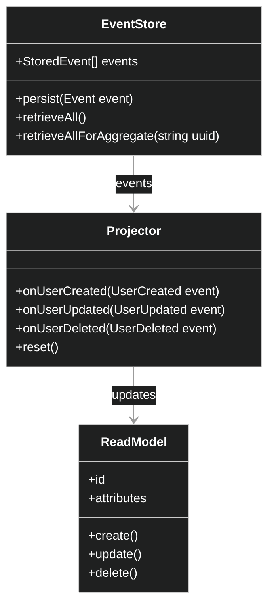

# Read Model Architecture (Dark Mode)

```mermaid
%%{init: {'theme': 'dark', 'themeVariables': { 'primaryColor': '#2a2a2a', 'primaryTextColor': '#ffffff', 'primaryBorderColor': '#555555', 'lineColor': '#999999', 'secondaryColor': '#252525', 'tertiaryColor': '#333333' }}}%%
classDiagram
    class EventStore {
        +StoredEvent[] events
        +persist(Event event)
        +retrieveAll()
        +retrieveAllForAggregate(string uuid)
    }
    
    class Projector {
        +onUserCreated(UserCreated event)
        +onUserUpdated(UserUpdated event)
        +onUserDeleted(UserDeleted event)
        +reset()
    }
    
    class ReadModel {
        +id
        +attributes
        +create()
        +update()
        +delete()
    }
    
    EventStore --> Projector: events
    Projector --> ReadModel: updates
```
