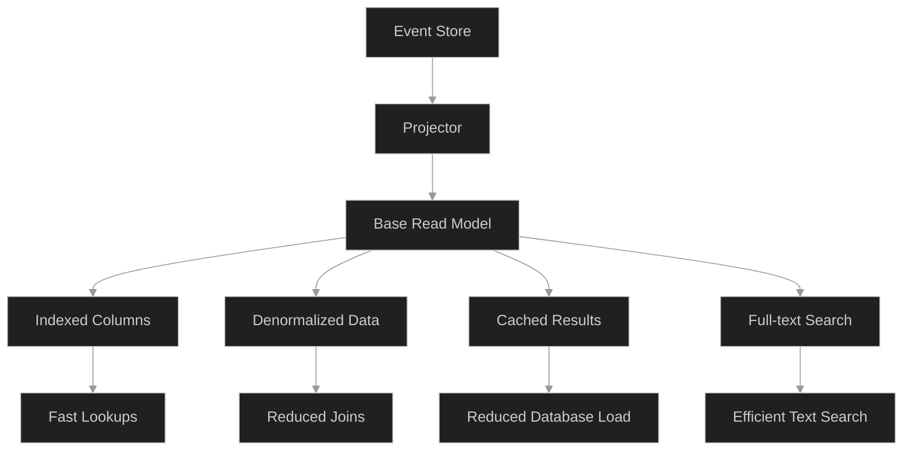

# Read Model Optimization (Dark Mode)

```mermaid
%%{init: {'theme': 'dark', 'themeVariables': { 'primaryColor': '#2a2a2a', 'primaryTextColor': '#ffffff', 'primaryBorderColor': '#555555', 'lineColor': '#999999', 'secondaryColor': '#252525', 'tertiaryColor': '#333333' }}}%%
flowchart TD
    A[Event Store] --> B[Projector]
    B --> C[Base Read Model]
    C --> D[Indexed Columns]
    C --> E[Denormalized Data]
    C --> F[Cached Results]
    C --> G[Full-text Search]
    D --> H[Fast Lookups]
    E --> I[Reduced Joins]
    F --> J[Reduced Database Load]
    G --> K[Efficient Text Search]
```
