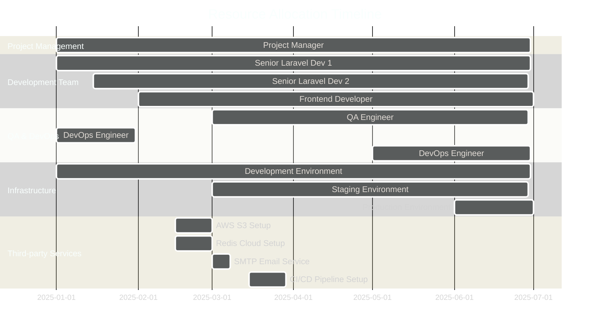

# Resource Allocation Timeline (Dark Mode)

```mermaid
%%{init: {'theme': 'dark', 'themeVariables': { 'primaryColor': '#2c3e50', 'primaryTextColor': '#ecf0f1', 'primaryBorderColor': '#7f8c8d', 'lineColor': '#ecf0f1', 'secondaryColor': '#34495e', 'tertiaryColor': '#282c34' }}}%%
gantt
    title Resource Allocation Timeline
    dateFormat  YYYY-MM-DD
    
    section Project Management
    Project Manager       :pm, 2025-01-01, 180d
    
    section Development Team
    Senior Laravel Dev 1  :sd1, 2025-01-01, 180d
    Senior Laravel Dev 2  :sd2, 2025-01-15, 165d
    Frontend Developer    :fd, 2025-02-01, 150d
    
    section QA & DevOps
    QA Engineer           :qa, 2025-03-01, 120d
    DevOps Engineer       :devops, 2025-01-01, 30d
    DevOps Engineer       :devops2, 2025-05-01, 60d
    
    section Infrastructure
    Development Environment :dev, 2025-01-01, 180d
    Staging Environment     :staging, 2025-03-01, 120d
    Production Environment  :prod, 2025-06-01, 30d
    
    section Third-party Services
    AWS S3 Setup           :s3, 2025-02-15, 14d
    Redis Cloud Setup      :redis, 2025-02-15, 14d
    SMTP Email Service     :smtp, 2025-03-01, 7d
    CI/CD Pipeline Setup   :cicd, 2025-03-15, 14d

```
