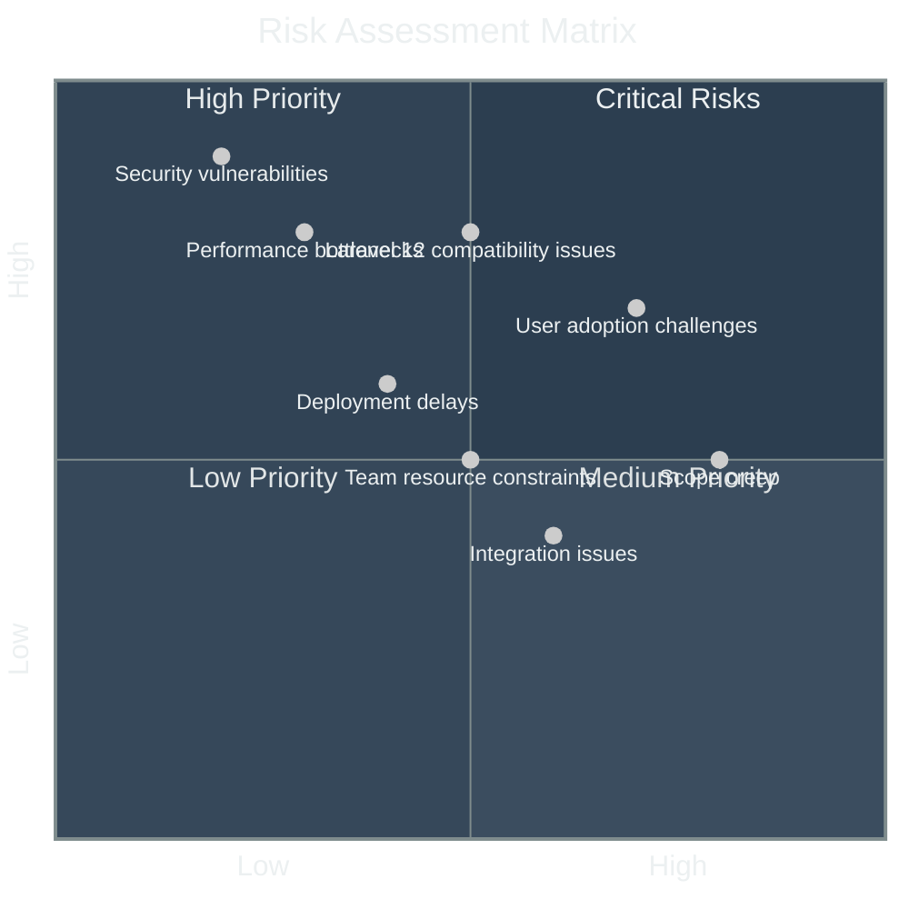

# Risk Assessment (Dark Mode)

```mermaid
%%{init: {'theme': 'dark', 'themeVariables': { 'primaryColor': '#2c3e50', 'primaryTextColor': '#ecf0f1', 'primaryBorderColor': '#7f8c8d', 'lineColor': '#ecf0f1', 'secondaryColor': '#34495e', 'tertiaryColor': '#282c34' }}}%%
quadrantChart
    title Risk Assessment Matrix
    x-axis Low --> High
    y-axis Low --> High
    quadrant-1 "Critical Risks"
    quadrant-2 "High Priority"
    quadrant-3 "Low Priority"
    quadrant-4 "Medium Priority"
    "Laravel 12 compatibility issues": [0.5, 0.8]
    "Performance bottlenecks": [0.3, 0.8]
    "Security vulnerabilities": [0.2, 0.9]
    "Scope creep": [0.8, 0.5]
    "Team resource constraints": [0.5, 0.5]
    "Integration issues": [0.6, 0.4]
    "Deployment delays": [0.4, 0.6]
    "User adoption challenges": [0.7, 0.7]

```
