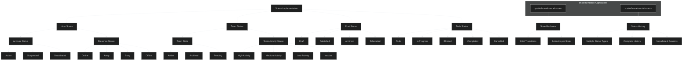

```mermaid
%%{init: {'theme': 'dark', 'themeVariables': { 'primaryColor': '#2c3e50', 'primaryTextColor': '#ecf0f1', 'primaryBorderColor': '#7f8c8d', 'lineColor': '#ecf0f1', 'secondaryColor': '#34495e', 'tertiaryColor': '#282c34' }}}%%
graph TD
    A[Status Implementation] --> B[User Status]
    A --> C[Team Status]
    A --> D[Post Status]
    A --> E[Todo Status]
    
    B --> B1[Account Status]
    B --> B2[Presence Status]
    
    B1 --> B1A[Active]
    B1 --> B1B[Suspended]
    B1 --> B1C[Deactivated]
    
    B2 --> B2A[Online]
    B2 --> B2B[Away]
    B2 --> B2C[Busy]
    B2 --> B2D[Offline]
    
    C --> C1[Team State]
    C --> C2[Team Activity Status]
    
    C1 --> C1A[Active]
    C1 --> C1B[Archived]
    C1 --> C1C[Pending]
    
    C2 --> C2A[High Activity]
    C2 --> C2B[Medium Activity]
    C2 --> C2C[Low Activity]
    C2 --> C2D[Inactive]
    
    D --> D1[Draft]
    D --> D2[Published]
    D --> D3[Archived]
    D --> D4[Scheduled]
    
    E --> E1[Todo]
    E --> E2[In Progress]
    E --> E3[Blocked]
    E --> E4[Completed]
    E --> E5[Cancelled]
    
    subgraph "Implementation Approaches"
    F[spatie/laravel-model-states]
    G[spatie/laravel-model-status]
    end
    
    F --> H[State Machines]
    G --> I[Status History]
    
    H --> J[Strict Transitions]
    H --> K[Behavior per State]
    
    I --> L[Multiple Status Types]
    I --> M[Complete History]
    I --> N[Metadata & Reasons]
```
