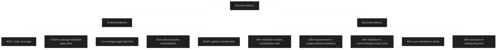

# Success Metrics (Dark Mode)

```mermaid
%%{init: {'theme': 'dark', 'themeVariables': { 'primaryColor': '#2c3e50', 'primaryTextColor': '#ecf0f1', 'primaryBorderColor': '#7f8c8d', 'lineColor': '#ecf0f1', 'secondaryColor': '#34495e', 'tertiaryColor': '#282c34' }}}%%
graph TD
    A[Success Metrics] --> B[Technical Metrics]
    A --> C[Business Metrics]
    
    B --> B1[90%+ code coverage]
    B --> B2["<100ms average database query time"]
    B --> B3["<1s average page load time"]
    B --> B4[Zero critical security vulnerabilities]
    B --> B5[99.9% uptime in production]
    
    C --> C1[30% reduction in team coordination time]
    C --> C2[25% improvement in project delivery timelines]
    C --> C3[40% reduction in communication tools costs]
    C --> C4[90% user satisfaction rating]
    C --> C5[50% reduction in onboarding time]

```
