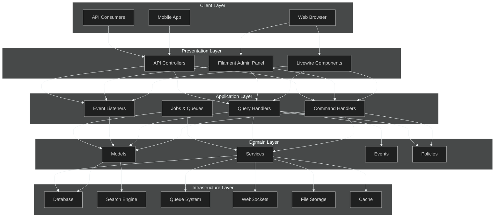

# TAD Architecture (Dark Mode)

```mermaid
%%{init: {'theme': 'dark', 'themeVariables': { 'primaryColor': '#2c3e50', 'primaryTextColor': '#ecf0f1', 'primaryBorderColor': '#7f8c8d', 'lineColor': '#ecf0f1', 'secondaryColor': '#34495e', 'tertiaryColor': '#282c34' }}}%%
flowchart TD
    subgraph "Client Layer"
        A1[Web Browser]
        A2[Mobile App]
        A3[API Consumers]
    end

    subgraph "Presentation Layer"
        B1[Livewire Components]
        B2[Filament Admin Panel]
        B3[API Controllers]
    end

    subgraph "Application Layer"
        C1[Command Handlers]
        C2[Query Handlers]
        C3[Event Listeners]
        C4[Jobs & Queues]
    end

    subgraph "Domain Layer"
        D1[Models]
        D2[Services]
        D3[Events]
        D4[Policies]
    end

    subgraph "Infrastructure Layer"
        E1[Database]
        E2[Search Engine]
        E3[Queue System]
        E4[WebSockets]
        E5[File Storage]
        E6[Cache]
    end

    A1 --> B1
    A1 --> B2
    A2 --> B3
    A3 --> B3

    B1 --> C1
    B1 --> C2
    B1 --> C3
    B2 --> C1
    B2 --> C2
    B2 --> C3
    B3 --> C1
    B3 --> C2
    B3 --> C3

    C1 --> D1
    C1 --> D2
    C1 --> D4
    C2 --> D1
    C2 --> D2
    C2 --> D3
    C2 --> D4
    C3 --> D1
    C4 --> D1
    C4 --> D2

    D1 --> E1
    D1 --> E2
    D2 --> E1
    D2 --> E3
    D2 --> E4
    D2 --> E5
    D2 --> E6
```
