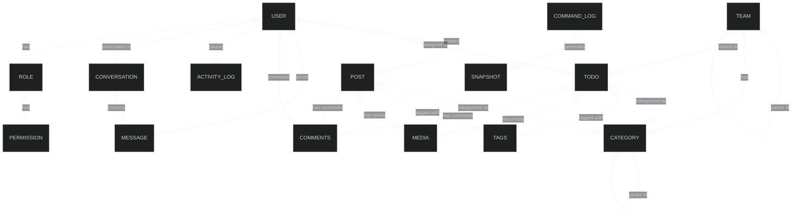

# TAD Database Schema (Dark Mode)

```mermaid
%%{init: {'theme': 'dark', 'themeVariables': { 'primaryColor': '#2c3e50', 'primaryTextColor': '#ecf0f1', 'primaryBorderColor': '#7f8c8d', 'lineColor': '#ecf0f1', 'secondaryColor': '#34495e', 'tertiaryColor': '#282c34' }}}%%
erDiagram
    USER ||--o{ POST : "authors"
    USER ||--o{ TODO : "assigned to"
    USER ||--o{ MESSAGE : "sends"
    USER ||--o{ COMMENTS : "comments"
    USER ||--o{ ACTIVITY_LOG : "causer"
    USER }o--o{ CONVERSATION : "participates in"
    USER }|..|{ ROLE : "has"

    TEAM ||--o{ TEAM : "parent of"
    TEAM ||--|{ CATEGORY : "has"
    TEAM ||--o{ TODO : "related to"

    CATEGORY ||--o{ CATEGORY : "parent of"

    POST }o..o{ CATEGORY : "categorized as"
    POST }o..o{ TAGS : "tagged with"
    POST }o..o{ MEDIA : "has media"
    POST }o..o{ COMMENTS : "has comments"

    TODO }o..o{ CATEGORY : "categorized as"
    TODO }o..o{ TAGS : "tagged with"
    TODO }o..o{ MEDIA : "has media"
    TODO }o..o{ COMMENTS : "has comments"

    CONVERSATION ||--o{ MESSAGE : "contains"

    ROLE }|..|{ PERMISSION : "has"

    COMMAND_LOG ||--o{ SNAPSHOT : "generates"
```
