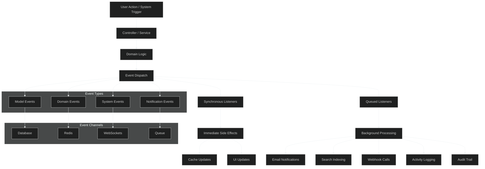

# TAD Event Flow (Dark Mode)

```mermaid
%%{init: {'theme': 'dark', 'themeVariables': { 'primaryColor': '#2c3e50', 'primaryTextColor': '#ecf0f1', 'primaryBorderColor': '#7f8c8d', 'lineColor': '#ecf0f1', 'secondaryColor': '#34495e', 'tertiaryColor': '#282c34' }}}%%
flowchart TD
    A[User Action / System Trigger] --> B[Controller / Service]
    B --> C[Domain Logic]
    C --> D[Event Dispatch]
    
    D --> E1[Synchronous Listeners]
    D --> E2[Queued Listeners]
    
    E1 --> F1[Immediate Side Effects]
    E2 --> F2[Background Processing]
    
    F1 --> G1[Cache Updates]
    F1 --> G2[UI Updates]
    
    F2 --> H1[Email Notifications]
    F2 --> H2[Search Indexing]
    F2 --> H3[Webhook Calls]
    F2 --> H4[Activity Logging]
    F2 --> H5[Audit Trail]
    
    subgraph "Event Types"
        I1[Model Events]
        I2[Domain Events]
        I3[System Events]
        I4[Notification Events]
    end
    
    subgraph "Event Channels"
        J1[Database]
        J2[Redis]
        J3[WebSockets]
        J4[Queue]
    end
    
    D --> I1
    D --> I2
    D --> I3
    D --> I4
    
    I1 --> J1
    I2 --> J2
    I3 --> J3
    I4 --> J4
```
