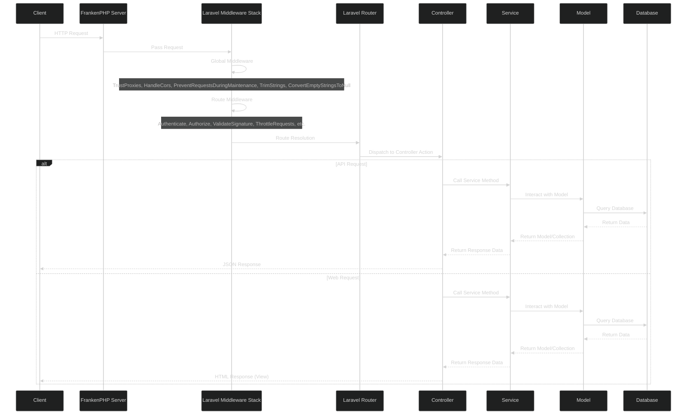

# TAD Request Lifecycle (Dark Mode)

```mermaid
%%{init: {'theme': 'dark', 'themeVariables': { 'primaryColor': '#2c3e50', 'primaryTextColor': '#ecf0f1', 'primaryBorderColor': '#7f8c8d', 'lineColor': '#ecf0f1', 'secondaryColor': '#34495e', 'tertiaryColor': '#282c34' }}}%%
sequenceDiagram
    participant Client
    participant Server as FrankenPHP Server
    participant Middleware as Laravel Middleware Stack
    participant Router as Laravel Router
    participant Controller
    participant Service
    participant Model
    participant DB as Database
    
    Client->>Server: HTTP Request
    Server->>Middleware: Pass Request
    
    Middleware->>Middleware: Global Middleware
    Note over Middleware: TrustProxies, HandleCors, PreventRequestsDuringMaintenance, TrimStrings, ConvertEmptyStringsToNull
    
    Middleware->>Middleware: Route Middleware
    Note over Middleware: Authenticate, Authorize, ValidateSignature, ThrottleRequests, etc.
    
    Middleware->>Router: Route Resolution
    Router->>Controller: Dispatch to Controller Action
    
    alt API Request
        Controller->>Service: Call Service Method
        Service->>Model: Interact with Model
        Model->>DB: Query Database
        DB-->>Model: Return Data
        Model-->>Service: Return Model/Collection
        Service-->>Controller: Return Response Data
        Controller-->>Client: JSON Response
    else Web Request
        Controller->>Service: Call Service Method
        Service->>Model: Interact with Model
        Model->>DB: Query Database
        DB-->>Model: Return Data
        Model-->>Service: Return Model/Collection
        Service-->>Controller: Return Response Data
        Controller-->>Client: HTML Response (View)
    end
```
