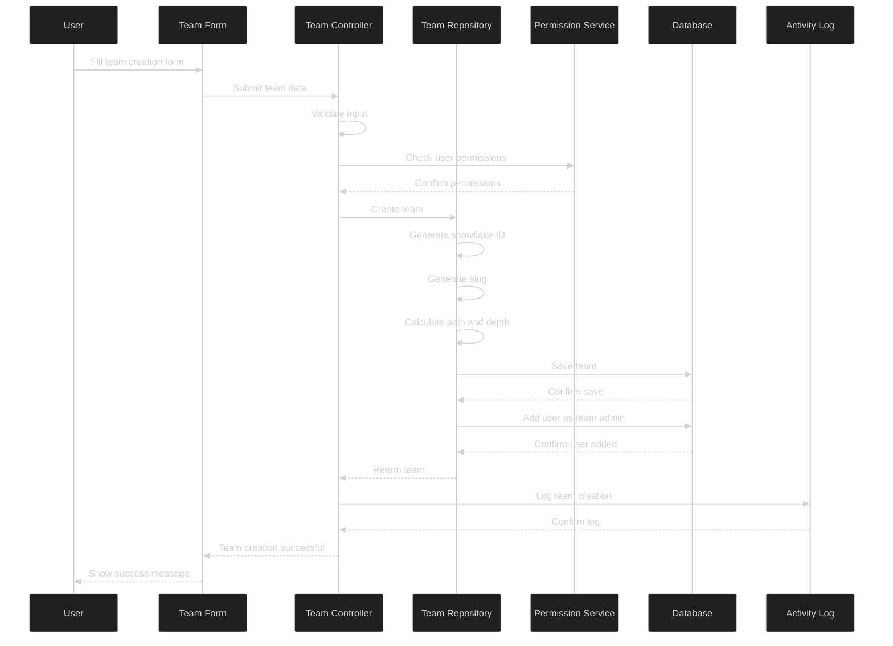

# Team Creation Sequence (Dark Mode)

```mermaid
%%{init: {'theme': 'dark', 'themeVariables': { 'primaryColor': '#2c3e50', 'primaryTextColor': '#ecf0f1', 'primaryBorderColor': '#7f8c8d', 'lineColor': '#ecf0f1', 'secondaryColor': '#34495e', 'tertiaryColor': '#282c34' }}}%%
sequenceDiagram
    participant User as User
    participant TeamForm as Team Form
    participant TeamController as Team Controller
    participant TeamRepository as Team Repository
    participant PermissionService as Permission Service
    participant Database as Database
    participant ActivityLog as Activity Log

    User->>TeamForm: Fill team creation form
    TeamForm->>TeamController: Submit team data
    TeamController->>TeamController: Validate input
    TeamController->>PermissionService: Check user permissions
    PermissionService-->>TeamController: Confirm permissions
    TeamController->>TeamRepository: Create team
    TeamRepository->>TeamRepository: Generate snowflake ID
    TeamRepository->>TeamRepository: Generate slug
    TeamRepository->>TeamRepository: Calculate path and depth
    TeamRepository->>Database: Save team
    Database-->>TeamRepository: Confirm save
    TeamRepository->>Database: Add user as team admin
    Database-->>TeamRepository: Confirm user added
    TeamRepository-->>TeamController: Return team
    TeamController->>ActivityLog: Log team creation
    ActivityLog-->>TeamController: Confirm log
    TeamController-->>TeamForm: Team creation successful
    TeamForm-->>User: Show success message
```
