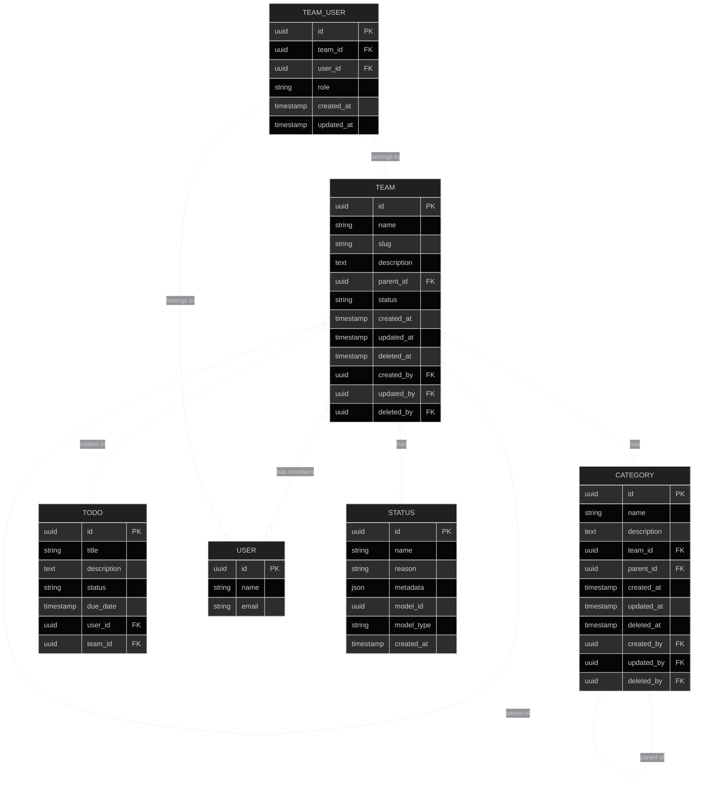

```mermaid
%%{init: {'theme': 'dark', 'themeVariables': { 'primaryColor': '#2c3e50', 'primaryTextColor': '#ecf0f1', 'primaryBorderColor': '#7f8c8d', 'lineColor': '#ecf0f1', 'secondaryColor': '#34495e', 'tertiaryColor': '#282c34' }}}%%
erDiagram
    TEAM ||--o{ TEAM : "parent of"
    TEAM ||--|{ CATEGORY : "has"
    TEAM ||--o{ TODO : "related to"
    TEAM }o--o{ USER : "has members"
    TEAM ||--o{ STATUS : "has"
    
    TEAM {
        uuid id PK
        string name
        string slug
        text description
        uuid parent_id FK
        string status
        timestamp created_at
        timestamp updated_at
        timestamp deleted_at
        uuid created_by FK
        uuid updated_by FK
        uuid deleted_by FK
    }
    
    TEAM_USER }|--|| USER : "belongs to"
    TEAM_USER }|--|| TEAM : "belongs to"
    TEAM_USER {
        uuid id PK
        uuid team_id FK
        uuid user_id FK
        string role
        timestamp created_at
        timestamp updated_at
    }
    
    CATEGORY ||--o{ CATEGORY : "parent of"
    CATEGORY {
        uuid id PK
        string name
        text description
        uuid team_id FK
        uuid parent_id FK
        timestamp created_at
        timestamp updated_at
        timestamp deleted_at
        uuid created_by FK
        uuid updated_by FK
        uuid deleted_by FK
    }
    
    STATUS {
        uuid id PK
        string name
        string reason
        json metadata
        uuid model_id
        string model_type
        timestamp created_at
    }
    
    USER {
        uuid id PK
        string name
        string email
    }
    
    TODO {
        uuid id PK
        string title
        text description
        string status
        timestamp due_date
        uuid user_id FK
        uuid team_id FK
    }
```
