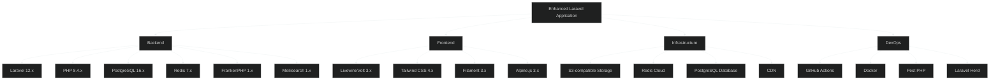

# Technology Stack (Dark Mode)

```mermaid
%%{init: {'theme': 'dark', 'themeVariables': { 'primaryColor': '#2c3e50', 'primaryTextColor': '#ecf0f1', 'primaryBorderColor': '#7f8c8d', 'lineColor': '#ecf0f1', 'secondaryColor': '#34495e', 'tertiaryColor': '#282c34' }}}%%
graph TD
    A[Enhanced Laravel Application] --> B[Backend]
    A --> C[Frontend]
    A --> D[Infrastructure]
    A --> E[DevOps]

    B --> B1[Laravel 12.x]
    B --> B2[PHP 8.4.x]
    B --> B3[PostgreSQL 16.x]
    B --> B4[Redis 7.x]
    B --> B5[FrankenPHP 1.x]
    B --> B6[Meilisearch 1.x]

    C --> C1[Livewire/Volt 3.x]
    C --> C2[Tailwind CSS 4.x]
    C --> C3[Filament 3.x]
    C --> C4[Alpine.js 3.x]

    D --> D1[S3-compatible Storage]
    D --> D2[Redis Cloud]
    D --> D3[PostgreSQL Database]
    D --> D4[CDN]

    E --> E1[GitHub Actions]
    E --> E2[Docker]
    E --> E3[Pest PHP]
    E --> E4[Laravel Herd]

```
