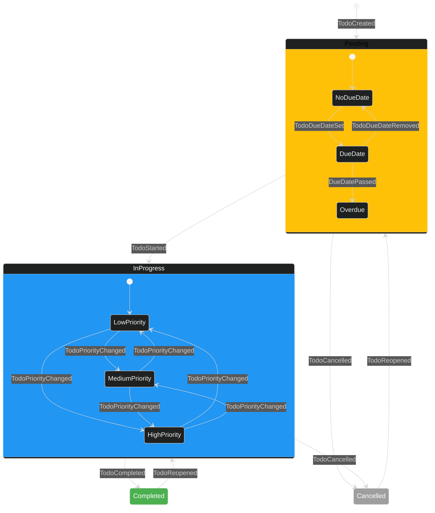

# Todo State Transitions (Dark Mode)

**Type:** State Diagram
**Created:** 2025-06-10
**Updated:** 2025-06-10
**Author:** AI Assistant

## Description

This diagram illustrates the state transitions for the Todo aggregate, showing how a todo item moves through different states based on events.

## Diagram Source

## Related Documents

- [event-sourcing-guide.md](../../event-sourcing-guide.md)
- [100-350-event-sourcing-implementation.md](../../100-implementation-plan/100-350-event-sourcing-implementation.md)

## Version History

| Version | Date | Changes | Author |
|---------|------|---------|--------|
| 1.0.0 | 2025-06-10 | Initial version | AI Assistant |
