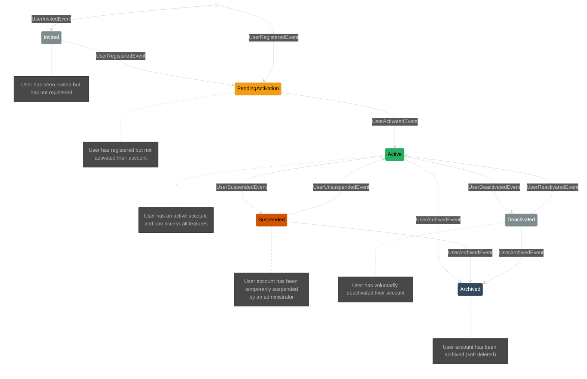

# User Aggregate States (Dark Mode)

```mermaid
%%{init: {'theme': 'dark', 'themeVariables': { 'primaryColor': '#2c3e50', 'primaryTextColor': '#ecf0f1', 'primaryBorderColor': '#7f8c8d', 'lineColor': '#ecf0f1', 'secondaryColor': '#34495e', 'tertiaryColor': '#282c34' }}}%%
stateDiagram-v2
    [*] --> Invited: UserInvitedEvent
    Invited --> PendingActivation: UserRegisteredEvent
    [*] --> PendingActivation: UserRegisteredEvent
    PendingActivation --> Active: UserActivatedEvent
    Active --> Suspended: UserSuspendedEvent
    Suspended --> Active: UserUnsuspendedEvent
    Active --> Deactivated: UserDeactivatedEvent
    Deactivated --> Active: UserReactivatedEvent
    Active --> Archived: UserArchivedEvent
    Suspended --> Archived: UserArchivedEvent
    Deactivated --> Archived: UserArchivedEvent

    %% State styling with classes
    classDef invitedState fill:#7F8C8D,stroke:#ecf0f1,color:white
    classDef pendingState fill:#F39C12,stroke:#ecf0f1,color:black
    classDef activeState fill:#27AE60,stroke:#ecf0f1,color:black
    classDef suspendedState fill:#D35400,stroke:#ecf0f1,color:black
    classDef deactivatedState fill:#7F8C8D,stroke:#ecf0f1,color:white
    classDef archivedState fill:#34495E,stroke:#ecf0f1,color:white

    class Invited invitedState
    class PendingActivation pendingState
    class Active activeState
    class Suspended suspendedState
    class Deactivated deactivatedState
    class Archived archivedState

    %% Notes
    note right of Invited
        User has been invited but has not registered
    end note

    note right of PendingActivation
        User has registered but not activated their account
    end note

    note right of Active
        User has an active account and can access all features
    end note

    note right of Suspended
        User account has been temporarily suspended
        by an administrator
    end note

    note right of Deactivated
        User has voluntarily deactivated their account
    end note

    note right of Archived
        User account has been archived (soft deleted)
    end note
```
