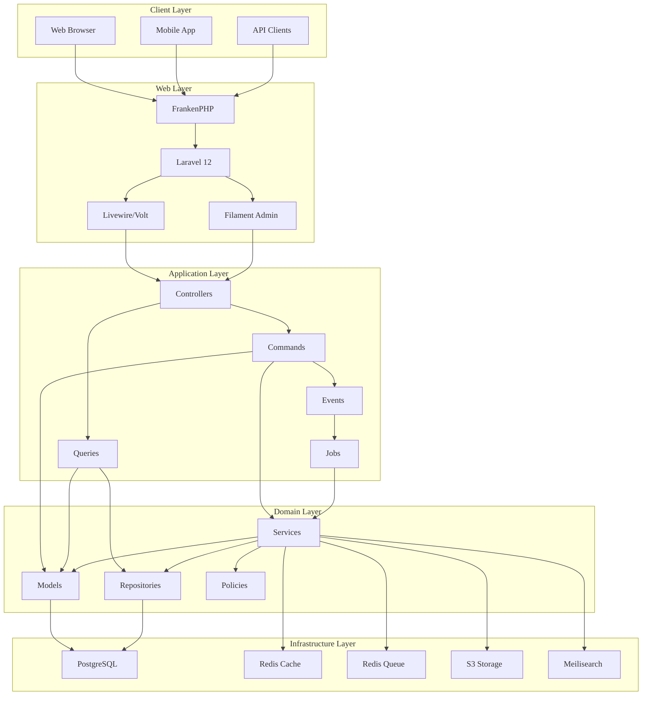

# Architecture Overview (Light Mode)

**Version:** 1.1.0
**Date:** 2025-05-20
**Author:** AI Assistant
**Status:** Updated

## Description

This diagram illustrates the high-level architecture of the Enhanced Laravel Application, showing the relationships between different components from the client layer through to the infrastructure layer.

## Diagram

## Alternative Text

This architecture diagram shows the layered structure of the Enhanced Laravel Application. It consists of:

1. **Client Layer**: Contains Web Browser, Mobile App, and API Clients that interact with the server.
2. **Web Layer**: Contains FrankenPHP, Laravel 12, Livewire/Volt, and Filament Admin components that handle HTTP requests and user interfaces.
3. **Application Layer**: Contains Controllers, Commands, Queries, Events, and Jobs that implement application logic.
4. **Domain Layer**: Contains Models, Services, Repositories, and Policies that implement domain logic.
5. **Infrastructure Layer**: Contains PostgreSQL database, Redis Cache, Redis Queue, S3 Storage, and Meilisearch that provide infrastructure support.

The diagram shows connections between components, illustrating how data flows through the system. For example, Web Browsers send requests to FrankenPHP, which forwards them to Laravel. Controllers handle these requests and use Commands and Queries to interact with the domain layer. The domain layer interacts with the infrastructure layer to persist and retrieve data.

## Version History

<h4 style="margin-top: 0; color: #111;">Document History</h4>

\n
\n
Table Details
\n\n| Version | Date | Changes | Author |
| --- | --- | --- | --- |
| 1.1.0 | 2025-05-20 | Updated formatting for high contrast and accessibility, added metadata and alternative text | AI Assistant |
| 1.0.0 | 2025-05-10 | Initial version | AI Assistant |
\n
\n

