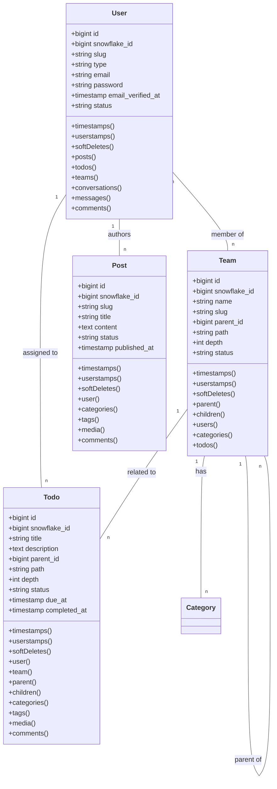

# Class Diagram (Light Mode)

```mermaid
%%{init: {'theme': 'default', 'themeVariables': { 'primaryColor': '#f5f5f5', 'primaryTextColor': '#333333', 'primaryBorderColor': '#cccccc', 'lineColor': '#666666', 'secondaryColor': '#f0f0f0', 'tertiaryColor': '#ffffff' }}}%%
classDiagram
    class User {
        +bigint id
        +bigint snowflake_id
        +string slug
        +string type
        +string email
        +string password
        +timestamp email_verified_at
        +string status
        +timestamps()
        +userstamps()
        +softDeletes()
        +posts()
        +todos()
        +teams()
        +conversations()
        +messages()
        +comments()
    }

    class Team {
        +bigint id
        +bigint snowflake_id
        +string name
        +string slug
        +bigint parent_id
        +string path
        +int depth
        +string status
        +timestamps()
        +userstamps()
        +softDeletes()
        +parent()
        +children()
        +users()
        +categories()
        +todos()
    }

    class Post {
        +bigint id
        +bigint snowflake_id
        +string slug
        +string title
        +text content
        +string status
        +timestamp published_at
        +timestamps()
        +userstamps()
        +softDeletes()
        +user()
        +categories()
        +tags()
        +media()
        +comments()
    }

    class Todo {
        +bigint id
        +bigint snowflake_id
        +string title
        +text description
        +bigint parent_id
        +string path
        +int depth
        +string status
        +timestamp due_at
        +timestamp completed_at
        +timestamps()
        +userstamps()
        +softDeletes()
        +user()
        +team()
        +parent()
        +children()
        +categories()
        +tags()
        +media()
        +comments()
    }

    User "1" -- "n" Post : authors
    User "1" -- "n" Todo : assigned to
    User "n" -- "n" Team : member of
    Team "1" -- "n" Team : parent of
    Team "1" -- "n" Category : has
    Team "1" -- "n" Todo : related to
```
