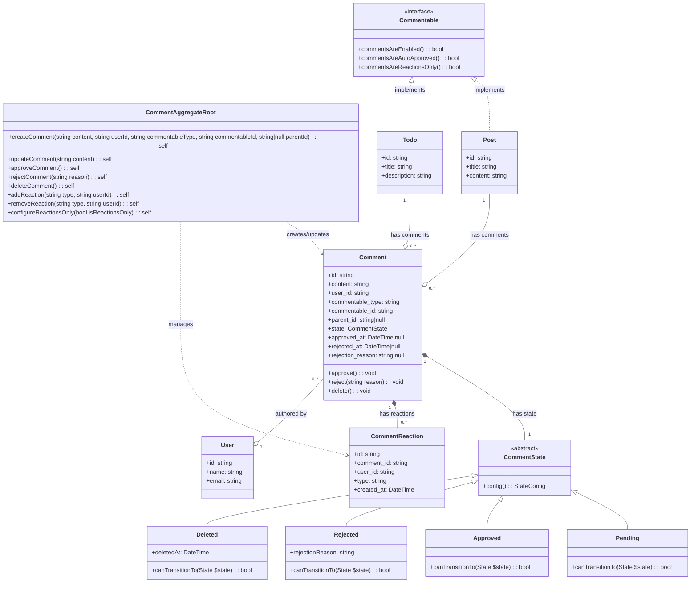

# Comment Reaction Structure (Light Mode)

```mermaid
%%{init: {'theme': 'default', 'themeVariables': { 'primaryColor': '#f5f5f5', 'primaryTextColor': '#333333', 'primaryBorderColor': '#cccccc', 'lineColor': '#666666', 'secondaryColor': '#f0f0f0', 'tertiaryColor': '#ffffff' }}}%%
classDiagram
    class Commentable {
        <<interface>>
        +commentsAreEnabled(): bool
        +commentsAreAutoApproved(): bool
        +commentsAreReactionsOnly(): bool
    }
    
    class CommentState {
        <<abstract>>
        +config(): StateConfig
    }
    
    class Pending {
        +canTransitionTo(State $state): bool
    }
    
    class Approved {
        +canTransitionTo(State $state): bool
    }
    
    class Rejected {
        +canTransitionTo(State $state): bool
        +rejectionReason: string
    }
    
    class Deleted {
        +canTransitionTo(State $state): bool
        +deletedAt: DateTime
    }
    
    class Comment {
        +id: string
        +content: string
        +user_id: string
        +commentable_type: string
        +commentable_id: string
        +parent_id: string|null
        +state: CommentState
        +approved_at: DateTime|null
        +rejected_at: DateTime|null
        +rejection_reason: string|null
        +approve(): void
        +reject(string reason): void
        +delete(): void
    }
    
    class CommentReaction {
        +id: string
        +comment_id: string
        +user_id: string
        +type: string
        +created_at: DateTime
    }
    
    class CommentAggregateRoot {
        +createComment(string content, string userId, string commentableType, string commentableId, string|null parentId): self
        +updateComment(string content): self
        +approveComment(): self
        +rejectComment(string reason): self
        +deleteComment(): self
        +addReaction(string type, string userId): self
        +removeReaction(string type, string userId): self
        +configureReactionsOnly(bool isReactionsOnly): self
    }
    
    class User {
        +id: string
        +name: string
        +email: string
    }
    
    class Post {
        +id: string
        +title: string
        +content: string
    }
    
    class Todo {
        +id: string
        +title: string
        +description: string
    }
    
    CommentState <|-- Pending
    CommentState <|-- Approved
    CommentState <|-- Rejected
    CommentState <|-- Deleted
    
    Comment "1" *-- "1" CommentState : has state
    Comment "1" *-- "0..*" CommentReaction : has reactions
    Comment "0..*" --o "1" User : authored by
    
    CommentAggregateRoot ..> Comment : creates/updates
    CommentAggregateRoot ..> CommentReaction : manages
    
    Commentable <|.. Post : implements
    Commentable <|.. Todo : implements
    
    Post "1" --o "0..*" Comment : has comments
    Todo "1" --o "0..*" Comment : has comments
```
