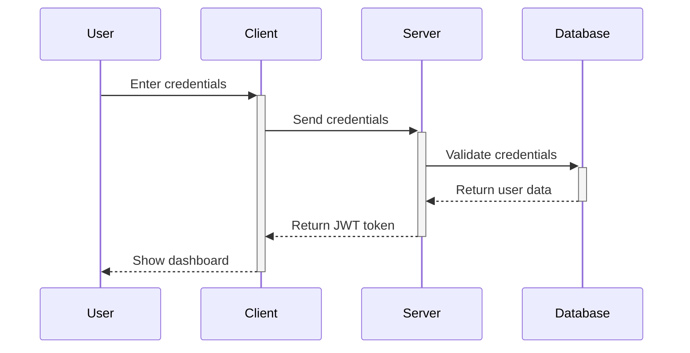

# Documentation Components (Light Mode)

```mermaid
%%{init: {'theme': 'default', 'themeVariables': { 'primaryColor': '#f5f5f5', 'primaryTextColor': '#333333', 'primaryBorderColor': '#cccccc', 'lineColor': '#666666', 'secondaryColor': '#f0f0f0', 'tertiaryColor': '#ffffff' }}}%%
sequenceDiagram
    User->>+Client: Enter credentials
    Client->>+Server: Send credentials
    Server->>+Database: Validate credentials
    Database-->>-Server: Return user data
    Server-->>-Client: Return JWT token
    Client-->>-User: Show dashboard
```
