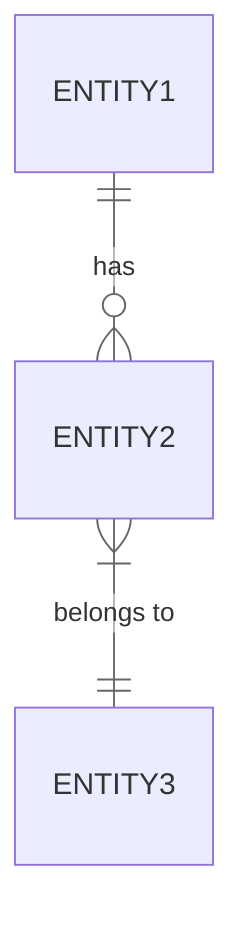

# Documentation Workflow (Light Mode)

```mermaid
%%{init: {'theme': 'default', 'themeVariables': { 'primaryColor': '#f5f5f5', 'primaryTextColor': '#333333', 'primaryBorderColor': '#cccccc', 'lineColor': '#666666', 'secondaryColor': '#f0f0f0', 'tertiaryColor': '#ffffff' }}}%%
erDiagram
    ENTITY1 ||--o{ ENTITY2 : has
    ENTITY2 }|--|| ENTITY3 : "belongs to"
```
