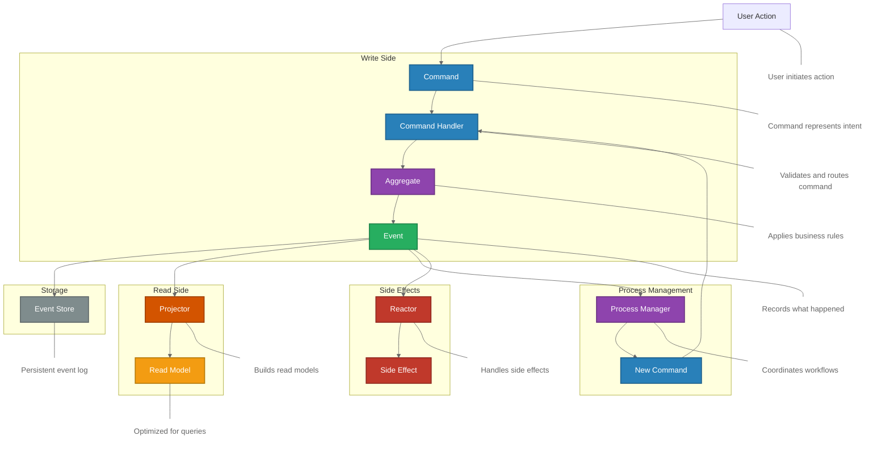

# Event Sourcing Flow Enhanced (Light Mode)

```mermaid
%%{init: {'theme': 'default', 'themeVariables': { 'primaryColor': '#f5f5f5', 'primaryTextColor': '#333333', 'primaryBorderColor': '#cccccc', 'lineColor': '#666666', 'secondaryColor': '#f0f0f0', 'tertiaryColor': '#ffffff' }}}%%
graph TD
    %% Main components
    A[User Action] --> B[Command]
    B --> C[Command Handler]
    C --> D[Aggregate]
    D --> E[Event]
    E --> F[Event Store]
    E --> G[Projector]
    G --> H[Read Model]
    E --> I[Process Manager]
    I --> J[New Command]
    J --> C
    E --> K[Reactor]
    K --> L[Side Effect]
    
    %% Component styling
    style B fill:#2980B9,stroke:#1F618D,color:white,stroke-width:2px
    style C fill:#2980B9,stroke:#1F618D,color:white,stroke-width:2px
    style D fill:#8E44AD,stroke:#6C3483,color:white,stroke-width:2px
    style E fill:#27AE60,stroke:#1E8449,color:white,stroke-width:2px
    style F fill:#7F8C8D,stroke:#616A6B,color:white,stroke-width:2px
    style G fill:#D35400,stroke:#A04000,color:white,stroke-width:2px
    style H fill:#F39C12,stroke:#B67B0B,color:white,stroke-width:2px
    style I fill:#8E44AD,stroke:#6C3483,color:white,stroke-width:2px
    style J fill:#2980B9,stroke:#1F618D,color:white,stroke-width:2px
    style K fill:#C0392B,stroke:#922B21,color:white,stroke-width:2px
    style L fill:#C0392B,stroke:#922B21,color:white,stroke-width:2px
    
    %% Subgraphs for logical grouping
    subgraph "Write Side"
        B
        C
        D
        E
    end
    
    subgraph "Storage"
        F
    end
    
    subgraph "Read Side"
        G
        H
    end
    
    subgraph "Process Management"
        I
        J
    end
    
    subgraph "Side Effects"
        K
        L
    end
    
    %% Annotations
    classDef annotation fill:none,stroke:none,color:#666
    
    A1[User initiates action]:::annotation
    B1[Command represents intent]:::annotation
    C1[Validates and routes command]:::annotation
    D1[Applies business rules]:::annotation
    E1[Records what happened]:::annotation
    F1[Persistent event log]:::annotation
    G1[Builds read models]:::annotation
    H1[Optimized for queries]:::annotation
    I1[Coordinates workflows]:::annotation
    K1[Handles side effects]:::annotation
    
    A --- A1
    B --- B1
    C --- C1
    D --- D1
    E --- E1
    F --- F1
    G --- G1
    H --- H1
    I --- I1
    K --- K1
```
