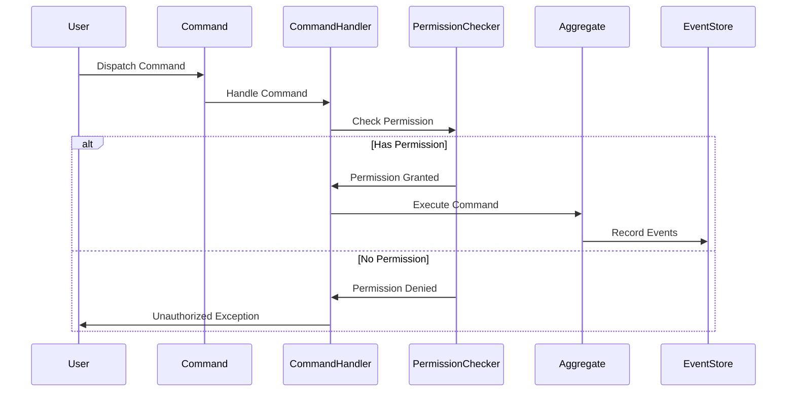

# Event Sourcing Permissions (Light Mode)

```mermaid
%%{init: {'theme': 'default', 'themeVariables': { 'primaryColor': '#f5f5f5', 'primaryTextColor': '#333333', 'primaryBorderColor': '#cccccc', 'lineColor': '#666666', 'secondaryColor': '#f0f0f0', 'tertiaryColor': '#ffffff' }}}%%
sequenceDiagram
    participant User
    participant Command
    participant CommandHandler
    participant PermissionChecker
    participant Aggregate
    participant EventStore
    
    User->>Command: Dispatch Command
    Command->>CommandHandler: Handle Command
    CommandHandler->>PermissionChecker: Check Permission
    alt Has Permission
        PermissionChecker->>CommandHandler: Permission Granted
        CommandHandler->>Aggregate: Execute Command
        Aggregate->>EventStore: Record Events
    else No Permission
        PermissionChecker->>CommandHandler: Permission Denied
        CommandHandler->>User: Unauthorized Exception
    end
```
