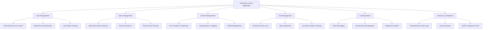

# Executive Summary Features (Light Mode)

```mermaid
%%{init: {'theme': 'default', 'themeVariables': { 'primaryColor': '#f5f5f5', 'primaryTextColor': '#333333', 'primaryBorderColor': '#cccccc', 'lineColor': '#666666', 'secondaryColor': '#f0f0f0', 'tertiaryColor': '#ffffff' }}}%%
graph TD
    A[Enhanced Laravel Application] --> B[User Management]
    A --> C[Team Management]
    A --> D[Content Management]
    A --> E[Task Management]
    A --> F[Communication]
    A --> G[Security & Compliance]
    
    B --> B1[Role-based Access Control]
    B --> B2[Multi-factor Authentication]
    B --> B3[User Status Tracking]
    
    C --> C1[Hierarchical Team Structure]
    C --> C2[Team Permissions]
    C --> C3[Team Activity Tracking]
    
    D --> D1[Post Creation & Publishing]
    D --> D2[Categorization & Tagging]
    D --> D3[Media Management]
    
    E --> E1[Hierarchical Todo Lists]
    E --> E2[Task Assignment]
    E --> E3[Due Date & Status Tracking]
    
    F --> F1[Team Messaging]
    F --> F2[Conversation Management]
    F --> F3[Notification System]
    
    G --> G1[Comprehensive Audit Logs]
    G --> G2[Data Encryption]
    G --> G3[GDPR Compliance Tools]
```
