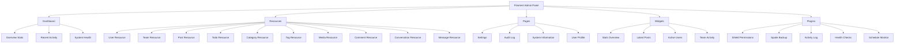

# Filament Admin Panel (Light Mode)

```mermaid
%%{init: {'theme': 'default', 'themeVariables': { 'primaryColor': '#f5f5f5', 'primaryTextColor': '#333333', 'primaryBorderColor': '#cccccc', 'lineColor': '#666666', 'secondaryColor': '#f0f0f0', 'tertiaryColor': '#ffffff' }}}%%
graph TD
    A[Filament Admin Panel] --> B[Dashboard]
    A --> C[Resources]
    A --> D[Pages]
    A --> E[Widgets]
    A --> F[Plugins]

    B --> B1[Overview Stats]
    B --> B2[Recent Activity]
    B --> B3[System Health]

    C --> C1[User Resource]
    C --> C2[Team Resource]
    C --> C3[Post Resource]
    C --> C4[Todo Resource]
    C --> C5[Category Resource]
    C --> C6[Tag Resource]
    C --> C7[Media Resource]
    C --> C8[Comment Resource]
    C --> C9[Conversation Resource]
    C --> C10[Message Resource]

    D --> D1[Settings]
    D --> D2[Audit Log]
    D --> D3[System Information]
    D --> D4[User Profile]

    E --> E1[Stats Overview]
    E --> E2[Latest Posts]
    E --> E3[Active Users]
    E --> E4[Team Activity]

    F --> F1[Shield Permissions]
    F --> F2[Spatie Backup]
    F --> F3[Activity Log]
    F --> F4[Health Checks]
    F --> F5[Schedule Monitor]
```
