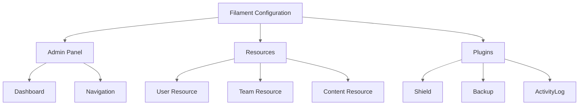

```mermaid
%%{init: {'theme': 'default', 'themeVariables': { 'primaryColor': '#f5f5f5', 'primaryTextColor': '#333333', 'primaryBorderColor': '#cccccc', 'lineColor': '#666666', 'secondaryColor': '#f0f0f0', 'tertiaryColor': '#ffffff' }}}%%
graph TD
    A[Filament Configuration] --> B[Admin Panel]
    A --> C[Resources]
    A --> D[Plugins]
    B --> E[Dashboard]
    B --> F[Navigation]
    C --> G[User Resource]
    C --> H[Team Resource]
    C --> I[Content Resource]
    D --> J[Shield]
    D --> K[Backup]
    D --> L[ActivityLog]
```
