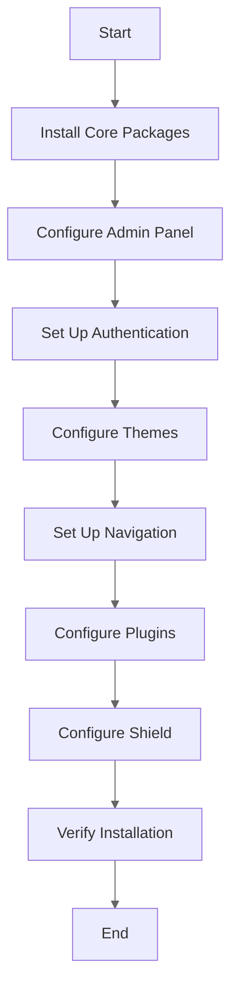

# Filament Installation Process (Light Mode)

```mermaid
%%{init: {'theme': 'default', 'themeVariables': { 'primaryColor': '#f5f5f5', 'primaryTextColor': '#333333', 'primaryBorderColor': '#cccccc', 'lineColor': '#666666', 'secondaryColor': '#f0f0f0', 'tertiaryColor': '#ffffff' }}}%%
flowchart TD
    A[Start] --> B[Install Core Packages]
    B --> C[Configure Admin Panel]
    C --> D[Set Up Authentication]
    D --> E[Configure Themes]
    E --> F[Set Up Navigation]
    F --> G[Configure Plugins]
    G --> H[Configure Shield]
    H --> I[Verify Installation]
    I --> J[End]
```
