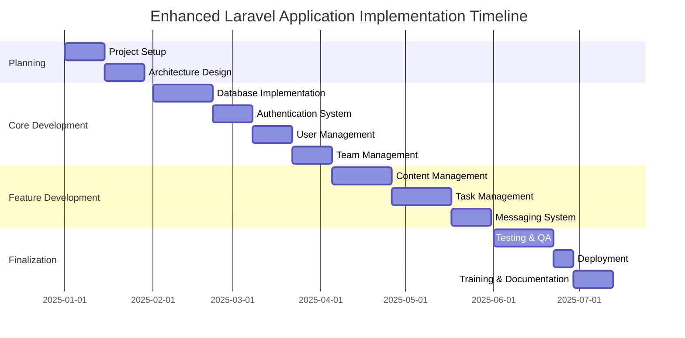

# Implementation Timeline (Light Mode)

```mermaid
%%{init: {'theme': 'default', 'themeVariables': { 'primaryColor': '#f5f5f5', 'primaryTextColor': '#333333', 'primaryBorderColor': '#cccccc', 'lineColor': '#666666', 'secondaryColor': '#f0f0f0', 'tertiaryColor': '#ffffff' }}}%%
gantt
    title Enhanced Laravel Application Implementation Timeline
    dateFormat  YYYY-MM-DD
    section Planning
    Project Setup           :2025-01-01, 2w
    Architecture Design     :2025-01-15, 2w
    section Core Development
    Database Implementation :2025-02-01, 3w
    Authentication System   :2025-02-22, 2w
    User Management         :2025-03-08, 2w
    Team Management         :2025-03-22, 2w
    section Feature Development
    Content Management      :2025-04-05, 3w
    Task Management         :2025-04-26, 3w
    Messaging System        :2025-05-17, 2w
    section Finalization
    Testing & QA            :2025-06-01, 3w
    Deployment              :2025-06-22, 1w
    Training & Documentation:2025-06-29, 2w
```
