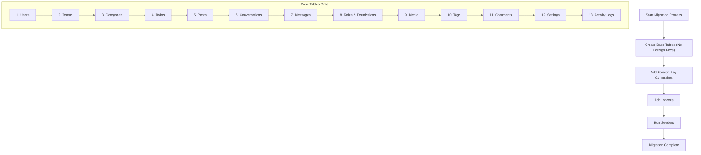

# Migration Sequence (Light Mode)

```mermaid
%%{init: {'theme': 'default', 'themeVariables': { 'primaryColor': '#f5f5f5', 'primaryTextColor': '#333333', 'primaryBorderColor': '#cccccc', 'lineColor': '#666666', 'secondaryColor': '#f0f0f0', 'tertiaryColor': '#ffffff' }}}%%
flowchart TD
    A["Start Migration Process"] --> B["Create Base Tables (No Foreign Keys)"]
    B --> C["Add Foreign Key Constraints"]
    C --> D["Add Indexes"]
    D --> E["Run Seeders"]
    E --> F["Migration Complete"]

    subgraph "Base Tables Order"
        B1["1. Users"] --> B2["2. Teams"] --> B3["3. Categories"] --> B4["4. Todos"]
        B4 --> B5["5. Posts"] --> B6["6. Conversations"] --> B7["7. Messages"]
        B7 --> B8["8. Roles & Permissions"] --> B9["9. Media"] --> B10["10. Tags"]
        B10 --> B11["11. Comments"] --> B12["12. Settings"] --> B13["13. Activity Logs"]
    end
```
