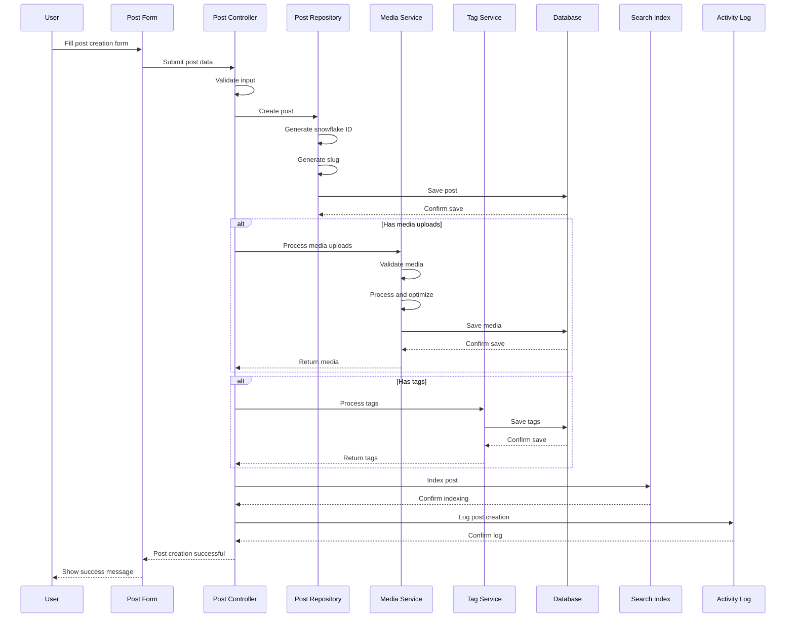

# Post Creation Sequence (Light Mode)

```mermaid
%%{init: {'theme': 'default', 'themeVariables': { 'primaryColor': '#f5f5f5', 'primaryTextColor': '#333333', 'primaryBorderColor': '#cccccc', 'lineColor': '#666666', 'secondaryColor': '#f0f0f0', 'tertiaryColor': '#ffffff' }}}%%
sequenceDiagram
    participant User as User
    participant PostForm as Post Form
    participant PostController as Post Controller
    participant PostRepository as Post Repository
    participant MediaService as Media Service
    participant TagService as Tag Service
    participant Database as Database
    participant SearchIndex as Search Index
    participant ActivityLog as Activity Log

    User->>PostForm: Fill post creation form
    PostForm->>PostController: Submit post data
    PostController->>PostController: Validate input
    PostController->>PostRepository: Create post
    PostRepository->>PostRepository: Generate snowflake ID
    PostRepository->>PostRepository: Generate slug
    PostRepository->>Database: Save post
    Database-->>PostRepository: Confirm save
    
    alt Has media uploads
        PostController->>MediaService: Process media uploads
        MediaService->>MediaService: Validate media
        MediaService->>MediaService: Process and optimize
        MediaService->>Database: Save media
        Database-->>MediaService: Confirm save
        MediaService-->>PostController: Return media
    end
    
    alt Has tags
        PostController->>TagService: Process tags
        TagService->>Database: Save tags
        Database-->>TagService: Confirm save
        TagService-->>PostController: Return tags
    end
    
    PostController->>SearchIndex: Index post
    SearchIndex-->>PostController: Confirm indexing
    PostController->>ActivityLog: Log post creation
    ActivityLog-->>PostController: Confirm log
    PostController-->>PostForm: Post creation successful
    PostForm-->>User: Show success message
```
