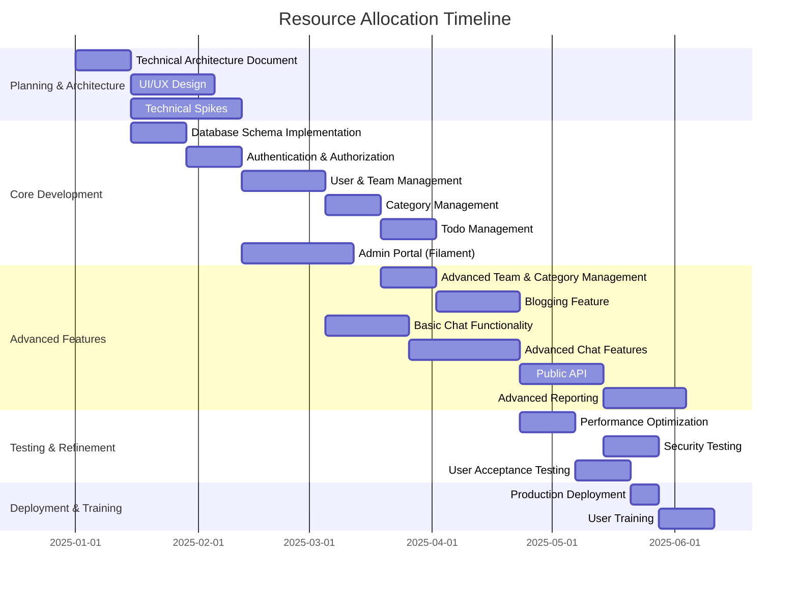

# Project Roadmap (Light Mode)

```mermaid
%%{init: {'theme': 'default', 'themeVariables': { 'primaryColor': '#f5f5f5', 'primaryTextColor': '#333333', 'primaryBorderColor': '#cccccc', 'lineColor': '#666666', 'secondaryColor': '#f0f0f0', 'tertiaryColor': '#ffffff' }}}%%
gantt
    title Resource Allocation Timeline
    dateFormat  YYYY-MM-DD
    section Planning & Architecture
    Technical Architecture Document    :a1, 2025-01-01, 14d
    UI/UX Design                       :a2, after a1, 21d
    Technical Spikes                   :a3, after a1, 28d

    section Core Development
    Database Schema Implementation     :b1, after a1, 14d
    Authentication & Authorization     :b2, after b1, 14d
    User & Team Management             :b3, after b2, 21d
    Category Management                :b4, after b3, 14d
    Todo Management                    :b5, after b4, 14d
    Admin Portal (Filament)            :b6, after b2, 28d

    section Advanced Features
    Advanced Team & Category Management :c1, after b4, 14d
    Blogging Feature                   :c2, after b5, 21d
    Basic Chat Functionality           :c3, after b3, 21d
    Advanced Chat Features             :c4, after c3, 28d
    Public API                         :c5, after c2, 21d
    Advanced Reporting                 :c6, after c5, 21d

    section Testing & Refinement
    Performance Optimization           :d1, after c4, 14d
    Security Testing                   :d2, after c5, 14d
    User Acceptance Testing            :d3, after d1, 14d

    section Deployment & Training
    Production Deployment              :e1, after d3, 7d
    User Training                      :e2, after e1, 14d
```
