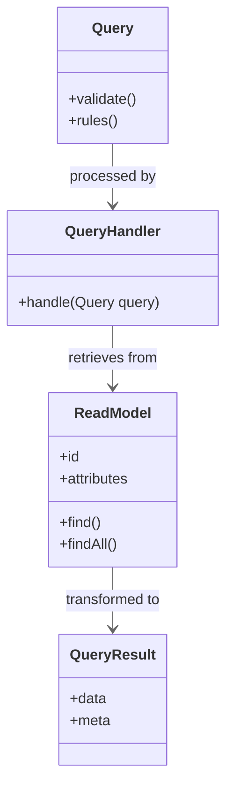

# Query Architecture (Light Mode)

```mermaid
%%{init: {'theme': 'default', 'themeVariables': { 'primaryColor': '#f5f5f5', 'primaryTextColor': '#333333', 'primaryBorderColor': '#cccccc', 'lineColor': '#666666', 'secondaryColor': '#f0f0f0', 'tertiaryColor': '#ffffff' }}}%%
classDiagram
    class Query {
        +validate()
        +rules()
    }
    
    class QueryHandler {
        +handle(Query query)
    }
    
    class ReadModel {
        +id
        +attributes
        +find()
        +findAll()
    }
    
    class QueryResult {
        +data
        +meta
    }
    
    Query --> QueryHandler: processed by
    QueryHandler --> ReadModel: retrieves from
    ReadModel --> QueryResult: transformed to
```
