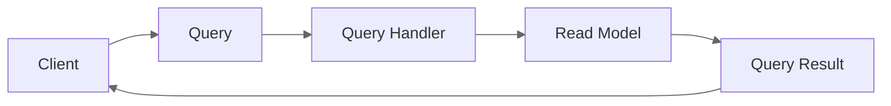

# Query Flow (Light Mode)

```mermaid
%%{init: {'theme': 'default', 'themeVariables': { 'primaryColor': '#f5f5f5', 'primaryTextColor': '#333333', 'primaryBorderColor': '#cccccc', 'lineColor': '#666666', 'secondaryColor': '#f0f0f0', 'tertiaryColor': '#ffffff' }}}%%
flowchart LR
    A[Client] --> B[Query]
    B --> C[Query Handler]
    C --> D[Read Model]
    D --> E[Query Result]
    E --> A
```
