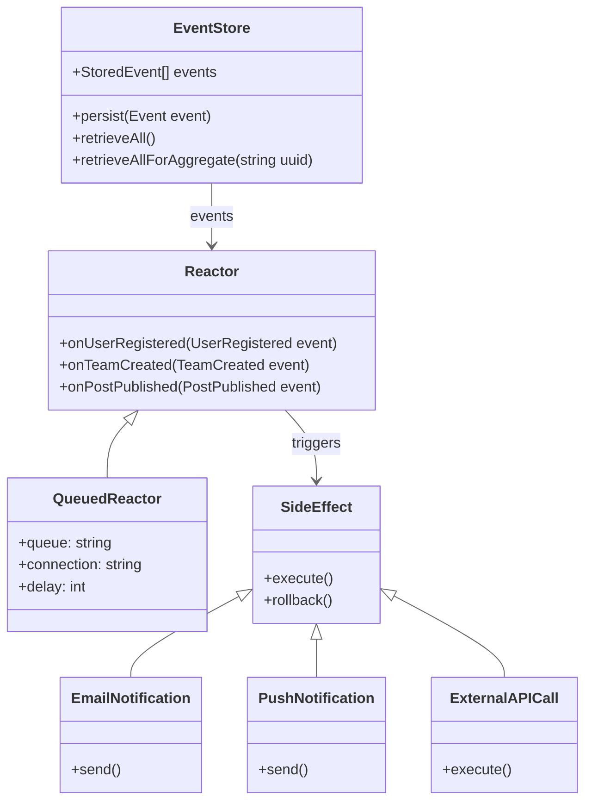

# Reactor Architecture (Light Mode)

```mermaid
%%{init: {'theme': 'default', 'themeVariables': { 'primaryColor': '#f5f5f5', 'primaryTextColor': '#333333', 'primaryBorderColor': '#cccccc', 'lineColor': '#666666', 'secondaryColor': '#f0f0f0', 'tertiaryColor': '#ffffff' }}}%%
classDiagram
    class EventStore {
        +StoredEvent[] events
        +persist(Event event)
        +retrieveAll()
        +retrieveAllForAggregate(string uuid)
    }
    
    class Reactor {
        +onUserRegistered(UserRegistered event)
        +onTeamCreated(TeamCreated event)
        +onPostPublished(PostPublished event)
    }
    
    class QueuedReactor {
        +queue: string
        +connection: string
        +delay: int
    }
    
    class SideEffect {
        +execute()
        +rollback()
    }
    
    class EmailNotification {
        +send()
    }
    
    class PushNotification {
        +send()
    }
    
    class ExternalAPICall {
        +execute()
    }
    
    EventStore --> Reactor: events
    Reactor <|-- QueuedReactor
    Reactor --> SideEffect: triggers
    SideEffect <|-- EmailNotification
    SideEffect <|-- PushNotification
    SideEffect <|-- ExternalAPICall
```
