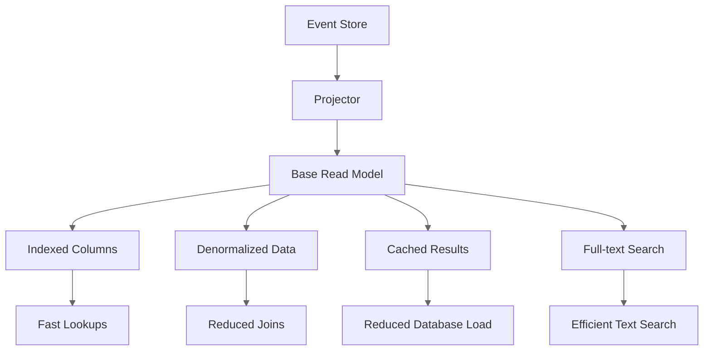

# Read Model Optimization (Light Mode)

```mermaid
%%{init: {'theme': 'default', 'themeVariables': { 'primaryColor': '#f5f5f5', 'primaryTextColor': '#333333', 'primaryBorderColor': '#cccccc', 'lineColor': '#666666', 'secondaryColor': '#f0f0f0', 'tertiaryColor': '#ffffff' }}}%%
flowchart TD
    A[Event Store] --> B[Projector]
    B --> C[Base Read Model]
    C --> D[Indexed Columns]
    C --> E[Denormalized Data]
    C --> F[Cached Results]
    C --> G[Full-text Search]
    D --> H[Fast Lookups]
    E --> I[Reduced Joins]
    F --> J[Reduced Database Load]
    G --> K[Efficient Text Search]
```
