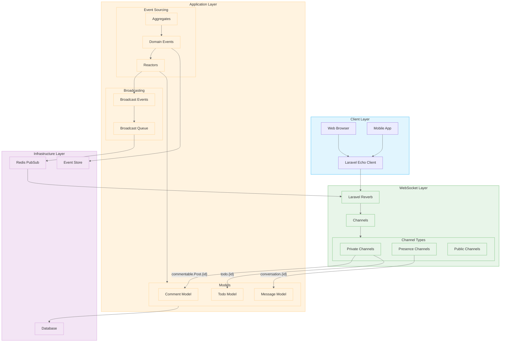

# Realtime Architecture (Light Mode)

```mermaid
%%{init: {'theme': 'default', 'themeVariables': { 'primaryColor': '#f5f5f5', 'primaryTextColor': '#333333', 'primaryBorderColor': '#cccccc', 'lineColor': '#666666', 'secondaryColor': '#f0f0f0', 'tertiaryColor': '#ffffff' }}}%%
flowchart TB
    subgraph Client ["Client Layer"]
        Browser["Web Browser"]
        MobileApp["Mobile App"]
        Echo["Laravel Echo Client"]
    end

    subgraph WebSocket ["WebSocket Layer"]
        Reverb["Laravel Reverb"]
        Channels["Channels"]
        
        subgraph ChannelTypes ["Channel Types"]
            Private["Private Channels"]
            Presence["Presence Channels"]
            Public["Public Channels"]
        end
    end

    subgraph Application ["Application Layer"]
        subgraph EventSourcing ["Event Sourcing"]
            Aggregates["Aggregates"]
            Events["Domain Events"]
            Reactors["Reactors"]
        end
        
        subgraph Broadcasting ["Broadcasting"]
            BroadcastEvents["Broadcast Events"]
            Queue["Broadcast Queue"]
        end
        
        subgraph Models ["Models"]
            Comment["Comment Model"]
            Message["Message Model"]
            Todo["Todo Model"]
        end
    end

    subgraph Infrastructure ["Infrastructure Layer"]
        Redis["Redis PubSub"]
        EventStore["Event Store"]
        Database["Database"]
    end
    
    %% Client connections
    Browser --> Echo
    MobileApp --> Echo
    Echo --> Reverb
    
    %% WebSocket connections
    Reverb --> Channels
    Channels --> ChannelTypes
    
    %% Event flow
    Aggregates --> Events
    Events --> Reactors
    Events --> EventStore
    
    %% Reactor actions
    Reactors --> BroadcastEvents
    Reactors --> Models
    
    %% Broadcasting flow
    BroadcastEvents --> Queue
    Queue --> Redis
    
    %% WebSocket server connections
    Redis --> Reverb
    
    %% Model persistence
    Models --> Database
    
    %% Channel examples
    Private --> |"commentable.Post.{id}"| Comment
    Private --> |"todo.{id}"| Todo
    Presence --> |"conversation.{id}"| Message
    
    %% Add notes
    classDef note fill:#fff,stroke:#999,stroke-width:1px,color:#333
    
    class Client,WebSocket,Application,Infrastructure,EventSourcing,Broadcasting,Models,ChannelTypes note
    
    %% Add styling
    classDef clientLayer fill:#e1f5fe,stroke:#81d4fa,stroke-width:2px
    classDef wsLayer fill:#e8f5e9,stroke:#a5d6a7,stroke-width:2px
    classDef appLayer fill:#fff3e0,stroke:#ffe0b2,stroke-width:2px
    classDef infraLayer fill:#f3e5f5,stroke:#e1bee7,stroke-width:2px
    
    class Client clientLayer
    class WebSocket,Reverb,Channels,ChannelTypes,Private,Presence,Public wsLayer
    class Application,EventSourcing,Broadcasting,Models,Aggregates,Events,Reactors,BroadcastEvents,Queue,Comment,Message,Todo appLayer
    class Infrastructure,Redis,EventStore,Database infraLayer
```
