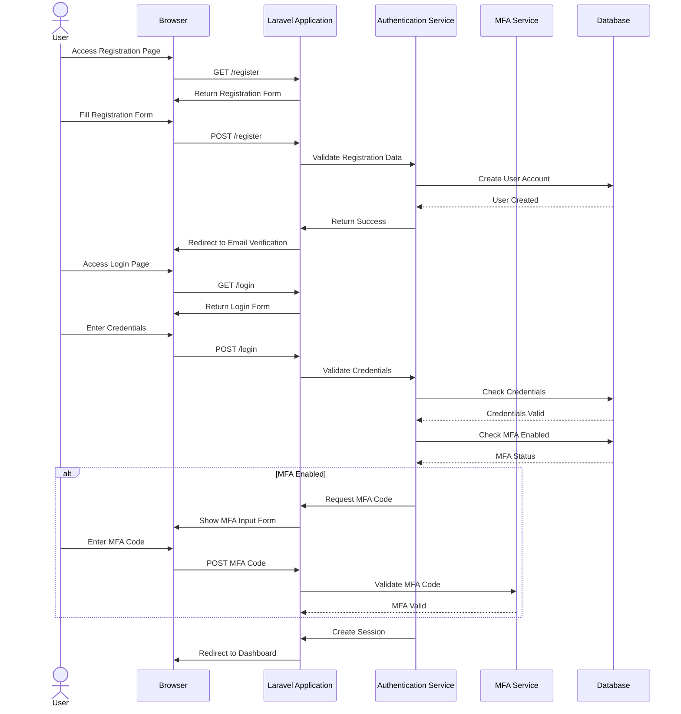

# TAD Authentication Flow (Light Mode)

```mermaid
%%{init: {'theme': 'default', 'themeVariables': { 'primaryColor': '#f5f5f5', 'primaryTextColor': '#333333', 'primaryBorderColor': '#cccccc', 'lineColor': '#666666', 'secondaryColor': '#f0f0f0', 'tertiaryColor': '#ffffff' }}}%%
sequenceDiagram
    actor User
    participant Browser
    participant App as Laravel Application
    participant Auth as Authentication Service
    participant MFA as MFA Service
    participant DB as Database

    %% Registration Flow
    User->>Browser: Access Registration Page
    Browser->>App: GET /register
    App->>Browser: Return Registration Form
    User->>Browser: Fill Registration Form
    Browser->>App: POST /register
    App->>Auth: Validate Registration Data
    Auth->>DB: Create User Account
    DB-->>Auth: User Created
    Auth->>App: Return Success
    App->>Browser: Redirect to Email Verification

    %% Login Flow
    User->>Browser: Access Login Page
    Browser->>App: GET /login
    App->>Browser: Return Login Form
    User->>Browser: Enter Credentials
    Browser->>App: POST /login
    App->>Auth: Validate Credentials
    Auth->>DB: Check Credentials
    DB-->>Auth: Credentials Valid
    Auth->>DB: Check MFA Enabled
    DB-->>Auth: MFA Status

    alt MFA Enabled
        Auth->>App: Request MFA Code
        App->>Browser: Show MFA Input Form
        User->>Browser: Enter MFA Code
        Browser->>App: POST MFA Code
        App->>MFA: Validate MFA Code
        MFA-->>App: MFA Valid
    end

    Auth->>App: Create Session
    App->>Browser: Redirect to Dashboard
```
