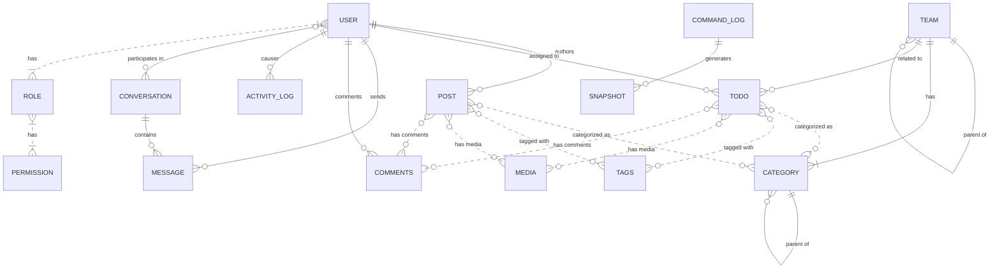

# TAD Database Schema (Light Mode)

```mermaid
%%{init: {'theme': 'default', 'themeVariables': { 'primaryColor': '#f5f5f5', 'primaryTextColor': '#333333', 'primaryBorderColor': '#cccccc', 'lineColor': '#666666', 'secondaryColor': '#f0f0f0', 'tertiaryColor': '#ffffff' }}}%%
erDiagram
    USER ||--o{ POST : "authors"
    USER ||--o{ TODO : "assigned to"
    USER ||--o{ MESSAGE : "sends"
    USER ||--o{ COMMENTS : "comments"
    USER ||--o{ ACTIVITY_LOG : "causer"
    USER }o--o{ CONVERSATION : "participates in"
    USER }|..|{ ROLE : "has"

    TEAM ||--o{ TEAM : "parent of"
    TEAM ||--|{ CATEGORY : "has"
    TEAM ||--o{ TODO : "related to"

    CATEGORY ||--o{ CATEGORY : "parent of"

    POST }o..o{ CATEGORY : "categorized as"
    POST }o..o{ TAGS : "tagged with"
    POST }o..o{ MEDIA : "has media"
    POST }o..o{ COMMENTS : "has comments"

    TODO }o..o{ CATEGORY : "categorized as"
    TODO }o..o{ TAGS : "tagged with"
    TODO }o..o{ MEDIA : "has media"
    TODO }o..o{ COMMENTS : "has comments"

    CONVERSATION ||--o{ MESSAGE : "contains"

    ROLE }|..|{ PERMISSION : "has"

    COMMAND_LOG ||--o{ SNAPSHOT : "generates"
```
