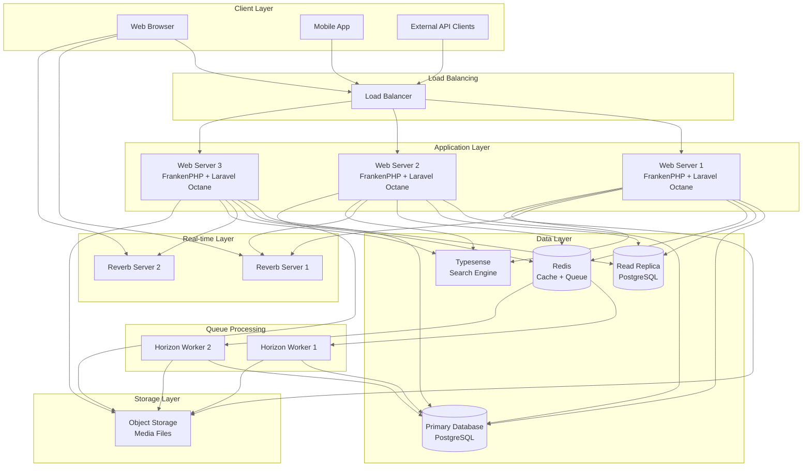

# TAD Deployment Architecture (Light Mode)

```mermaid
%%{init: {'theme': 'default', 'themeVariables': { 'primaryColor': '#f5f5f5', 'primaryTextColor': '#333333', 'primaryBorderColor': '#cccccc', 'lineColor': '#666666', 'secondaryColor': '#f0f0f0', 'tertiaryColor': '#ffffff' }}}%%
flowchart TB
    subgraph "Client Layer"
        Browser["Web Browser"]
        MobileApp["Mobile App"]
        ExternalAPI["External API Clients"]
    end

    subgraph "Load Balancing"
        LB["Load Balancer"]
    end

    subgraph "Application Layer"
        WebServer1["Web Server 1<br>FrankenPHP + Laravel Octane"]
        WebServer2["Web Server 2<br>FrankenPHP + Laravel Octane"]
        WebServer3["Web Server 3<br>FrankenPHP + Laravel Octane"]
    end

    subgraph "Queue Processing"
        HorizonWorker1["Horizon Worker 1"]
        HorizonWorker2["Horizon Worker 2"]
    end

    subgraph "Real-time Layer"
        ReverbServer1["Reverb Server 1"]
        ReverbServer2["Reverb Server 2"]
    end

    subgraph "Data Layer"
        PrimaryDB[("Primary Database<br>PostgreSQL")]
        ReadReplica[("Read Replica<br>PostgreSQL")]
        Redis[("Redis<br>Cache + Queue")]
        Typesense["Typesense<br>Search Engine"]
    end

    subgraph "Storage Layer"
        ObjectStorage["Object Storage<br>Media Files"]
    end

    Browser --> LB
    MobileApp --> LB
    ExternalAPI --> LB

    LB --> WebServer1
    LB --> WebServer2
    LB --> WebServer3

    WebServer1 --> PrimaryDB
    WebServer2 --> PrimaryDB
    WebServer3 --> PrimaryDB

    WebServer1 --> ReadReplica
    WebServer2 --> ReadReplica
    WebServer3 --> ReadReplica

    WebServer1 --> Redis
    WebServer2 --> Redis
    WebServer3 --> Redis

    Redis --> HorizonWorker1
    Redis --> HorizonWorker2

    HorizonWorker1 --> PrimaryDB
    HorizonWorker2 --> PrimaryDB

    WebServer1 --> ReverbServer1
    WebServer2 --> ReverbServer1
    WebServer3 --> ReverbServer2

    Browser --> ReverbServer1
    Browser --> ReverbServer2

    WebServer1 --> Typesense
    WebServer2 --> Typesense
    WebServer3 --> Typesense

    WebServer1 --> ObjectStorage
    WebServer2 --> ObjectStorage
    WebServer3 --> ObjectStorage

    HorizonWorker1 --> ObjectStorage
    HorizonWorker2 --> ObjectStorage
```
