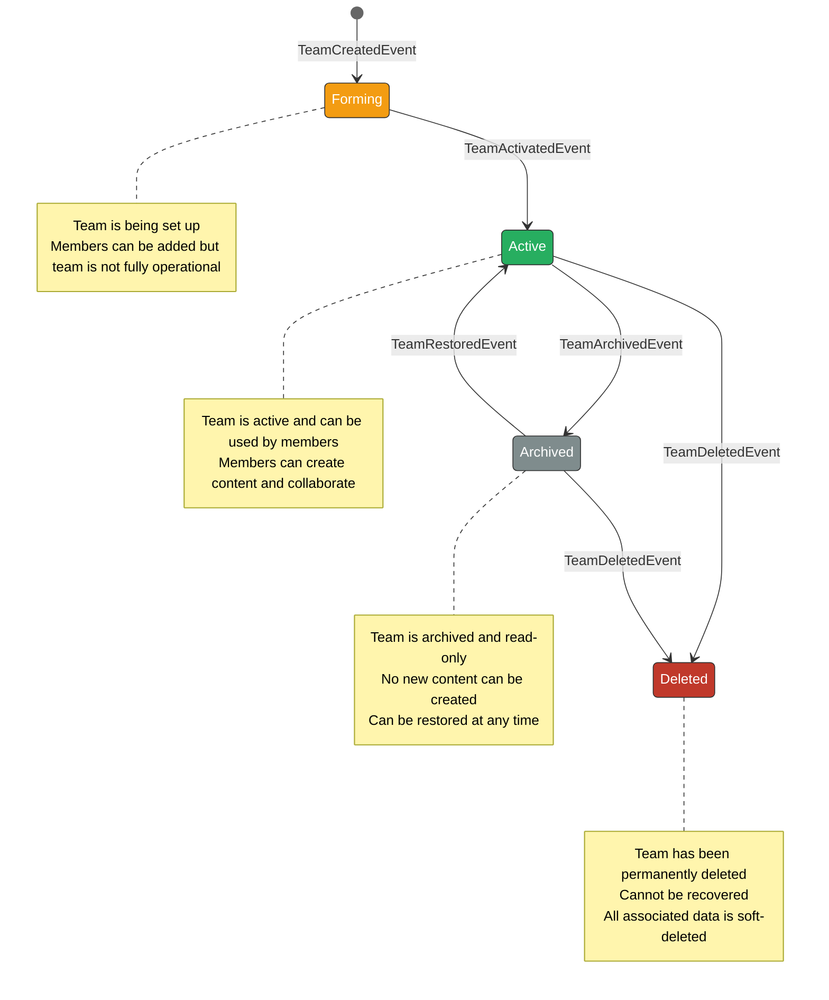

# Team Aggregate States (Light Mode)

```mermaid
%%{init: {'theme': 'default', 'themeVariables': { 'primaryColor': '#f5f5f5', 'primaryTextColor': '#333333', 'primaryBorderColor': '#cccccc', 'lineColor': '#666666', 'secondaryColor': '#f0f0f0', 'tertiaryColor': '#ffffff' }}}%%
stateDiagram-v2
    [*] --> Forming: TeamCreatedEvent
    Forming --> Active: TeamActivatedEvent
    Active --> Archived: TeamArchivedEvent
    Archived --> Active: TeamRestoredEvent
    Active --> Deleted: TeamDeletedEvent
    Archived --> Deleted: TeamDeletedEvent
    
    %% State styling with classes
    classDef formingState fill:#F39C12,stroke:#333,color:white
    classDef activeState fill:#27AE60,stroke:#333,color:white
    classDef archivedState fill:#7F8C8D,stroke:#333,color:white
    classDef deletedState fill:#C0392B,stroke:#333,color:white
    
    class Forming formingState
    class Active activeState
    class Archived archivedState
    class Deleted deletedState
    
    %% Notes
    note right of Forming
        Team is being set up
        Members can be added but team is not fully operational
    end note
    
    note right of Active
        Team is active and can be used by members
        Members can create content and collaborate
    end note
    
    note right of Archived
        Team is archived and read-only
        No new content can be created
        Can be restored at any time
    end note
    
    note right of Deleted
        Team has been permanently deleted
        Cannot be recovered
        All associated data is soft-deleted
    end note
```
