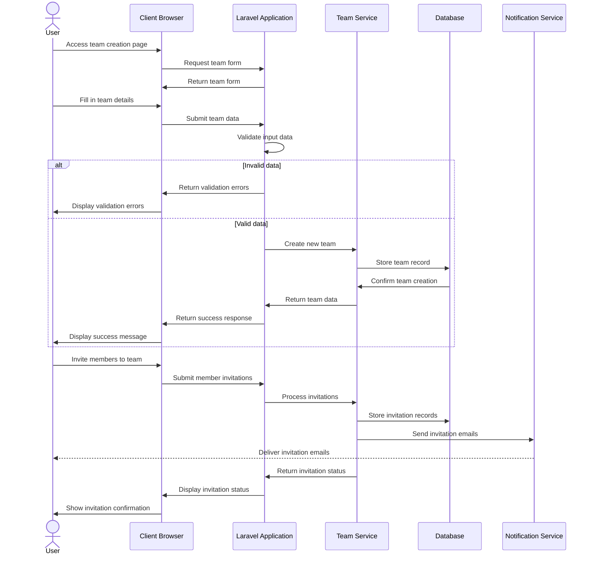

# Team Creation and Management (Light Mode)

```mermaid
%%{init: {'theme': 'default', 'themeVariables': { 'primaryColor': '#f5f5f5', 'primaryTextColor': '#333333', 'primaryBorderColor': '#cccccc', 'lineColor': '#666666', 'secondaryColor': '#f0f0f0', 'tertiaryColor': '#ffffff' }}}%%
sequenceDiagram
    actor User
    participant Client as Client Browser
    participant App as Laravel Application
    participant TeamService as Team Service
    participant DB as Database
    participant Notification as Notification Service

    User->>Client: Access team creation page
    Client->>App: Request team form
    App->>Client: Return team form
    User->>Client: Fill in team details
    Client->>App: Submit team data
    App->>App: Validate input data

    alt Invalid data
        App->>Client: Return validation errors
        Client->>User: Display validation errors
    else Valid data
        App->>TeamService: Create new team
        TeamService->>DB: Store team record
        DB->>TeamService: Confirm team creation
        TeamService->>App: Return team data
        App->>Client: Return success response
        Client->>User: Display success message
    end

    User->>Client: Invite members to team
    Client->>App: Submit member invitations
    App->>TeamService: Process invitations
    TeamService->>DB: Store invitation records
    TeamService->>Notification: Send invitation emails
    Notification-->>User: Deliver invitation emails
    TeamService->>App: Return invitation status
    App->>Client: Display invitation status
    Client->>User: Show invitation confirmation
```
