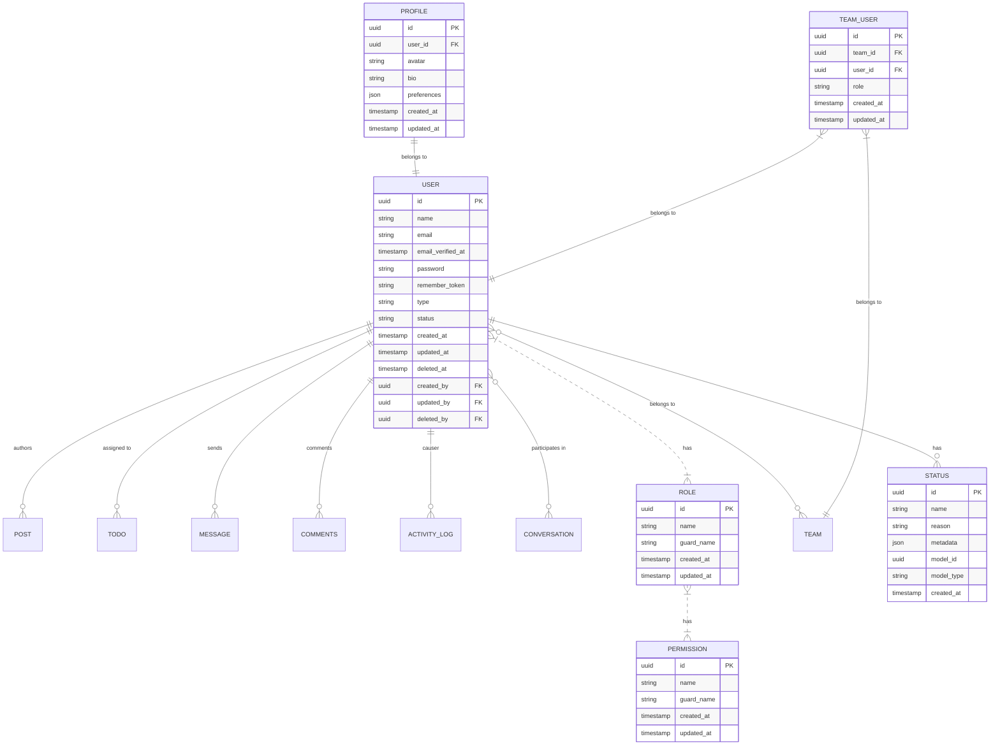

```mermaid
%%{init: {'theme': 'default', 'themeVariables': { 'primaryColor': '#f5f5f5', 'primaryTextColor': '#333333', 'primaryBorderColor': '#cccccc', 'lineColor': '#666666', 'secondaryColor': '#f0f0f0', 'tertiaryColor': '#ffffff' }}}%%
erDiagram
    USER ||--o{ POST : "authors"
    USER ||--o{ TODO : "assigned to"
    USER ||--o{ MESSAGE : "sends"
    USER ||--o{ COMMENTS : "comments"
    USER ||--o{ ACTIVITY_LOG : "causer"
    USER }o--o{ CONVERSATION : "participates in"
    USER }|..|{ ROLE : "has"
    USER }o--o{ TEAM : "belongs to"
    USER ||--o{ STATUS : "has"
    
    USER {
        uuid id PK
        string name
        string email
        timestamp email_verified_at
        string password
        string remember_token
        string type
        string status
        timestamp created_at
        timestamp updated_at
        timestamp deleted_at
        uuid created_by FK
        uuid updated_by FK
        uuid deleted_by FK
    }
    
    ROLE }|..|{ PERMISSION : "has"
    ROLE {
        uuid id PK
        string name
        string guard_name
        timestamp created_at
        timestamp updated_at
    }
    
    PERMISSION {
        uuid id PK
        string name
        string guard_name
        timestamp created_at
        timestamp updated_at
    }
    
    STATUS {
        uuid id PK
        string name
        string reason
        json metadata
        uuid model_id
        string model_type
        timestamp created_at
    }
    
    PROFILE ||--|| USER : "belongs to"
    PROFILE {
        uuid id PK
        uuid user_id FK
        string avatar
        string bio
        json preferences
        timestamp created_at
        timestamp updated_at
    }
    
    TEAM_USER }|--|| USER : "belongs to"
    TEAM_USER }|--|| TEAM : "belongs to"
    TEAM_USER {
        uuid id PK
        uuid team_id FK
        uuid user_id FK
        string role
        timestamp created_at
        timestamp updated_at
    }
```
