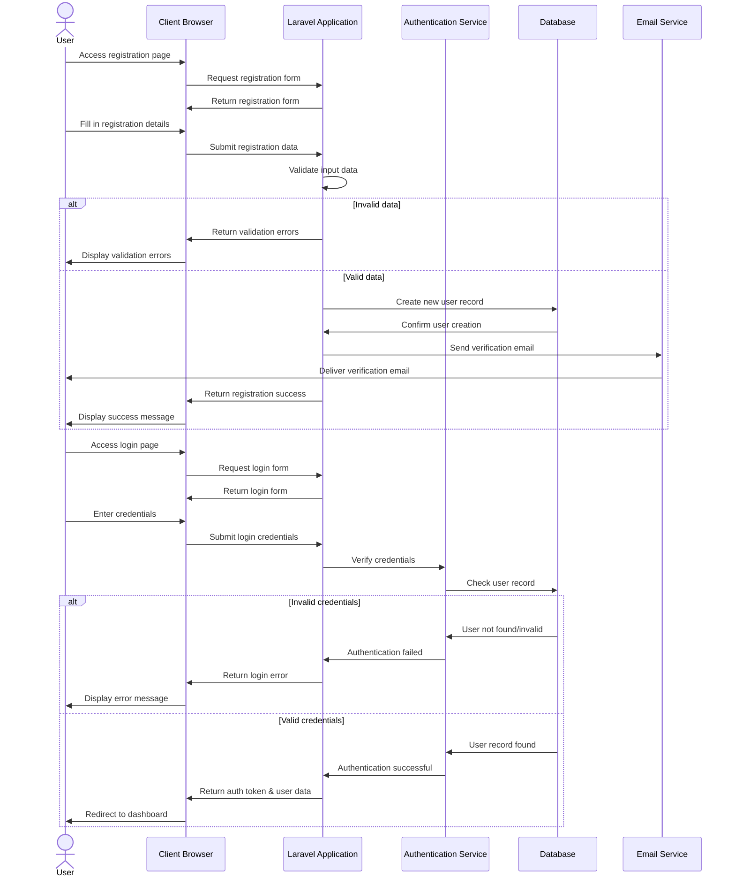

# User Registration and Authentication (Light Mode)

```mermaid
%%{init: {'theme': 'default', 'themeVariables': { 'primaryColor': '#f5f5f5', 'primaryTextColor': '#333333', 'primaryBorderColor': '#cccccc', 'lineColor': '#666666', 'secondaryColor': '#f0f0f0', 'tertiaryColor': '#ffffff' }}}%%
sequenceDiagram
    actor User
    participant Client as Client Browser
    participant App as Laravel Application
    participant Auth as Authentication Service
    participant DB as Database
    participant Email as Email Service

    User->>Client: Access registration page
    Client->>App: Request registration form
    App->>Client: Return registration form
    User->>Client: Fill in registration details
    Client->>App: Submit registration data
    App->>App: Validate input data

    alt Invalid data
        App->>Client: Return validation errors
        Client->>User: Display validation errors
    else Valid data
        App->>DB: Create new user record
        DB->>App: Confirm user creation
        App->>Email: Send verification email
        Email->>User: Deliver verification email
        App->>Client: Return registration success
        Client->>User: Display success message
    end

    User->>Client: Access login page
    Client->>App: Request login form
    App->>Client: Return login form
    User->>Client: Enter credentials
    Client->>App: Submit login credentials
    App->>Auth: Verify credentials
    Auth->>DB: Check user record

    alt Invalid credentials
        DB->>Auth: User not found/invalid
        Auth->>App: Authentication failed
        App->>Client: Return login error
        Client->>User: Display error message
    else Valid credentials
        DB->>Auth: User record found
        Auth->>App: Authentication successful
        App->>Client: Return auth token & user data
        Client->>User: Redirect to dashboard
    end
```
