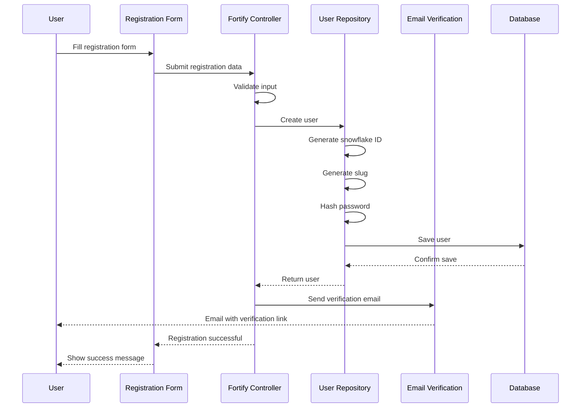

# User Registration Sequence (Light Mode)

```mermaid
%%{init: {'theme': 'default', 'themeVariables': { 'primaryColor': '#f5f5f5', 'primaryTextColor': '#333333', 'primaryBorderColor': '#cccccc', 'lineColor': '#666666', 'secondaryColor': '#f0f0f0', 'tertiaryColor': '#ffffff' }}}%%
sequenceDiagram
    participant User as User
    participant RegistrationForm as Registration Form
    participant FortifyController as Fortify Controller
    participant UserRepository as User Repository
    participant EmailVerification as Email Verification
    participant Database as Database

    User->>RegistrationForm: Fill registration form
    RegistrationForm->>FortifyController: Submit registration data
    FortifyController->>FortifyController: Validate input
    FortifyController->>UserRepository: Create user
    UserRepository->>UserRepository: Generate snowflake ID
    UserRepository->>UserRepository: Generate slug
    UserRepository->>UserRepository: Hash password
    UserRepository->>Database: Save user
    Database-->>UserRepository: Confirm save
    UserRepository-->>FortifyController: Return user
    FortifyController->>EmailVerification: Send verification email
    EmailVerification-->>User: Email with verification link
    FortifyController-->>RegistrationForm: Registration successful
    RegistrationForm-->>User: Show success message
```
