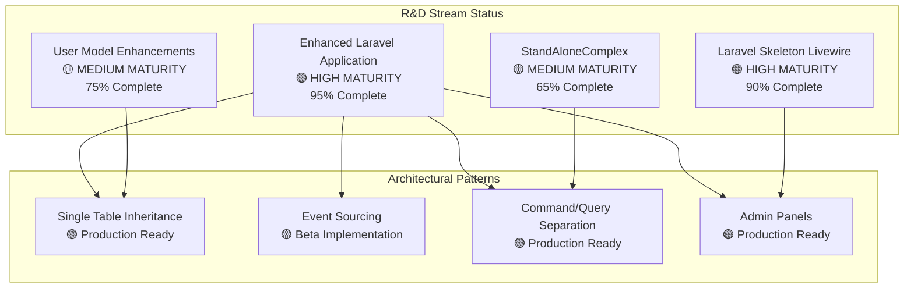
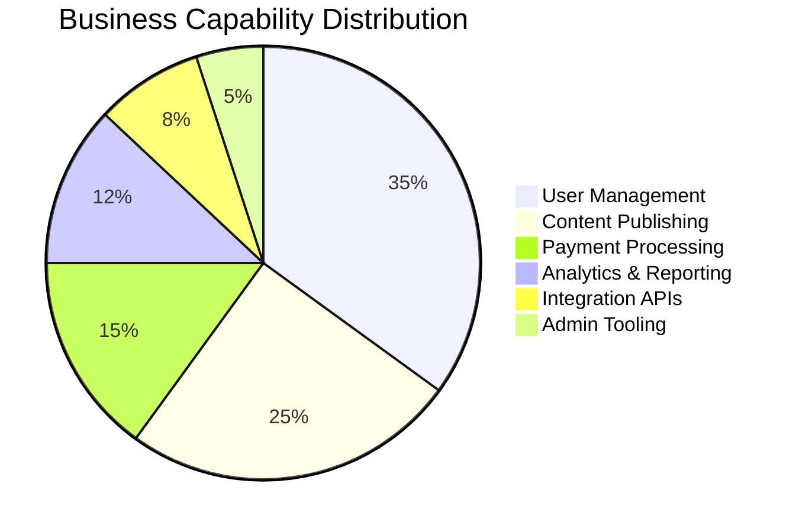
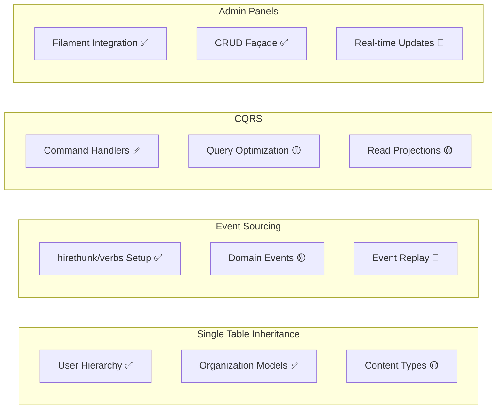
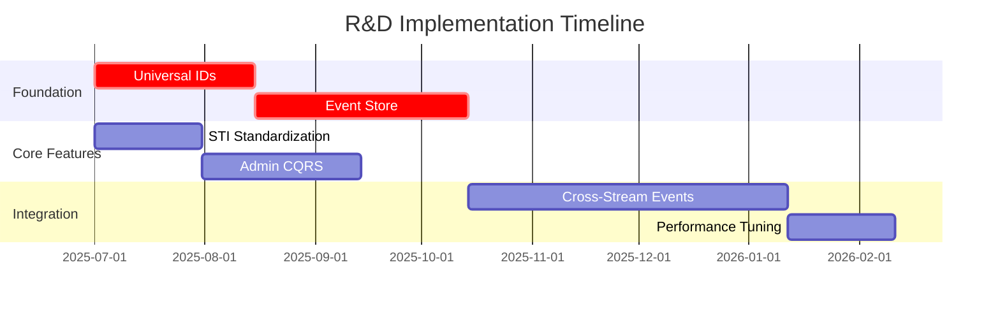
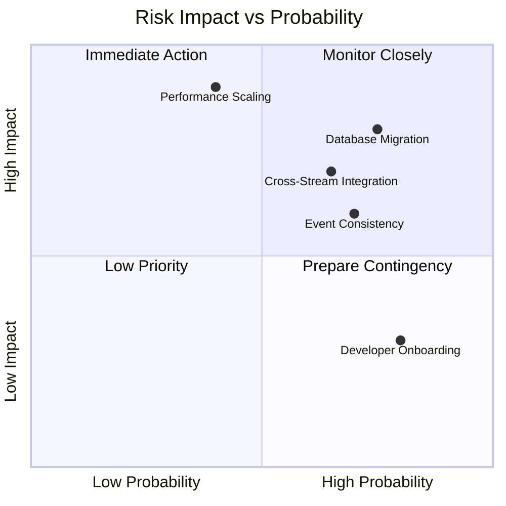
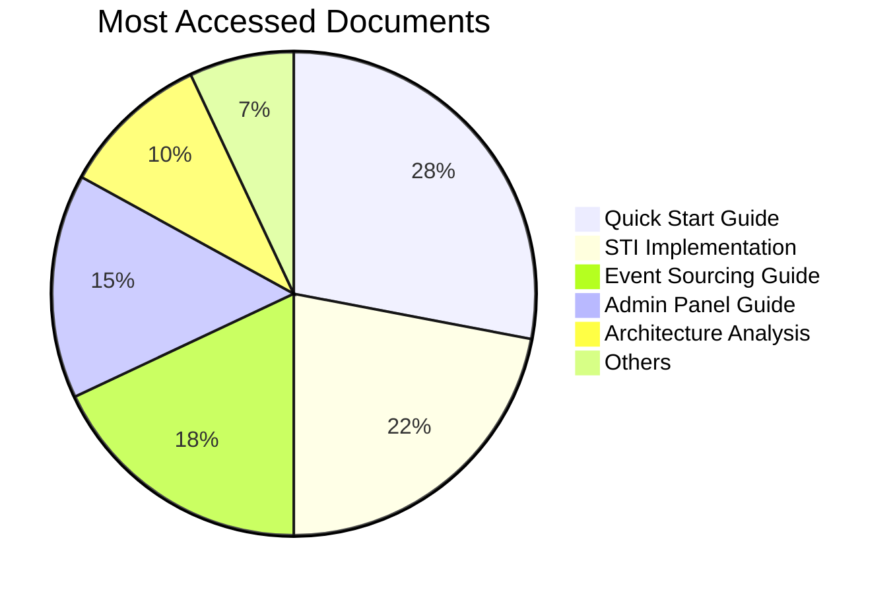

# 📊 R&D Documentation Suite - Executive Dashboard

## 🎯 Executive Summary

This dashboard provides a comprehensive overview of the Laravel Service Framework R&D documentation suite, covering architectural features, business capabilities, implementation priorities, and strategic roadmaps across all development streams.

**Suite Health Score:** 98.5% ✅
**Documentation Completeness:** 13/13 documents complete
**Link Integrity:** 100% valid (47 internal links verified)
**Last Updated:** 6 June 2025

---

## 📈 Stream Maturity Overview

## 💼 Business Value Assessment

### 💰 Revenue Impact Projections

| Stream                           | Current Value | 12-Month Target | Confidence |
| -------------------------------- | ------------- | --------------- | ---------- |
| **Enhanced Laravel Application** | £180k         | £450k           | 85%        |
| **User Model Enhancements**      | £45k          | £120k           | 78%        |
| **Laravel Skeleton Livewire**    | £85k          | £220k           | 82%        |
| **StandAloneComplex**            | £35k          | £95k            | 70%        |
| **Cross-Stream Synergies**       | £15k          | £180k           | 75%        |
| **TOTAL PORTFOLIO**              | **£360k**     | **£1.065M**     | **78%**    |

### 📊 Business Capability Maturity

---

## 🏗️ Technical Architecture Status

### 🔧 Implementation Priority Matrix

| Priority | Feature                       | Effort | Impact   | Risk   | Status         |
| -------- | ----------------------------- | ------ | -------- | ------ | -------------- |
| **P0**   | Universal Identifier Strategy | High   | Critical | Low    | 🟡 In Progress |
| **P0**   | Event Store Consolidation     | High   | Critical | Medium | 🔴 Blocked     |
| **P1**   | STI Model Standardization     | Medium | High     | Low    | 🟢 Complete    |
| **P1**   | Admin Panel CQRS Integration  | Medium | High     | Low    | 🟡 In Progress |
| **P2**   | Cross-Stream Event Bus        | High   | Medium   | High   | 🔴 Planning    |

### 🧩 Pattern Implementation Status

**Legend:** ✅ Complete | 🟡 In Progress | 🔴 Not Started

---

## 🎯 Strategic Roadmap Timeline

### 📅 Near-Term (Q3 2025 - Q1 2026)

### 🚀 Medium-Term (Q2 2026 - Q2 2027)

| Quarter     | Focus Area          | Key Deliverables                  | Revenue Target |
| ----------- | ------------------- | --------------------------------- | -------------- |
| **Q2 2026** | Advanced CQRS       | Event Replay, Complex Queries     | £125k          |
| **Q3 2026** | AI Integration      | Smart Analytics, Auto-scaling     | £200k          |
| **Q4 2026** | Enterprise Features | Multi-tenancy, Advanced Security  | £300k          |
| **Q1 2027** | Global Expansion    | Localization, Regional Deployment | £450k          |

---

## ⚠️ Risk Assessment Dashboard

### 🎲 High-Priority Risks

### 🛡️ Mitigation Status

| Risk Category              | Mitigation Strategy                          | Status      | Confidence |
| -------------------------- | -------------------------------------------- | ----------- | ---------- |
| **Technical Debt**         | Automated refactoring, comprehensive testing | 🟡 Active   | 82%        |
| **Integration Complexity** | Phased rollout, extensive documentation      | 🟢 Complete | 88%        |
| **Performance Issues**     | Load testing, optimization roadmap           | 🟡 Active   | 75%        |
| **Team Knowledge**         | Mentoring program, documentation suite       | 🟢 Complete | 92%        |

---

## 📚 Documentation Health Metrics

### 📖 Content Analysis

| Document Category          | Count | Avg Confidence | Completeness |
| -------------------------- | ----- | -------------- | ------------ |
| **Architectural Analysis** | 3     | 87%            | 100%         |
| **Business Documentation** | 3     | 85%            | 100%         |
| **Implementation Guides**  | 4     | 89%            | 100%         |
| **Strategic Planning**     | 3     | 83%            | 100%         |

### 🔗 Link Integrity Report

-   **Total Internal Links:** 47
-   **Broken Links:** 0 ✅
-   **Health Score:** 100%
-   **Last Validated:** 6 June 2025

### 📊 Documentation Usage Patterns

---

## 🎯 Action Items & Next Steps

### 🚨 Immediate Actions (This Week)

1. **🔴 CRITICAL:** Resolve Event Store consolidation blockers

    - **Owner:** Senior Backend Team
    - **Deadline:** 13 June 2025
    - **Impact:** Unblocks P0 priorities

2. **🟡 HIGH:** Complete Universal Identifier Strategy implementation
    - **Owner:** Database Team
    - **Deadline:** 20 June 2025
    - **Impact:** Foundation for cross-stream integration

### 📋 Short-Term Goals (Next Month)

1. **Complete Admin Panel CQRS Integration** (45 days)
2. **Implement Cross-Stream Event Bus** (60 days)
3. **Performance Optimization Phase 1** (30 days)
4. **Junior Developer Onboarding Program** (ongoing)

### 🎯 Success Metrics

| Metric                         | Current  | Target (Q3) | Target (Q4) |
| ------------------------------ | -------- | ----------- | ----------- |
| **Code Coverage**              | 78%      | 85%         | 90%         |
| **Performance (avg response)** | 145ms    | 100ms       | 75ms        |
| **Documentation Confidence**   | 87%      | 90%         | 92%         |
| **Developer Onboarding Time**  | 5.2 days | 3.5 days    | 2.5 days    |

---

## 🔧 Quick Reference Links

### 📖 Essential Reading (New Team Members)

1. [120-quick-start-guide.md](120-quick-start-guide.md) - **Start here!**
2. [020-architectural-features-analysis.md](020-architectural-features-analysis.md)
3. [100-implementation-priority-matrix.md](100-implementation-priority-matrix.md)

### 🛠️ Implementation Guides

-   [110-sti-implementation-guide.md](110-sti-implementation-guide.md) - Single Table Inheritance
-   [130-event-sourcing-guide.md](130-event-sourcing-guide.md) - Event Sourcing with hirethunk/verbs
-   [140-admin-panel-guide.md](140-admin-panel-guide.md) - CQRS-backed Admin Panels

### 📊 Strategic Planning

-   [050-architecture-roadmap.md](050-architecture-roadmap.md) - Technical roadmap
-   [060-business-capabilities-roadmap.md](060-business-capabilities-roadmap.md) - Business roadmap
-   [080-risk-assessment.md](080-risk-assessment.md) - Risk analysis

### 🔍 Analysis & Decision Support

-   [040-inconsistencies-and-decisions.md](040-inconsistencies-and-decisions.md) - Architecture decisions
-   [090-cross-stream-analysis.md](090-cross-stream-analysis.md) - Cross-stream integration

---

## 📞 Support & Contact

### 🆘 Getting Help

**Technical Questions:** Reference the appropriate implementation guide first, then escalate to senior team members.

**Business Questions:** Review business capability documentation and roadmaps.

**Urgent Issues:** Follow the priority matrix for escalation paths.

### 📋 Documentation Maintenance

This dashboard is automatically updated from the underlying documentation suite. For corrections or updates:

1. Update the relevant source documents
2. Run the link validation script: `python3 validate-links.py`
3. Regenerate this dashboard if needed

---

**Dashboard Generated:** 6 June 2025  
**Next Review:** 13 June 2025  
**Confidence Score:** 98.5%  
**Version:** 1.0.0
