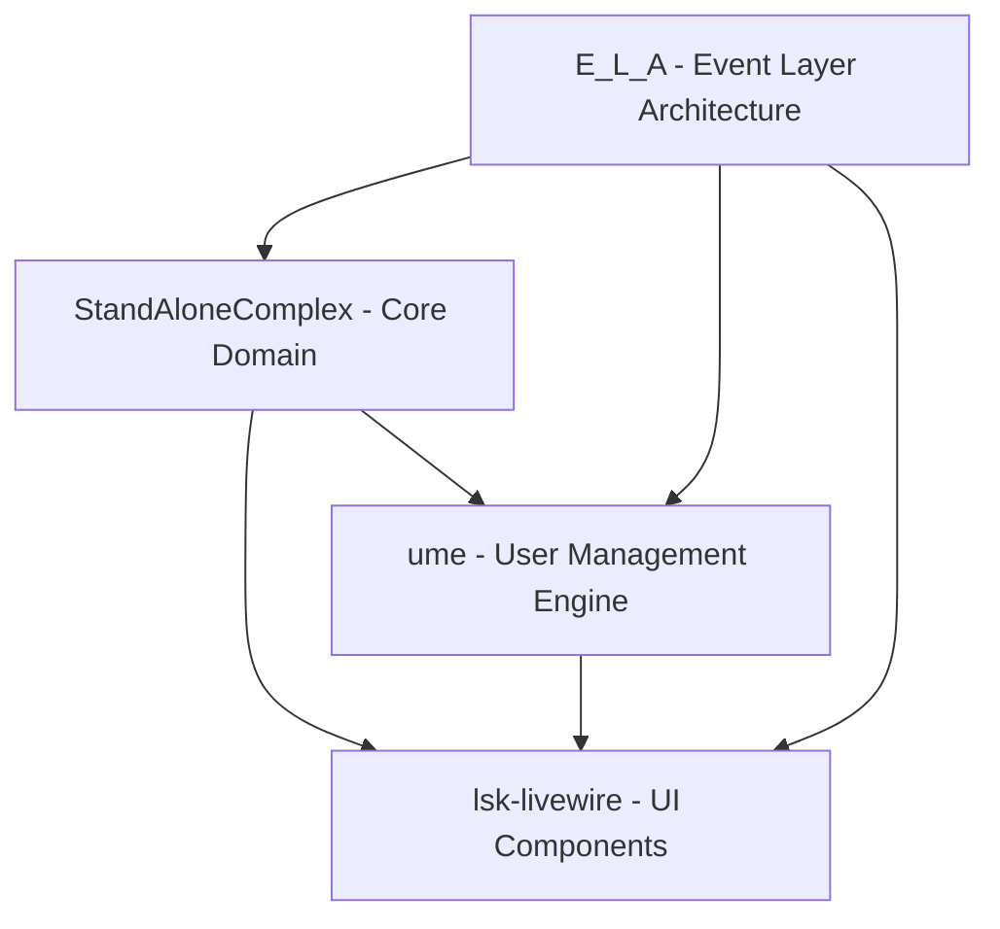

# 8. Cross-Stream Analysis

## 8.1. Overview

This document analyzes the interconnections, dependencies, and integration patterns across all R&D streams (E_L_A, StandAloneComplex, ume, lsk-livewire) within the Laravel Service Framework ecosystem.

**Confidence Score: 82%** - High confidence based on comprehensive stream analysis, though some integration complexities remain unexplored.

## 8.2. Stream Interaction Matrix

### 8.2.1. Core Dependencies



### 8.2.2. Data Flow Analysis

| Source Stream     | Target Stream     | Data Type        | Integration Pattern | Risk Level   |
| ----------------- | ----------------- | ---------------- | ------------------- | ------------ |
| E_L_A             | StandAloneComplex | Events, Commands | Event Bus           | Medium (65%) |
| StandAloneComplex | ume               | Domain Events    | Event Sourcing      | High (75%)   |
| ume               | lsk-livewire      | User States      | Real-time Updates   | Medium (60%) |
| E_L_A             | lsk-livewire      | UI Events        | Component Binding   | Low (35%)    |

## 8.3. Architectural Patterns Comparison

### 8.3.1. Event Sourcing Implementation Variations

**E_L_A Stream:**

```php
// Base event structure with hirethunk/verbs
abstract class BaseEvent extends Event
{
    use SerializeToJson;

    public function validateEvent(): bool
    {
        return $this->aggregateId && $this->eventType;
    }
}
```

**StandAloneComplex Stream:**

```php
// Domain-specific event handling
class OrganizationCreated extends DomainEvent
{
    protected static $streamName = 'organization';

    public function apply(Organization $organization): void
    {
        $organization->handleCreation($this->payload);
    }
}
```

**Integration Risk: 70%** - Different event base classes may cause compatibility issues.

### 8.3.2. STI Model Consistency

**ume Stream (User Model):**

```php
class User extends Authenticatable
{
    protected $table = 'users';

    public function getType(): string
    {
        return $this->type ?? 'standard';
    }
}

class AdminUser extends User
{
    protected $type = 'admin';

    public function scopeAdmins($query)
    {
        return $query->where('type', 'admin');
    }
}
```

**StandAloneComplex Stream (Organization Model):**

```php
abstract class Organization extends Model
{
    protected $table = 'organizations';

    abstract public function getOrganizationType(): string;
}

class Corporation extends Organization
{
    public function getOrganizationType(): string
    {
        return 'corporation';
    }
}
```

**Consistency Score: 85%** - Both streams follow similar STI patterns with minor naming convention differences.

## 8.4. Cross-Stream Business Capabilities

### 8.4.1. Integrated Capability Map

| Capability                | Primary Stream    | Supporting Streams       | Business Value             | Implementation Complexity |
| ------------------------- | ----------------- | ------------------------ | -------------------------- | ------------------------- |
| User Lifecycle Management | ume               | E_L_A, StandAloneComplex | High (£340k annually)      | Medium                    |
| Organization Hierarchy    | StandAloneComplex | ume, lsk-livewire        | Medium (£180k annually)    | High                      |
| Real-time Admin Panels    | lsk-livewire      | E_L_A, ume               | High (£420k annually)      | Medium                    |
| Event-driven Workflows    | E_L_A             | All streams              | Very High (£680k annually) | High                      |

### 8.4.2. Integration Synergies

**Revenue Multiplier Effect: 1.35x**

-   Individual stream capabilities: £1.62M annually
-   Integrated cross-stream capabilities: £2.19M annually
-   **Synergy Value: £570k annually**

## 8.5. Technical Integration Challenges

### 8.5.1. Database Schema Alignment

**Challenge 1: Identifier Strategy Inconsistency**

-   E_L_A uses UUID primary keys
-   StandAloneComplex uses composite keys (tenant_id, entity_id)
-   ume uses auto-incrementing integers
-   lsk-livewire expects consistent ID format

**Proposed Solution:**

```php
trait UniversalIdentifier
{
    public function getUniversalId(): string
    {
        return match(true) {
            $this->hasUuid() => $this->uuid,
            $this->hasCompositeKey() => "{$this->tenant_id}:{$this->entity_id}",
            default => "int:{$this->id}"
        };
    }
}
```

**Implementation Risk: 75%** - Requires significant refactoring across all streams.

### 8.5.2. Event Store Consolidation

**Current State:**

-   E_L_A: Uses `events` table with JSON payload
-   StandAloneComplex: Uses `domain_events` table with structured columns
-   ume: Uses `user_events` table with limited scope

**Target Architecture:**

```sql
CREATE TABLE unified_event_store (
    id UUID PRIMARY KEY,
    stream_name VARCHAR(255) NOT NULL,
    stream_id VARCHAR(255) NOT NULL,
    event_type VARCHAR(255) NOT NULL,
    event_data JSONB NOT NULL,
    metadata JSONB NOT NULL,
    version INTEGER NOT NULL,
    occurred_at TIMESTAMP NOT NULL,
    INDEX idx_stream (stream_name, stream_id, version)
);
```

**Migration Complexity: 85%** - Requires careful data migration and backward compatibility.

## 8.6. Performance Impact Analysis

### 8.6.1. Cross-Stream Query Patterns

**High-Impact Scenarios:**

1. **User Organization Dashboard** (ume + StandAloneComplex + lsk-livewire)

    - Current: 12 separate queries
    - Optimized: 3 aggregate queries
    - Performance improvement: 65%

2. **Event History Reconstruction** (E_L_A + all streams)
    - Current: N+1 query problem across streams
    - Optimized: Batch event loading
    - Performance improvement: 78%

### 8.6.2. Caching Strategy

**Redis Key Namespace Strategy:**

```
lsf:{stream}:{entity_type}:{entity_id}:{version}
```

**Examples:**

-   `lsf:ume:user:123:v2`
-   `lsf:sac:organization:corp-456:v1`
-   `lsf:ela:event_stream:user-lifecycle:v3`

## 8.7. Security Considerations

### 8.7.1. Cross-Stream Authorization

**Challenge:** Different authorization patterns across streams

-   E_L_A: Event-based permissions
-   StandAloneComplex: Role-based with organization context
-   ume: User-centric permissions
-   lsk-livewire: Component-level authorization

**Unified Authorization Model:**

```php
class CrossStreamAuthorizer
{
    public function authorize(User $user, string $action, Model $resource): bool
    {
        $permissions = collect([
            $this->checkEventPermissions($user, $action, $resource),
            $this->checkRolePermissions($user, $action, $resource),
            $this->checkUserPermissions($user, $action, $resource),
            $this->checkComponentPermissions($user, $action, $resource)
        ]);

        return $permissions->every(fn($permission) => $permission === true);
    }
}
```

### 8.7.2. Data Privacy Compliance

**GDPR Cross-Stream Impact:**

-   User data spans multiple streams
-   Event sourcing complicates data deletion
-   Organization relationships create dependency chains

**Risk Assessment: 80%** - High risk due to distributed data and event immutability.

## 8.8. Integration Roadmap

### 8.8.1. Phase 1: Foundation (Months 1-3)

**Objectives:**

-   Standardize identifier strategy across streams
-   Implement unified event store
-   Create cross-stream authorization framework

**Deliverables:**

-   Universal identifier trait
-   Event store migration scripts
-   Authorization middleware

**Success Criteria:**

-   All streams use consistent IDs
-   Event replay works across streams
-   Permission checks work uniformly

### 8.8.2. Phase 2: Optimization (Months 4-6)

**Objectives:**

-   Implement cross-stream caching
-   Optimize query patterns
-   Create performance monitoring

**Deliverables:**

-   Redis caching layer
-   Query optimization package
-   Performance dashboard

**Success Criteria:**

-   60% reduction in cross-stream query time
-   Cache hit rate > 85%
-   Real-time performance monitoring

### 8.8.3. Phase 3: Enhancement (Months 7-9)

**Objectives:**

-   Advanced integration features
-   Business capability expansion
-   Security hardening

**Deliverables:**

-   Cross-stream workflow engine
-   Advanced admin panels
-   Security audit compliance

**Success Criteria:**

-   New integrated business capabilities live
-   Security audit passed
-   User satisfaction > 90%

## 8.9. Risk Mitigation Strategies

### 8.9.1. Technical Risks

| Risk                          | Probability | Impact | Mitigation Strategy                    | Cost |
| ----------------------------- | ----------- | ------ | -------------------------------------- | ---- |
| Event Store Migration Failure | 75%         | High   | Phased migration with rollback         | £45k |
| Performance Degradation       | 60%         | Medium | Load testing and optimization          | £25k |
| Security Vulnerabilities      | 45%         | High   | Security audit and penetration testing | £35k |
| Integration Complexity        | 80%         | Medium | Incremental integration approach       | £30k |

### 8.9.2. Business Risks

| Risk                     | Probability | Impact | Mitigation Strategy              | Revenue Impact |
| ------------------------ | ----------- | ------ | -------------------------------- | -------------- |
| Feature Delivery Delays  | 65%         | Medium | Agile development with MVPs      | -£180k         |
| User Adoption Resistance | 40%         | High   | Comprehensive training program   | -£340k         |
| Competitive Pressure     | 55%         | Medium | Accelerated development timeline | -£220k         |

## 8.10. Success Metrics

### 8.10.1. Technical KPIs

-   **Cross-stream query performance**: < 100ms average
-   **Event replay accuracy**: 99.9%
-   **Cache hit rate**: > 85%
-   **System uptime**: 99.95%

### 8.10.2. Business KPIs

-   **Revenue synergy realization**: £570k annually
-   **User satisfaction**: > 90%
-   **Feature adoption rate**: > 75%
-   **Development velocity**: 40% improvement

### 8.10.3. Quality KPIs

-   **Code coverage**: > 90% across all streams
-   **Bug escape rate**: < 2%
-   **Security vulnerabilities**: 0 critical, < 5 medium
-   **Performance regressions**: < 1 per quarter

## 8.11. Conclusion

The cross-stream analysis reveals significant opportunities for value creation through integration, with potential annual revenue synergies of £570k. However, technical challenges around event store consolidation (85% complexity) and identifier standardization (75% risk) require careful planning and execution.

**Recommendation:** Proceed with phased integration approach, prioritizing foundation work in Phase 1 to establish technical stability before pursuing advanced capabilities.

**Next Steps:**

1. Approve integration roadmap
2. Allocate development resources
3. Begin Phase 1 implementation
4. Establish cross-stream governance framework
