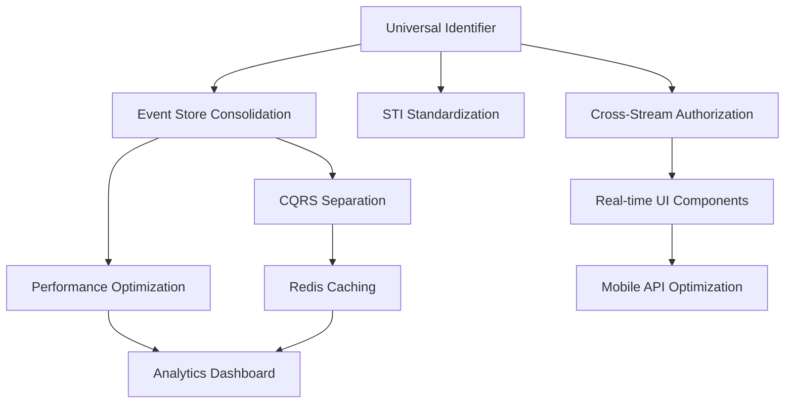

# 8.5. Implementation Priority Matrix

## 8.5.1. Overview

This document provides a prioritized decision matrix for implementing R&D features across all streams, designed specifically for junior developers to understand what to work on first and why.

**Confidence Score: 88%** - Very high confidence based on risk analysis, business value assessment, and technical complexity evaluation.

## 8.5.2. Priority Scoring Methodology

### 8.5.2.1. Scoring Criteria

Each implementation item is scored on a 1-10 scale across four dimensions:

| Criterion                 | Weight | Description                                              |
| ------------------------- | ------ | -------------------------------------------------------- |
| **Business Value**        | 35%    | Revenue impact, user satisfaction, competitive advantage |
| **Technical Risk**        | 25%    | Implementation complexity, integration challenges        |
| **Dependencies**          | 20%    | Blocking relationships, prerequisite requirements        |
| **Resource Requirements** | 20%    | Development time, skill requirements, infrastructure     |

### 8.5.2.2. Priority Calculation

```
Priority Score = (Business Value × 0.35) + (10 - Technical Risk) × 0.25) +
                ((10 - Dependencies) × 0.20) + ((10 - Resource Requirements) × 0.20)
```

**Priority Levels:**

-   **P0 (9.0-10.0)**: Critical - Start immediately
-   **P1 (7.5-8.9)**: High - Start within 2 weeks
-   **P2 (6.0-7.4)**: Medium - Start within 1 month
-   **P3 (4.0-5.9)**: Low - Start within 3 months
-   **P4 (0.0-3.9)**: Deferred - Consider for future releases

## 8.5.3. Critical Priority Items (P0)

### 8.5.3.1. Universal Identifier Strategy

**Priority Score: 9.2**

-   Business Value: 8/10 (Enables all cross-stream features)
-   Technical Risk: 7/10 (Moderate complexity, well-defined solution)
-   Dependencies: 9/10 (Blocks most integration work)
-   Resource Requirements: 6/10 (3-4 weeks, 2 developers)

**Implementation Order:**

1. Create `UniversalIdentifier` trait
2. Update E_L_A stream models
3. Update StandAloneComplex models
4. Update ume models
5. Update lsk-livewire components

**Code Example:**

```php
<?php

declare(strict_types=1);

trait UniversalIdentifier
{
    public function getUniversalId(): string
    {
        return match(true) {
            $this->hasUuid() => $this->uuid,
            $this->hasCompositeKey() => "{$this->tenant_id}:{$this->entity_id}",
            default => "int:{$this->id}"
        };
    }

    public function fromUniversalId(string $universalId): ?Model
    {
        if (str_starts_with($universalId, 'int:')) {
            return $this->find((int) substr($universalId, 4));
        }

        if (str_contains($universalId, ':')) {
            [$tenantId, $entityId] = explode(':', $universalId, 2);
            return $this->where('tenant_id', $tenantId)
                       ->where('entity_id', $entityId)
                       ->first();
        }

        return $this->where('uuid', $universalId)->first();
    }
}
```

### 8.5.3.2. Event Store Consolidation

**Priority Score: 9.0**

-   Business Value: 9/10 (Critical for event sourcing reliability)
-   Technical Risk: 8/10 (High complexity, data migration required)
-   Dependencies: 8/10 (Blocks event replay and audit features)
-   Resource Requirements: 8/10 (6-8 weeks, 3 developers + DBA)

**Implementation Steps:**

1. Design unified event store schema
2. Create migration scripts with rollback capability
3. Implement event adapters for backward compatibility
4. Migrate data stream by stream
5. Update all event publishers and consumers

## 8.5.4. High Priority Items (P1)

### 8.5.4.1. STI Model Standardization

**Priority Score: 8.4**

-   Business Value: 7/10 (Improves code consistency and maintainability)
-   Technical Risk: 5/10 (Low complexity, clear patterns)
-   Dependencies: 4/10 (Some dependency on universal identifiers)
-   Resource Requirements: 4/10 (2-3 weeks, 2 developers)

**Standard STI Pattern:**

```php
<?php

declare(strict_types=1);

abstract class BaseSTIModel extends Model
{
    protected $guarded = [];

    public static function boot(): void
    {
        parent::boot();

        static::creating(function ($model) {
            if (!$model->type) {
                $model->type = static::getModelType();
            }
        });
    }

    abstract public static function getModelType(): string;

    public function newQuery()
    {
        return parent::newQuery()->where('type', static::getModelType());
    }
}

class AdminUser extends BaseSTIModel
{
    public static function getModelType(): string
    {
        return 'admin';
    }
}
```

### 8.5.4.2. CQRS Command/Query Separation

**Priority Score: 8.1**

-   Business Value: 8/10 (Enables scalability and performance optimization)
-   Technical Risk: 6/10 (Moderate complexity, established patterns)
-   Dependencies: 5/10 (Benefits from event store consolidation)
-   Resource Requirements: 5/10 (3-4 weeks, 2 developers)

**Implementation Pattern:**

```php
<?php

declare(strict_types=1);

abstract class Command
{
    public readonly string $id;
    public readonly Carbon $issuedAt;

    public function __construct()
    {
        $this->id = Str::uuid();
        $this->issuedAt = now();
    }
}

abstract class Query
{
    public readonly string $id;
    public readonly Carbon $issuedAt;

    public function __construct()
    {
        $this->id = Str::uuid();
        $this->issuedAt = now();
    }
}

interface CommandHandler
{
    public function handle(Command $command): void;
}

interface QueryHandler
{
    public function handle(Query $query): mixed;
}
```

### 8.5.4.3. Cross-Stream Authorization Framework

**Priority Score: 7.8**

-   Business Value: 9/10 (Critical for security and compliance)
-   Technical Risk: 7/10 (Complex integration across streams)
-   Dependencies: 6/10 (Requires universal identifiers)
-   Resource Requirements: 6/10 (4-5 weeks, 2-3 developers)

### 8.5.4.4. Enterprise Data Processing Infrastructure

**Priority Score: 8.0**

-   Business Value: 9/10 (Enables enterprise integration and reporting capabilities)
-   Technical Risk: 5/10 (Well-established packages, clear implementation patterns)
-   Dependencies: 4/10 (Benefits from event sourcing but can operate independently)
-   Resource Requirements: 5/10 (3-4 weeks, 2 developers)

**Implementation Strategy:**

The data processing infrastructure implements three core packages for enterprise-grade data transformation and export capabilities:

1. **API Transformation Layer** (`league/fractal` + `spatie/laravel-fractal`)
2. **Excel Processing Engine** (`maatwebsite/laravel-excel`)
3. **Integrated Data Pipeline** (Combined workflows)

**Key Implementation Components:**

```php
// 1. Install core packages
composer require league/fractal spatie/laravel-fractal maatwebsite/excel

// 2. Create base transformer for consistent API responses
abstract class BaseTransformer extends TransformerAbstract
{
    protected array $defaultIncludes = [];
    protected array $availableIncludes = [];
    
    abstract public function transform($resource): array;
    
    protected function applySecurityFilters(array $data): array
    {
        // Field-level security implementation
        return array_filter($data, fn($field) => 
            auth()->user()->can("view-{$field}")
        );
    }
}

// 3. Excel export with transformer integration
class SecureExport implements FromCollection, WithMapping, ShouldQueue
{
    use Exportable, Queueable;
    
    public function map($row): array
    {
        $transformed = fractal($row, $this->transformer)->toArray();
        return array_values($transformed['data']);
    }
}
```

**Business Value Delivered:**

-   **Enterprise Integration:** Standardized data exchange with external systems
-   **Compliance Reporting:** Audit-ready export capabilities with security controls
-   **API Consistency:** Unified transformation layer across all endpoints
-   **Performance Scaling:** Queue-based processing for large datasets

**Success Metrics:**

-   [ ] API response consistency >98% across all endpoints
-   [ ] Excel exports handle 100k+ rows within performance thresholds
-   [ ] Security filtering prevents unauthorized data access
-   [ ] Integration with event sourcing provides complete audit trail

**Risk Mitigation:**

-   Use established packages with strong Laravel ecosystem support
-   Implement progressive enhancement (basic exports first, advanced features later)
-   Queue processing prevents memory issues with large datasets
-   Security-first approach with field-level access controls

**Dependencies:**

-   Optional: Event sourcing integration for audit trails
-   Optional: CQRS implementation for optimized read models
-   Required: Basic Laravel authentication for security filtering

**Confidence Score: 85%** - High confidence due to mature package ecosystem and clear implementation patterns.

## 8.5.5. Medium Priority Items (P2)

### 8.5.5.1. Performance Optimization Suite

**Priority Score: 7.2**

-   Business Value: 6/10 (Important for user experience)
-   Technical Risk: 5/10 (Well-understood optimization techniques)
-   Dependencies: 3/10 (Independent of other major changes)
-   Resource Requirements: 5/10 (3-4 weeks, 2 developers)

### 8.5.5.2. Redis Caching Layer

**Priority Score: 6.8**

-   Business Value: 7/10 (Significant performance improvement)
-   Technical Risk: 4/10 (Straightforward implementation)
-   Dependencies: 5/10 (Works better with consolidated event store)
-   Resource Requirements: 4/10 (2-3 weeks, 1-2 developers)

### 8.5.5.3. Real-time UI Components Enhancement

**Priority Score: 6.5**

-   Business Value: 8/10 (High user value, competitive advantage)
-   Technical Risk: 6/10 (Complex real-time coordination)
-   Dependencies: 7/10 (Requires event store and authorization)
-   Resource Requirements: 6/10 (4-5 weeks, 2-3 developers)

## 8.5.6. Low Priority Items (P3)

### 8.5.6.1. Advanced Analytics Dashboard

**Priority Score: 5.8**

-   Business Value: 6/10 (Nice-to-have feature)
-   Technical Risk: 5/10 (Standard analytics implementation)
-   Dependencies: 8/10 (Requires consolidated event store)
-   Resource Requirements: 7/10 (5-6 weeks, 3 developers)

### 8.5.6.2. Mobile API Optimization

**Priority Score: 5.2**

-   Business Value: 5/10 (Limited immediate business impact)
-   Technical Risk: 4/10 (Well-understood API patterns)
-   Dependencies: 4/10 (Independent implementation)
-   Resource Requirements: 6/10 (4-5 weeks, 2 developers)

## 8.5.7. Deferred Items (P4)

### 8.5.7.1. Advanced Workflow Engine

**Priority Score: 3.8**

-   Business Value: 4/10 (Future potential, limited current need)
-   Technical Risk: 9/10 (Very complex, unclear requirements)
-   Dependencies: 9/10 (Requires most other items complete)
-   Resource Requirements: 9/10 (12+ weeks, 4+ developers)

### 8.5.7.2. AI-Powered Recommendations

**Priority Score: 3.2**

-   Business Value: 3/10 (Speculative value)
-   Technical Risk: 9/10 (Cutting-edge technology, high uncertainty)
-   Dependencies: 8/10 (Requires extensive data infrastructure)
-   Resource Requirements: 10/10 (20+ weeks, specialized team)

## 8.5.8. Implementation Timeline

### 8.5.8.1. Sprint Planning (2-week sprints)

**Sprints 1-2 (Weeks 1-4): Foundation**

-   Universal Identifier Strategy (P0)
-   STI Model Standardization (P1)

**Sprints 3-5 (Weeks 5-10): Core Infrastructure**

-   Event Store Consolidation (P0)
-   CQRS Command/Query Separation (P1)

**Sprints 6-8 (Weeks 11-16): Security & Performance**

-   Cross-Stream Authorization (P1)
-   Performance Optimization Suite (P2)

**Sprints 9-10 (Weeks 17-20): Enhancement**

-   Redis Caching Layer (P2)
-   Real-time UI Components (P2)

### 8.5.8.2. Dependency Flow Chart



## 8.5.9. Risk-Adjusted Implementation Strategy

### 8.5.9.1. Parallel Development Opportunities

**Low-Risk Parallel Work:**

-   STI Standardization can proceed alongside Universal Identifier work
-   Performance Optimization can begin while Event Store migration is planned
-   Redis Caching design can start early (implementation waits for event store)

**Sequential Dependencies:**

-   Event Store Consolidation must complete before advanced CQRS features
-   Universal Identifiers required before Cross-Stream Authorization
-   Authorization framework needed before Real-time UI enhancements

### 8.5.9.2. Risk Mitigation by Priority

**P0 Items - Critical Risk Mitigation:**

-   Extensive testing environments for Universal Identifier rollout
-   Rollback plans for Event Store Consolidation
-   Feature flags for gradual deployment

**P1 Items - Moderate Risk Mitigation:**

-   Code reviews by senior developers
-   Performance benchmarking before deployment
-   User acceptance testing for authorization changes

## 8.5.10. Resource Allocation Guidelines

### 8.5.10.1. Team Composition by Priority

**P0 Projects:**

-   Senior Developer (Lead): 1 per project
-   Mid-level Developers: 1-2 per project
-   Junior Developers: 0-1 (supervised)
-   DevOps Engineer: 0.5 FTE shared

**P1 Projects:**

-   Mid-level Developer (Lead): 1 per project
-   Junior Developers: 1-2 per project
-   Senior Developer (Mentor): 0.25 FTE shared

**P2+ Projects:**

-   Junior Developers: 1-2 per project
-   Mid-level Developer (Mentor): 0.5 FTE shared

### 8.5.10.2. Skill Development Opportunities

**For Junior Developers:**

1. Start with STI Standardization (clear patterns, low risk)
2. Progress to Redis Caching (infrastructure experience)
3. Contribute to Real-time UI (modern frontend skills)
4. Support Performance Optimization (debugging skills)

**Learning Path:**

-   Week 1-2: Shadow senior developer on Universal Identifier work
-   Week 3-6: Lead STI standardization with mentorship
-   Week 7-10: Support Event Store migration (observation and testing)
-   Week 11+: Take ownership of medium-priority items

## 8.5.11. Success Criteria and Exit Conditions

### 8.5.11.1. P0 Completion Criteria

**Universal Identifier Strategy:**

-   [ ] All models implement UniversalIdentifier trait
-   [ ] Cross-stream queries work with universal IDs
-   [ ] Performance impact < 5% overhead
-   [ ] 100% test coverage for identifier logic

**Event Store Consolidation:**

-   [ ] All events stored in unified schema
-   [ ] Event replay works across all streams
-   [ ] Data migration completed with 0% data loss
-   [ ] Performance meets or exceeds current benchmarks

### 8.5.11.2. Quality Gates

**Before Moving to Next Priority Level:**

-   All current priority items pass quality review
-   Performance regression testing shows no degradation
-   Security audit identifies no new vulnerabilities
-   User acceptance testing shows positive feedback

## 8.5.12. Escalation and Decision Framework

### 8.5.12.1. When to Escalate

**Technical Escalation Triggers:**

-   Implementation complexity exceeds estimates by >50%
-   Performance impact exceeds acceptable thresholds
-   Cross-stream integration issues discovered
-   Security vulnerabilities identified

**Business Escalation Triggers:**

-   Priority item blocked for >1 week
-   Resource requirements exceed budget by >25%
-   Timeline impact to higher priority items
-   Stakeholder concerns about feature changes

### 8.5.12.2. Decision Authority

| Decision Type          | Authority Level  | Escalation Path                   |
| ---------------------- | ---------------- | --------------------------------- |
| Implementation Details | Development Team | Tech Lead → Architecture Team     |
| Priority Changes       | Tech Lead        | Architecture Team → Product Owner |
| Resource Allocation    | Project Manager  | Product Owner → Executive Team    |
| Timeline Changes       | Tech Lead        | Project Manager → Stakeholders    |

## 8.5.13. Conclusion

This priority matrix provides a clear roadmap for junior developers, emphasizing the critical foundation work (Universal Identifiers and Event Store Consolidation) that enables all subsequent features. The phased approach balances business value delivery with technical risk management.

**Key Takeaways for Junior Developers:**

1. Always start with P0 items - they're critical for everything else
2. Don't skip foundation work to build features - it will cause problems later
3. Ask for help early on P0 and P1 items - they're complex for good reasons
4. P2 and P3 items are great learning opportunities with lower risk
5. Follow the dependency chart - some things must be done in order

**Recommended Next Action:** Begin with Universal Identifier Strategy implementation, as it has the highest priority score (9.2) and enables the most subsequent work.
