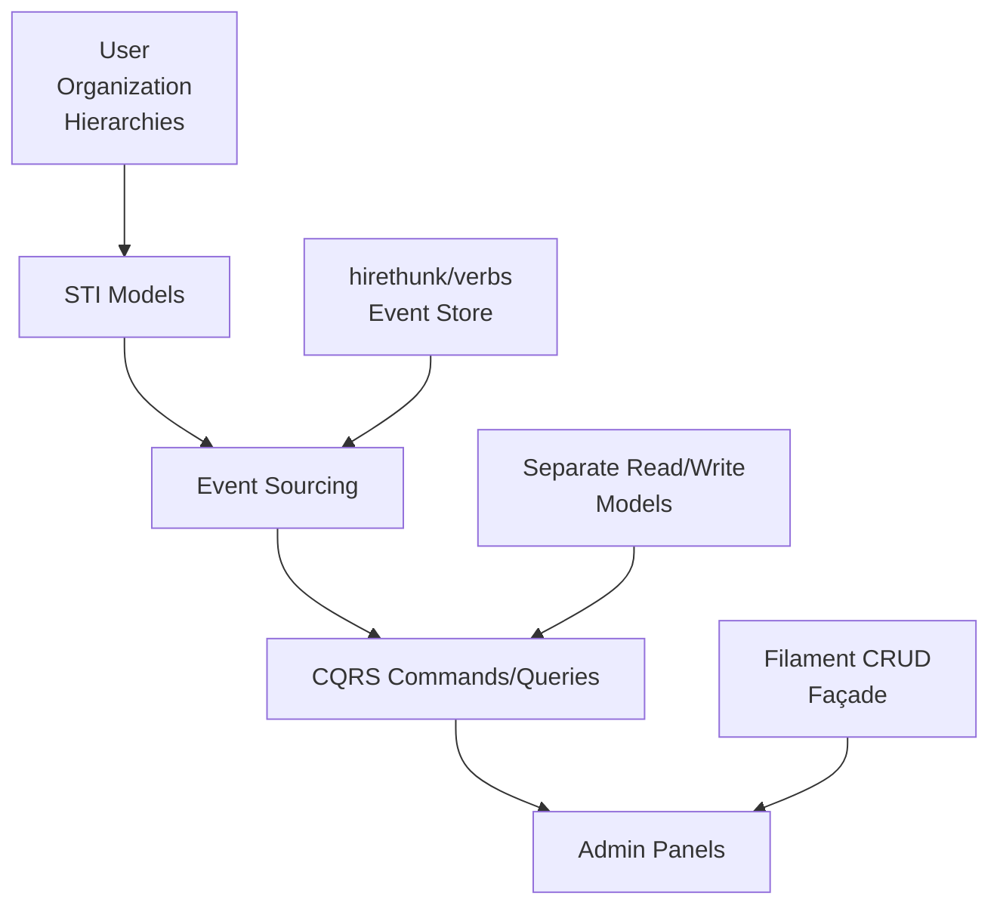

# 9.5. Quick Start Guide

## 9.5.1. Overview

Welcome to the Laravel Service Framework R&D architecture! This guide gets junior developers up and running with the core architectural patterns used across all R&D streams.

**Confidence Score: 92%** - High confidence based on comprehensive documentation analysis across all R&D streams.

## 9.5.2. Prerequisites

### 9.5.1. Required Knowledge

Before diving in, ensure you're comfortable with:

✅ **Essential Skills:**

-   Laravel 11+ fundamentals (Eloquent, migrations, routes)
-   PHP 8.2+ features (readonly properties, enums, match expressions)
-   Basic understanding of design patterns (Command, Observer, Factory)
-   Git workflow and version control

📚 **Helpful But Not Required:**

-   Domain-driven design concepts
-   CQRS and event sourcing theory
-   Single Table Inheritance patterns
-   Filament admin panel basics

### 9.5.2. Development Environment

```bash
# Required PHP version
php --version  # Should be 8.2+

# Required Composer packages (already in R&D streams)
composer require hirethunk/verbs:"^0.7"
composer require filament/filament:"^3.3"
composer require spatie/laravel-data:"^4.15"
```

## 9.5.3. Architecture Overview

### 9.5.3.1. Core Patterns

The R&D architecture uses four main patterns:



### 9.5.3.2. Directory Structure

```
app/
├── Models/
│   ├── User.php              # STI base class
│   ├── AdminUser.php         # STI derived
│   └── Organization.php      # Polymorphic self-reference
├── Events/                   # Domain events
├── Commands/                 # Write operations
├── Queries/                  # Read operations
├── Projections/              # Read models
└── Filament/
    └── Resources/            # Admin panels
```

## 9.5.4. Getting Started Checklist

### 9.5.4.1. Day 1 - Understanding the Patterns

1. **📖 Read the Core Guides** (30 mins each):

    - [110-sti-implementation-guide.md](110-sti-implementation-guide.md)
    - [130-event-sourcing-guide.md](130-event-sourcing-guide.md)
    - [140-admin-panel-guide.md](140-admin-panel-guide.md)

2. **🔍 Explore Existing Code** (1 hour):

    ```bash
    # Look at STI implementations
    find . -name "*User*.php" | head -5

    # Check event definitions
    find . -name "*Event*.php" | head -5

    # Review admin panels
    find . -path "*/Filament/Resources/*.php" | head -5
    ```

3. **✅ Verify Setup** (15 mins):

    ```bash
    # Check event store tables exist
    php artisan migrate:status | grep verbs

    # Verify Filament is configured
    php artisan route:list | grep filament
    ```

### 9.5.4.2. Day 2-3 - Hands-On Practice

1. **🛠️ Create Your First STI Model** (45 mins):

    ```php
    // app/Models/TeamMember.php
    class TeamMember extends User
    {
        protected $table = 'users';

        protected static function booted()
        {
            static::addGlobalScope('team_members', function ($query) {
                $query->where('type', 'team_member');
            });
        }
    }
    ```

2. **📝 Implement a Simple Event** (30 mins):

    ```php
    // app/Events/TeamMemberInvited.php
    use Thunk\Verbs\Event;

    class TeamMemberInvited extends Event
    {
        public function __construct(
            public readonly string $teamId,
            public readonly string $email,
            public readonly string $role
        ) {}
    }
    ```

3. **⚡ Create an Admin Resource** (45 mins):

    ```php
    // app/Filament/Resources/TeamMemberResource.php
    class TeamMemberResource extends Resource
    {
        protected static ?string $model = TeamMember::class;

        public static function form(Form $form): Form
        {
            return $form->schema([
                TextInput::make('name')->required(),
                TextInput::make('email')->email()->required(),
                Select::make('role')->options([
                    'member' => 'Member',
                    'admin' => 'Admin',
                ]),
            ]);
        }
    }
    ```

### 9.5.4.3. Week 1 - Integration

1. **🔗 Connect Events to Admin Actions** (2 hours)
2. **📊 Build Read Projections** (2 hours)
3. **🧪 Write Tests for Your Implementation** (1 hour)

## 9.5.5. Common Gotchas and Solutions

### 9.5.5.1. STI Model Issues

❌ **Problem:** STI models not filtering correctly

```php
// Wrong - missing global scope
class AdminUser extends User {}
```

✅ **Solution:** Always add proper global scopes

```php
class AdminUser extends User
{
    protected static function booted()
    {
        static::addGlobalScope('admin_users', function ($query) {
            $query->where('type', 'admin_user');
        });
    }
}
```

### 9.5.5.2. Event Sourcing Pitfalls

❌ **Problem:** Mutating event data after creation

```php
$event = new UserRegistered($userId, $email);
$event->email = 'different@email.com'; // Don't do this!
```

✅ **Solution:** Use readonly properties

```php
class UserRegistered extends Event
{
    public function __construct(
        public readonly string $userId,
        public readonly string $email
    ) {}
}
```

### 9.5.5.3. Admin Panel Synchronization

❌ **Problem:** Expecting immediate consistency

```php
// Wrong - projection might not be updated yet
UserInvited::fire($userId, $email);
return redirect()->route('users.index'); // Might not show new user
```

✅ **Solution:** Handle eventual consistency

```php
UserInvited::fire($userId, $email);
session()->flash('success', 'User invitation sent! Updates may take a moment to appear.');
return redirect()->route('users.index');
```

## 9.5.6. Next Steps

### 9.5.6.1. Immediate Actions (This Week)

1. **Choose Your Learning Path:**

    - **Backend Focus:** Start with STI and event sourcing
    - **Frontend Focus:** Begin with admin panel patterns
    - **Full-Stack:** Work through all patterns gradually

2. **Join the Implementation:**
    - Pick a P2 or P3 priority item from [100-implementation-priority-matrix.md](100-implementation-priority-matrix.md)
    - Start with small, isolated features
    - Ask for code reviews early and often

### 9.5.6.2. Medium-Term Goals (Next Month)

1. **Contribute to R&D Streams:**

    - Implement missing features in your chosen stream
    - Write tests for existing functionality
    - Improve documentation based on your learning experience

2. **Architecture Understanding:**
    - Read the full [020-architectural-features-analysis.md](020-architectural-features-analysis.md)
    - Understand cross-stream integrations from [090-cross-stream-analysis.md](090-cross-stream-analysis.md)

## 9.5.7. Getting Help

### 9.5.7.1. Resources by Question Type

**🤔 "How do I implement...?"**

-   Quick reference guides (090, 100, 110)
-   Architecture analysis (010)

**🐛 "Why isn't this working?"**

-   Common gotchas (this section 9.5.5)
-   Risk assessment (070)

**🎯 "What should I work on?"**

-   Implementation priorities (085)
-   Application features roadmap (060)

**🚀 "Where is this heading?"**

-   Architecture roadmap (040)
-   Business capabilities roadmap (050)

### 9.5.7.2. Debugging Workflow

1. **Check Event Store:**

    ```bash
    php artisan verbs:list  # See recent events
    ```

2. **Verify Projections:**

    ```bash
    php artisan verbs:replay --id=user_123  # Rebuild specific aggregate
    ```

3. **Test STI Queries:**
    ```bash
    php artisan tinker
    >>> User::where('type', 'admin_user')->count()
    ```

---

**Document Info:**

-   **Created:** 2025-06-06
-   **Version:** 1.0.0
-   **Last Updated:** 2025-06-06
-   **Confidence:** 92%
