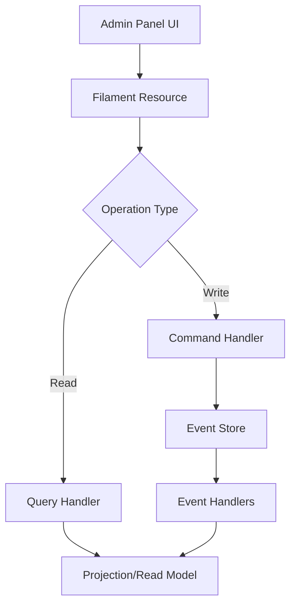

# 11. Admin Panel Implementation Quick Reference

## 11.1. Overview

Quick reference for implementing CQRS-backed admin panels using Filament that appear as traditional CRUD but use event sourcing and command/query separation underneath.

**Confidence Score: 85%** - High confidence based on Filament patterns and CQRS integration analysis from R&D streams.

## 11.2. Admin Panel Architecture

### 11.2.1. CQRS Behind CRUD Façade

The admin panels present a traditional CRUD interface to users while internally using:

-   **Commands** for all write operations
-   **Queries** for all read operations
-   **Event sourcing** for audit trails
-   **Projections** for fast reads



### 11.2.2. Benefits of This Approach

✅ **Advantages:**

-   Familiar CRUD interface for admin users
-   Complete audit trail of all changes
-   Event-driven side effects (notifications, integrations)
-   Scalable read performance through projections
-   Time travel debugging capabilities

⚠️ **Considerations:**

-   Eventual consistency between writes and reads
-   Increased complexity in implementation
-   Need for projection maintenance

## 11.3. Filament Setup with CQRS

### 11.3.1. Installation and Configuration

```bash
composer require filament/filament:"^3.3"
php artisan filament:install --panels
php artisan make:filament-user
```

**Admin Panel Provider:**

```php
<?php

declare(strict_types=1);

namespace App\Providers\Filament;

use Filament\Panel;
use Filament\PanelProvider;
use Filament\Support\Colors\Color;

class AdminPanelProvider extends PanelProvider
{
    public function panel(Panel $panel): Panel
    {
        return $panel
            ->default()
            ->id('admin')
            ->path('admin')
            ->login()
            ->colors([
                'primary' => Color::Amber,
            ])
            ->discoverResources(in: app_path('Filament/Resources'), for: 'App\\Filament\\Resources')
            ->discoverPages(in: app_path('Filament/Pages'), for: 'App\\Filament\\Pages')
            ->discoverWidgets(in: app_path('Filament/Widgets'), for: 'App\\Filament\\Widgets')
            ->middleware([
                \App\Http\Middleware\AdminPanelMiddleware::class,
            ]);
    }
}
```

### 11.3.2. Base CQRS Resource

```php
<?php

declare(strict_types=1);

namespace App\Filament\Resources;

use Filament\Resources\Resource;
use Filament\Forms;
use Filament\Tables;
use Illuminate\Database\Eloquent\Model;

abstract class BaseCQRSResource extends Resource
{
    /**
     * Get the command handler for this resource
     */
    abstract protected function getCommandHandler(): object;

    /**
     * Get the query handler for this resource
     */
    abstract protected function getQueryHandler(): object;

    /**
     * Get the projection model for table queries
     */
    abstract protected function getProjectionModel(): string;

    /**
     * Override the default table query to use projections
     */
    public static function getEloquentQuery(): \Illuminate\Database\Eloquent\Builder
    {
        $projectionModel = app(static::class)->getProjectionModel();
        return $projectionModel::query();
    }

    /**
     * Handle create operation through command
     */
    protected function handleCreate(array $data): void
    {
        $command = $this->buildCreateCommand($data);
        $this->getCommandHandler()->handle($command);
    }

    /**
     * Handle update operation through command
     */
    protected function handleUpdate(Model $record, array $data): void
    {
        $command = $this->buildUpdateCommand($record, $data);
        $this->getCommandHandler()->handle($command);
    }

    /**
     * Handle delete operation through command
     */
    protected function handleDelete(Model $record): void
    {
        $command = $this->buildDeleteCommand($record);
        $this->getCommandHandler()->handle($command);
    }

    /**
     * Build create command - override in child classes
     */
    abstract protected function buildCreateCommand(array $data): object;

    /**
     * Build update command - override in child classes
     */
    abstract protected function buildUpdateCommand(Model $record, array $data): object;

    /**
     * Build delete command - override in child classes
     */
    abstract protected function buildDeleteCommand(Model $record): object;
}
```

## 11.4. User Management Resource

### 11.4.1. User Projection Model

```php
<?php

declare(strict_types=1);

namespace App\Models\Projections;

use Illuminate\Database\Eloquent\Model;
use Illuminate\Database\Eloquent\Builder;

class UserProjection extends Model
{
    protected $table = 'user_projections';

    protected $fillable = [
        'user_id',
        'name',
        'email',
        'type',
        'is_active',
        'metadata',
    ];

    protected $casts = [
        'user_id' => 'integer',
        'is_active' => 'boolean',
        'metadata' => 'array',
        'created_at' => 'datetime',
        'updated_at' => 'datetime',
    ];

    /**
     * Scope for active users
     */
    public function scopeActive(Builder $query): Builder
    {
        return $query->where('is_active', true);
    }

    /**
     * Scope for specific user type
     */
    public function scopeOfType(Builder $query, string $type): Builder
    {
        return $query->where('type', $type);
    }

    /**
     * Get user type badge color
     */
    public function getTypeBadgeColorAttribute(): string
    {
        return match($this->type) {
            'admin' => 'danger',
            'manager' => 'warning',
            'customer' => 'success',
            default => 'gray',
        };
    }
}
```

### 11.4.2. User Commands

```php
<?php

declare(strict_types=1);

namespace App\Commands\User;

class CreateUserCommand
{
    public function __construct(
        public readonly string $name,
        public readonly string $email,
        public readonly string $type,
        public readonly array $metadata = []
    ) {}
}

class UpdateUserCommand
{
    public function __construct(
        public readonly int $userId,
        public readonly string $name,
        public readonly string $email,
        public readonly string $type,
        public readonly array $metadata = []
    ) {}
}

class DeactivateUserCommand
{
    public function __construct(
        public readonly int $userId,
        public readonly string $reason = ''
    ) {}
}
```

### 11.4.3. User Command Handler

```php
<?php

declare(strict_types=1);

namespace App\Handlers;

use App\Commands\User\{CreateUserCommand, UpdateUserCommand, DeactivateUserCommand};
use App\Events\{UserRegistered, UserUpdated, UserDeactivated};
use App\States\UserState;

class UserCommandHandler
{
    public function handle(CreateUserCommand $command): void
    {
        // Validate email uniqueness
        $existingUser = UserState::where('email', $command->email)->first();
        if ($existingUser) {
            throw new \InvalidArgumentException('Email already exists');
        }

        // Generate new user ID
        $userId = app('snowflake')->nextId();

        // Fire event
        UserRegistered::fire(
            user_id: $userId,
            name: $command->name,
            email: $command->email,
            type: $command->type,
            metadata: $command->metadata
        );
    }

    public function handle(UpdateUserCommand $command): void
    {
        $userState = UserState::load($command->userId);

        if (!$userState->canUpdate()) {
            throw new \InvalidArgumentException('User cannot be updated');
        }

        UserUpdated::fire(
            user_id: $command->userId,
            name: $command->name,
            email: $command->email,
            type: $command->type,
            metadata: $command->metadata
        );
    }

    public function handle(DeactivateUserCommand $command): void
    {
        $userState = UserState::load($command->userId);

        if (!$userState->is_active) {
            throw new \InvalidArgumentException('User is already deactivated');
        }

        UserDeactivated::fire(
            user_id: $command->userId,
            reason: $command->reason
        );
    }
}
```

### 11.4.4. User Filament Resource

```php
<?php

declare(strict_types=1);

namespace App\Filament\Resources;

use App\Models\Projections\UserProjection;
use App\Handlers\UserCommandHandler;
use App\Commands\User\{CreateUserCommand, UpdateUserCommand, DeactivateUserCommand};
use Filament\Forms;
use Filament\Tables;
use Filament\Forms\Form;
use Filament\Tables\Table;
use Illuminate\Database\Eloquent\Model;

class UserResource extends BaseCQRSResource
{
    protected static ?string $model = UserProjection::class;
    protected static ?string $navigationIcon = 'heroicon-o-users';
    protected static ?string $navigationLabel = 'Users';

    protected function getCommandHandler(): UserCommandHandler
    {
        return app(UserCommandHandler::class);
    }

    protected function getQueryHandler(): object
    {
        return new class {
            public function getUsers(array $filters = []): array
            {
                // Implement complex query logic here
                return UserProjection::query()
                    ->when($filters['type'] ?? null, fn($q, $type) => $q->ofType($type))
                    ->when($filters['active'] ?? null, fn($q) => $q->active())
                    ->get()
                    ->toArray();
            }
        };
    }

    protected function getProjectionModel(): string
    {
        return UserProjection::class;
    }

    public static function form(Form $form): Form
    {
        return $form
            ->schema([
                Forms\Components\Section::make('User Information')
                    ->schema([
                        Forms\Components\TextInput::make('name')
                            ->required()
                            ->maxLength(255),

                        Forms\Components\TextInput::make('email')
                            ->email()
                            ->required()
                            ->unique(ignoreRecord: true)
                            ->maxLength(255),

                        Forms\Components\Select::make('type')
                            ->options([
                                'admin' => 'Administrator',
                                'manager' => 'Manager',
                                'customer' => 'Customer',
                            ])
                            ->required()
                            ->default('customer'),

                        Forms\Components\Toggle::make('is_active')
                            ->label('Active')
                            ->default(true)
                            ->hiddenOn('create'),
                    ])
                    ->columns(2),

                Forms\Components\Section::make('Metadata')
                    ->schema([
                        Forms\Components\KeyValue::make('metadata')
                            ->label('Additional Information')
                            ->reorderable()
                            ->addActionLabel('Add field')
                            ->keyLabel('Field name')
                            ->valueLabel('Value'),
                    ])
                    ->collapsible(),
            ]);
    }

    public static function table(Table $table): Table
    {
        return $table
            ->columns([
                Tables\Columns\TextColumn::make('user_id')
                    ->label('ID')
                    ->sortable()
                    ->searchable(),

                Tables\Columns\TextColumn::make('name')
                    ->searchable()
                    ->sortable(),

                Tables\Columns\TextColumn::make('email')
                    ->searchable()
                    ->sortable()
                    ->copyable(),

                Tables\Columns\BadgeColumn::make('type')
                    ->colors([
                        'danger' => 'admin',
                        'warning' => 'manager',
                        'success' => 'customer',
                    ]),

                Tables\Columns\IconColumn::make('is_active')
                    ->boolean()
                    ->trueIcon('heroicon-o-check-circle')
                    ->falseIcon('heroicon-o-x-circle')
                    ->trueColor('success')
                    ->falseColor('danger'),

                Tables\Columns\TextColumn::make('created_at')
                    ->dateTime()
                    ->sortable()
                    ->toggleable(isToggledHiddenByDefault: true),

                Tables\Columns\TextColumn::make('updated_at')
                    ->dateTime()
                    ->sortable()
                    ->toggleable(isToggledHiddenByDefault: true),
            ])
            ->filters([
                Tables\Filters\SelectFilter::make('type')
                    ->options([
                        'admin' => 'Administrator',
                        'manager' => 'Manager',
                        'customer' => 'Customer',
                    ]),

                Tables\Filters\TernaryFilter::make('is_active')
                    ->label('Active')
                    ->boolean()
                    ->trueLabel('Active only')
                    ->falseLabel('Inactive only')
                    ->native(false),
            ])
            ->actions([
                Tables\Actions\ViewAction::make(),
                Tables\Actions\EditAction::make(),
                Tables\Actions\Action::make('deactivate')
                    ->icon('heroicon-o-x-circle')
                    ->color('danger')
                    ->requiresConfirmation()
                    ->visible(fn(UserProjection $record) => $record->is_active)
                    ->action(function (UserProjection $record) {
                        app(UserCommandHandler::class)->handle(
                            new DeactivateUserCommand($record->user_id, 'Deactivated via admin panel')
                        );
                    }),
            ])
            ->bulkActions([
                Tables\Actions\BulkActionGroup::make([
                    Tables\Actions\DeleteBulkAction::make(),
                ]),
            ]);
    }

    protected function buildCreateCommand(array $data): CreateUserCommand
    {
        return new CreateUserCommand(
            name: $data['name'],
            email: $data['email'],
            type: $data['type'],
            metadata: $data['metadata'] ?? []
        );
    }

    protected function buildUpdateCommand(Model $record, array $data): UpdateUserCommand
    {
        return new UpdateUserCommand(
            userId: $record->user_id,
            name: $data['name'],
            email: $data['email'],
            type: $data['type'],
            metadata: $data['metadata'] ?? []
        );
    }

    protected function buildDeleteCommand(Model $record): DeactivateUserCommand
    {
        return new DeactivateUserCommand(
            userId: $record->user_id,
            reason: 'Deleted via admin panel'
        );
    }

    /**
     * Override create to use command handler
     */
    public static function create(array $data): Model
    {
        $resource = new static();
        $resource->handleCreate($data);

        // Return the created projection (eventual consistency means it might not exist yet)
        return UserProjection::where('email', $data['email'])->firstOrFail();
    }

    /**
     * Override update to use command handler
     */
    public static function update(Model $record, array $data): Model
    {
        $resource = new static();
        $resource->handleUpdate($record, $data);

        // Refresh the projection
        return $record->fresh();
    }
}
```

## 11.5. Organization Management Resource

### 11.5.1. Organization Resource Implementation

```php
<?php

declare(strict_types=1);

namespace App\Filament\Resources;

use App\Models\Projections\OrganizationProjection;
use App\Handlers\OrganizationCommandHandler;
use App\Commands\Organization\{CreateOrganizationCommand, UpdateOrganizationCommand};
use Filament\Forms;
use Filament\Tables;
use Filament\Forms\Form;
use Filament\Tables\Table;
use Illuminate\Database\Eloquent\Model;

class OrganizationResource extends BaseCQRSResource
{
    protected static ?string $model = OrganizationProjection::class;
    protected static ?string $navigationIcon = 'heroicon-o-building-office';
    protected static ?string $navigationLabel = 'Organizations';

    protected function getCommandHandler(): OrganizationCommandHandler
    {
        return app(OrganizationCommandHandler::class);
    }

    protected function getQueryHandler(): object
    {
        return new class {
            public function getOrganizations(array $filters = []): array
            {
                return OrganizationProjection::query()
                    ->when($filters['type'] ?? null, fn($q, $type) => $q->where('type', $type))
                    ->withCount('members')
                    ->get()
                    ->toArray();
            }
        };
    }

    protected function getProjectionModel(): string
    {
        return OrganizationProjection::class;
    }

    public static function form(Form $form): Form
    {
        return $form
            ->schema([
                Forms\Components\Section::make('Organization Details')
                    ->schema([
                        Forms\Components\TextInput::make('name')
                            ->required()
                            ->maxLength(255),

                        Forms\Components\Select::make('type')
                            ->options([
                                'corporation' => 'Corporation',
                                'partnership' => 'Partnership',
                                'llc' => 'Limited Liability Company',
                            ])
                            ->required(),

                        Forms\Components\TextInput::make('tax_id')
                            ->label('Tax ID')
                            ->maxLength(50),

                        Forms\Components\TextInput::make('email')
                            ->email()
                            ->maxLength(255),

                        Forms\Components\TextInput::make('phone')
                            ->tel()
                            ->maxLength(20),
                    ])
                    ->columns(2),

                Forms\Components\Section::make('Address')
                    ->schema([
                        Forms\Components\TextInput::make('address.street')
                            ->label('Street Address'),

                        Forms\Components\TextInput::make('address.city')
                            ->label('City'),

                        Forms\Components\TextInput::make('address.state')
                            ->label('State/Province'),

                        Forms\Components\TextInput::make('address.postal_code')
                            ->label('Postal Code'),

                        Forms\Components\TextInput::make('address.country')
                            ->label('Country')
                            ->default('United States'),
                    ])
                    ->columns(2)
                    ->collapsible(),
            ]);
    }

    public static function table(Table $table): Table
    {
        return $table
            ->columns([
                Tables\Columns\TextColumn::make('organization_id')
                    ->label('ID')
                    ->sortable(),

                Tables\Columns\TextColumn::make('name')
                    ->searchable()
                    ->sortable(),

                Tables\Columns\BadgeColumn::make('type')
                    ->colors([
                        'primary' => 'corporation',
                        'warning' => 'partnership',
                        'success' => 'llc',
                    ]),

                Tables\Columns\TextColumn::make('email')
                    ->searchable()
                    ->toggleable(),

                Tables\Columns\TextColumn::make('members_count')
                    ->label('Members')
                    ->counts('members')
                    ->sortable(),

                Tables\Columns\TextColumn::make('created_at')
                    ->dateTime()
                    ->sortable()
                    ->toggleable(isToggledHiddenByDefault: true),
            ])
            ->filters([
                Tables\Filters\SelectFilter::make('type')
                    ->options([
                        'corporation' => 'Corporation',
                        'partnership' => 'Partnership',
                        'llc' => 'LLC',
                    ]),
            ])
            ->actions([
                Tables\Actions\ViewAction::make(),
                Tables\Actions\EditAction::make(),
                Tables\Actions\Action::make('manage_members')
                    ->icon('heroicon-o-users')
                    ->url(fn(OrganizationProjection $record) => static::getUrl('members', ['record' => $record])),
            ])
            ->bulkActions([
                Tables\Actions\BulkActionGroup::make([
                    Tables\Actions\DeleteBulkAction::make(),
                ]),
            ]);
    }

    protected function buildCreateCommand(array $data): CreateOrganizationCommand
    {
        return new CreateOrganizationCommand(
            name: $data['name'],
            type: $data['type'],
            taxId: $data['tax_id'] ?? null,
            email: $data['email'] ?? null,
            phone: $data['phone'] ?? null,
            address: $data['address'] ?? []
        );
    }

    protected function buildUpdateCommand(Model $record, array $data): UpdateOrganizationCommand
    {
        return new UpdateOrganizationCommand(
            organizationId: $record->organization_id,
            name: $data['name'],
            type: $data['type'],
            taxId: $data['tax_id'] ?? null,
            email: $data['email'] ?? null,
            phone: $data['phone'] ?? null,
            address: $data['address'] ?? []
        );
    }

    protected function buildDeleteCommand(Model $record): object
    {
        // Organizations typically aren't deleted, just deactivated
        throw new \LogicException('Organizations cannot be deleted through the admin panel');
    }
}
```

## 11.6. Real-time Updates with Livewire

### 11.6.1. Event Broadcasting

```php
<?php

declare(strict_types=1);

namespace App\Events;

use Illuminate\Broadcasting\Channel;
use Illuminate\Broadcasting\InteractsWithSockets;
use Illuminate\Contracts\Broadcasting\ShouldBroadcast;
use Illuminate\Foundation\Events\Dispatchable;
use Illuminate\Queue\SerializesModels;

class UserProjectionUpdated implements ShouldBroadcast
{
    use Dispatchable, InteractsWithSockets, SerializesModels;

    public function __construct(
        public readonly int $userId,
        public readonly array $changes
    ) {}

    public function broadcastOn(): array
    {
        return [
            new Channel('admin-panel'),
            new Channel("user.{$this->userId}"),
        ];
    }

    public function broadcastAs(): string
    {
        return 'user.updated';
    }

    public function broadcastWith(): array
    {
        return [
            'user_id' => $this->userId,
            'changes' => $this->changes,
        ];
    }
}
```

### 11.6.2. Filament Real-time Table

```php
<?php

declare(strict_types=1);

namespace App\Filament\Resources\UserResource\Pages;

use App\Filament\Resources\UserResource;
use Filament\Resources\Pages\ListRecords;
use Livewire\Attributes\On;

class ListUsers extends ListRecords
{
    protected static string $resource = UserResource::class;

    /**
     * Listen for real-time updates
     */
    #[On('echo:admin-panel,user.updated')]
    public function handleUserUpdated(array $data): void
    {
        // Refresh the table when user data changes
        $this->resetTable();

        // Optionally show a notification
        $this->notify(
            \Filament\Notifications\Notification::make()
                ->title('User Updated')
                ->body("User {$data['user_id']} has been updated")
                ->success()
        );
    }

    /**
     * Refresh table data
     */
    public function refreshTable(): void
    {
        $this->resetTable();
    }

    protected function getHeaderActions(): array
    {
        return [
            \Filament\Actions\CreateAction::make(),
            \Filament\Actions\Action::make('refresh')
                ->label('Refresh')
                ->icon('heroicon-o-arrow-path')
                ->action('refreshTable'),
        ];
    }
}
```

## 11.7. Custom Admin Widgets

### 11.7.1. User Statistics Widget

```php
<?php

declare(strict_types=1);

namespace App\Filament\Widgets;

use App\Models\Projections\UserProjection;
use Filament\Widgets\StatsOverviewWidget as BaseWidget;
use Filament\Widgets\StatsOverviewWidget\Stat;

class UserStatsWidget extends BaseWidget
{
    protected function getStats(): array
    {
        return [
            Stat::make('Total Users', UserProjection::count())
                ->description('All registered users')
                ->descriptionIcon('heroicon-m-users')
                ->color('success'),

            Stat::make('Active Users', UserProjection::where('is_active', true)->count())
                ->description('Currently active users')
                ->descriptionIcon('heroicon-m-check-circle')
                ->color('primary'),

            Stat::make('Admin Users', UserProjection::where('type', 'admin')->count())
                ->description('Administrator accounts')
                ->descriptionIcon('heroicon-m-shield-check')
                ->color('warning'),

            Stat::make('New This Month', UserProjection::whereMonth('created_at', now()->month)->count())
                ->description('Users registered this month')
                ->descriptionIcon('heroicon-m-arrow-trending-up')
                ->color('success'),
        ];
    }
}
```

### 11.7.2. Event Activity Widget

```php
<?php

declare(strict_types=1);

namespace App\Filament\Widgets;

use Filament\Widgets\ChartWidget;
use Illuminate\Support\Facades\DB;

class EventActivityWidget extends ChartWidget
{
    protected static ?string $heading = 'Event Activity';
    protected static ?int $sort = 2;

    protected function getData(): array
    {
        $data = DB::table('verb_events')
            ->selectRaw('DATE(created_at) as date, COUNT(*) as count')
            ->where('created_at', '>=', now()->subDays(30))
            ->groupBy('date')
            ->orderBy('date')
            ->pluck('count', 'date')
            ->toArray();

        return [
            'datasets' => [
                [
                    'label' => 'Events per day',
                    'data' => array_values($data),
                    'backgroundColor' => 'rgba(59, 130, 246, 0.1)',
                    'borderColor' => 'rgb(59, 130, 246)',
                ],
            ],
            'labels' => array_keys($data),
        ];
    }

    protected function getType(): string
    {
        return 'line';
    }
}
```

## 11.8. Advanced Admin Features

### 11.8.1. Event Replay Interface

```php
<?php

declare(strict_types=1);

namespace App\Filament\Pages;

use Filament\Pages\Page;
use Filament\Forms\Components\{DateTimePicker, Select, TextInput};
use Filament\Forms\Form;
use Filament\Actions\Action;
use Illuminate\Support\Facades\DB;

class EventReplay extends Page
{
    protected static ?string $navigationIcon = 'heroicon-o-clock';
    protected static string $view = 'filament.pages.event-replay';

    public ?string $eventType = null;
    public ?string $aggregateId = null;
    public ?string $fromDate = null;
    public ?string $toDate = null;

    public function form(Form $form): Form
    {
        return $form
            ->schema([
                Select::make('eventType')
                    ->label('Event Type')
                    ->options($this->getEventTypes())
                    ->searchable(),

                TextInput::make('aggregateId')
                    ->label('Aggregate ID')
                    ->hint('Leave empty to replay all aggregates'),

                DateTimePicker::make('fromDate')
                    ->label('From Date')
                    ->default(now()->subHour()),

                DateTimePicker::make('toDate')
                    ->label('To Date')
                    ->default(now()),
            ]);
    }

    protected function getHeaderActions(): array
    {
        return [
            Action::make('replay')
                ->label('Replay Events')
                ->icon('heroicon-o-play')
                ->requiresConfirmation()
                ->modalHeading('Replay Events')
                ->modalDescription('This will replay events and may affect current state. Are you sure?')
                ->action('replayEvents'),
        ];
    }

    public function replayEvents(): void
    {
        $query = DB::table('verb_events')
            ->when($this->eventType, fn($q) => $q->where('type', $this->eventType))
            ->when($this->aggregateId, fn($q) => $q->where('aggregate_id', $this->aggregateId))
            ->when($this->fromDate, fn($q) => $q->where('created_at', '>=', $this->fromDate))
            ->when($this->toDate, fn($q) => $q->where('created_at', '<=', $this->toDate))
            ->orderBy('created_at');

        $eventCount = $query->count();

        // Queue the replay job
        \App\Jobs\ReplayEventsJob::dispatch([
            'event_type' => $this->eventType,
            'aggregate_id' => $this->aggregateId,
            'from_date' => $this->fromDate,
            'to_date' => $this->toDate,
        ]);

        $this->notify(
            \Filament\Notifications\Notification::make()
                ->title('Event Replay Started')
                ->body("Replaying {$eventCount} events. Check the job queue for progress.")
                ->success()
        );
    }

    private function getEventTypes(): array
    {
        return DB::table('verb_events')
            ->distinct()
            ->pluck('type', 'type')
            ->toArray();
    }
}
```

### 11.8.2. Audit Trail Viewer

```php
<?php

declare(strict_types=1);

namespace App\Filament\Resources\UserResource\Pages;

use App\Filament\Resources\UserResource;
use Filament\Resources\Pages\ViewRecord;
use Filament\Infolists\Infolist;
use Filament\Infolists\Components\{Section, TextEntry, RepeatableEntry};
use Illuminate\Support\Facades\DB;

class ViewUser extends ViewRecord
{
    protected static string $resource = UserResource::class;

    public function infolist(Infolist $infolist): Infolist
    {
        return $infolist
            ->schema([
                Section::make('User Information')
                    ->schema([
                        TextEntry::make('name'),
                        TextEntry::make('email'),
                        TextEntry::make('type')
                            ->badge()
                            ->color(fn(string $state): string => match ($state) {
                                'admin' => 'danger',
                                'manager' => 'warning',
                                'customer' => 'success',
                                default => 'gray',
                            }),
                        TextEntry::make('is_active')
                            ->boolean(),
                        TextEntry::make('created_at')
                            ->dateTime(),
                        TextEntry::make('updated_at')
                            ->dateTime(),
                    ])
                    ->columns(2),

                Section::make('Event History')
                    ->schema([
                        RepeatableEntry::make('events')
                            ->schema([
                                TextEntry::make('type')
                                    ->label('Event Type'),
                                TextEntry::make('data')
                                    ->label('Event Data')
                                    ->formatStateUsing(fn($state) => json_encode($state, JSON_PRETTY_PRINT))
                                    ->html(),
                                TextEntry::make('created_at')
                                    ->label('Occurred At')
                                    ->dateTime(),
                            ])
                            ->columns(3),
                    ])
                    ->collapsible(),
            ]);
    }

    protected function mutateFormDataBeforeFill(array $data): array
    {
        // Load event history for this user
        $events = DB::table('verb_events')
            ->where('aggregate_id', $data['user_id'])
            ->orderBy('created_at', 'desc')
            ->get()
            ->map(fn($event) => [
                'type' => $event->type,
                'data' => json_decode($event->data, true),
                'created_at' => $event->created_at,
            ])
            ->toArray();

        $data['events'] = $events;

        return $data;
    }
}
```

## 11.9. Error Handling and Validation

### 11.9.1. Command Validation

```php
<?php

declare(strict_types=1);

namespace App\Http\Middleware;

use Closure;
use Illuminate\Http\Request;
use Illuminate\Validation\ValidationException;

class AdminPanelMiddleware
{
    public function handle(Request $request, Closure $next)
    {
        try {
            return $next($request);
        } catch (\InvalidArgumentException $e) {
            // Convert domain exceptions to validation errors
            throw ValidationException::withMessages([
                'general' => [$e->getMessage()],
            ]);
        } catch (\Exception $e) {
            // Log unexpected errors
            logger()->error('Admin panel error', [
                'error' => $e->getMessage(),
                'trace' => $e->getTraceAsString(),
                'user' => auth()->id(),
                'request' => $request->all(),
            ]);

            throw $e;
        }
    }
}
```

### 11.9.2. Eventual Consistency Handling

```php
<?php

declare(strict_types=1);

namespace App\Filament\Resources\Concerns;

use Filament\Notifications\Notification;

trait HandlesEventualConsistency
{
    protected function handleEventualConsistency(callable $action, string $successMessage): void
    {
        try {
            $action();

            Notification::make()
                ->title('Action Queued')
                ->body($successMessage . ' This may take a moment to reflect in the interface.')
                ->warning()
                ->send();

        } catch (\Exception $e) {
            Notification::make()
                ->title('Action Failed')
                ->body($e->getMessage())
                ->danger()
                ->send();
        }
    }
}
```

## 11.10. Performance Optimization

### 11.10.1. Projection Eager Loading

```php
<?php

declare(strict_types=1);

namespace App\Models\Projections;

use Illuminate\Database\Eloquent\Model;
use Illuminate\Database\Eloquent\Relations\HasMany;

class OrganizationProjection extends Model
{
    protected $with = ['members']; // Always eager load

    public function members(): HasMany
    {
        return $this->hasMany(UserProjection::class, 'organization_id', 'organization_id');
    }

    /**
     * Scope with member count for admin tables
     */
    public function scopeWithMemberCount($query)
    {
        return $query->withCount('members');
    }
}
```

### 11.10.2. Caching Strategy

```php
<?php

declare(strict_types=1);

namespace App\Filament\Resources;

use Illuminate\Support\Facades\Cache;

abstract class BaseCQRSResource extends Resource
{
    // ...existing code...

    /**
     * Cache frequently accessed projections
     */
    protected function getCachedProjection(string $key, callable $callback, int $ttl = 300)
    {
        return Cache::remember("projection:{$key}", $ttl, $callback);
    }

    /**
     * Invalidate projection cache when events occur
     */
    protected function invalidateProjectionCache(string $key): void
    {
        Cache::forget("projection:{$key}");
    }
}
```

## 11.11. Testing Admin Panels

### 11.11.1. Feature Tests

```php
<?php

declare(strict_types=1);

use App\Models\Projections\UserProjection;
use App\Models\User;

test('admin can create user through panel', function () {
    $admin = User::factory()->admin()->create();

    $this->actingAs($admin)
        ->post('/admin/users', [
            'name' => 'Test User',
            'email' => 'test@example.com',
            'type' => 'customer',
        ])
        ->assertRedirect();

    // Check that projection is eventually created
    $this->assertDatabaseHas('user_projections', [
        'email' => 'test@example.com',
        'type' => 'customer',
    ]);
});

test('admin can view user audit trail', function () {
    $admin = User::factory()->admin()->create();
    $user = UserProjection::factory()->create();

    $response = $this->actingAs($admin)
        ->get("/admin/users/{$user->user_id}");

    $response->assertSee('Event History');
    $response->assertSee('UserRegistered');
});
```

### 11.11.2. Component Tests

```php
<?php

declare(strict_types=1);

use App\Filament\Resources\UserResource;
use App\Models\User;
use App\Models\Projections\UserProjection;

test('user resource displays correct data', function () {
    $admin = User::factory()->admin()->create();
    $users = UserProjection::factory()->count(5)->create();

    \Livewire\Livewire::actingAs($admin)
        ->test(UserResource\Pages\ListUsers::class)
        ->assertCanSeeTableRecords($users)
        ->assertCountTableRecords(5);
});

test('user resource can filter by type', function () {
    $admin = User::factory()->admin()->create();
    $adminUsers = UserProjection::factory()->count(2)->create(['type' => 'admin']);
    $customerUsers = UserProjection::factory()->count(3)->create(['type' => 'customer']);

    \Livewire\Livewire::actingAs($admin)
        ->test(UserResource\Pages\ListUsers::class)
        ->filterTable('type', 'admin')
        ->assertCanSeeTableRecords($adminUsers)
        ->assertCannotSeeTableRecords($customerUsers);
});
```

## 11.12. Deployment and Monitoring

### 11.12.1. Health Checks

```php
<?php

declare(strict_types=1);

namespace App\Http\Controllers;

use Illuminate\Http\JsonResponse;
use Illuminate\Support\Facades\{DB, Cache};

class AdminHealthController extends Controller
{
    public function __invoke(): JsonResponse
    {
        $checks = [
            'database' => $this->checkDatabase(),
            'event_store' => $this->checkEventStore(),
            'projections' => $this->checkProjections(),
            'cache' => $this->checkCache(),
        ];

        $allHealthy = collect($checks)->every(fn($check) => $check['status'] === 'ok');

        return response()->json([
            'status' => $allHealthy ? 'healthy' : 'unhealthy',
            'checks' => $checks,
            'timestamp' => now()->toISOString(),
        ], $allHealthy ? 200 : 503);
    }

    private function checkDatabase(): array
    {
        try {
            DB::connection()->getPdo();
            return ['status' => 'ok', 'message' => 'Database connection successful'];
        } catch (\Exception $e) {
            return ['status' => 'error', 'message' => 'Database connection failed: ' . $e->getMessage()];
        }
    }

    private function checkEventStore(): array
    {
        try {
            $eventCount = DB::table('verb_events')->count();
            return ['status' => 'ok', 'message' => "Event store has {$eventCount} events"];
        } catch (\Exception $e) {
            return ['status' => 'error', 'message' => 'Event store check failed: ' . $e->getMessage()];
        }
    }

    private function checkProjections(): array
    {
        try {
            $userCount = UserProjection::count();
            return ['status' => 'ok', 'message' => "User projection has {$userCount} records"];
        } catch (\Exception $e) {
            return ['status' => 'error', 'message' => 'Projection check failed: ' . $e->getMessage()];
        }
    }

    private function checkCache(): array
    {
        try {
            Cache::put('health_check', 'ok', 60);
            $result = Cache::get('health_check');
            return ['status' => $result === 'ok' ? 'ok' : 'error', 'message' => 'Cache working'];
        } catch (\Exception $e) {
            return ['status' => 'error', 'message' => 'Cache check failed: ' . $e->getMessage()];
        }
    }
}
```

## 11.13. Best Practices Checklist

### 11.13.1. Implementation Checklist

-   [ ] Use projections for all admin panel read operations
-   [ ] Implement commands for all write operations
-   [ ] Add proper validation at the command level
-   [ ] Handle eventual consistency gracefully
-   [ ] Implement real-time updates where appropriate
-   [ ] Add comprehensive audit trails
-   [ ] Cache frequently accessed data
-   [ ] Write tests for both UI and command handling
-   [ ] Monitor performance and health
-   [ ] Document admin procedures

### 11.13.2. Security Checklist

-   [ ] Implement proper authorization for admin actions
-   [ ] Validate all input data
-   [ ] Log all admin actions for audit
-   [ ] Use HTTPS for admin panel access
-   [ ] Implement rate limiting
-   [ ] Add CSRF protection
-   [ ] Sanitize display data
-   [ ] Implement proper session management

### 11.13.3. Performance Checklist

-   [ ] Use database indexes on projection tables
-   [ ] Implement query optimization for large datasets
-   [ ] Add caching for expensive operations
-   [ ] Monitor query performance
-   [ ] Optimize event replay procedures
-   [ ] Use appropriate pagination
-   [ ] Implement bulk operations efficiently

**Remember**: The key to successful CQRS admin panels is maintaining the illusion of traditional CRUD while leveraging the power of event sourcing behind the scenes. Always prioritize user experience while ensuring data consistency and auditability!
