# UUID/ULID/Snowflake Trait Implementation Diagrams

## Executive Summary
This document provides visual representations of the `HasSecondaryUniqueKey` trait implementation, including class diagrams, sequence diagrams, architectural overviews, and integration patterns. These diagrams illustrate how the trait integrates with the UMS-STI system and demonstrate the relationships between different components, supporting UUID, ULID, and Snowflake identifier formats through an enhanced native PHP enum with color and label metadata.

## Learning Objectives
After reviewing these diagrams, you will:
- Visualize the trait's integration with the STI architecture
- Understand the class relationships and inheritance patterns
- Follow the sequence of operations for key generation and retrieval
- Comprehend the architectural impact on the overall system
- Identify integration points and dependencies

## Prerequisite Knowledge
- UML diagram notation
- Object-oriented programming concepts
- Laravel Eloquent model relationships
- UMS-STI architecture basics

## Class Diagrams

### 1. Enhanced Trait Structure with Enum Integration

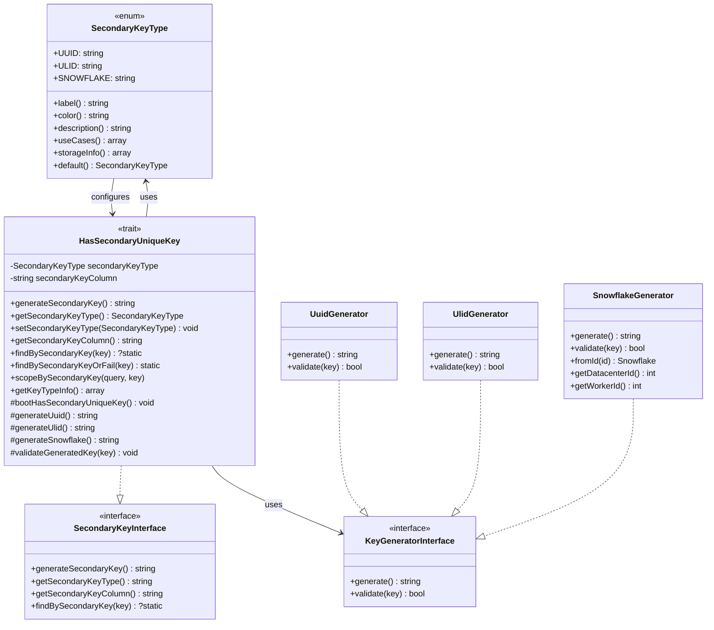

### 2. STI Integration with Secondary Keys

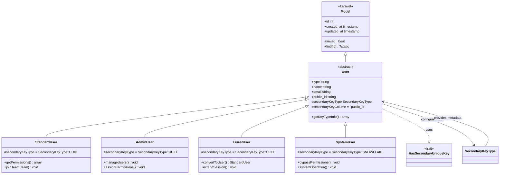

### 3. Database Schema Relationships

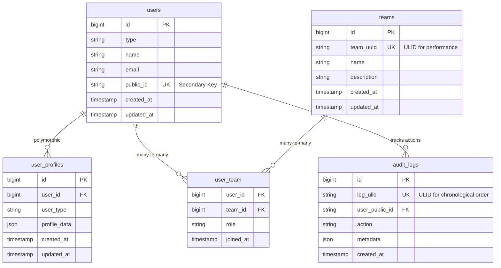

## Sequence Diagrams

### 1. Secondary Key Generation Flow

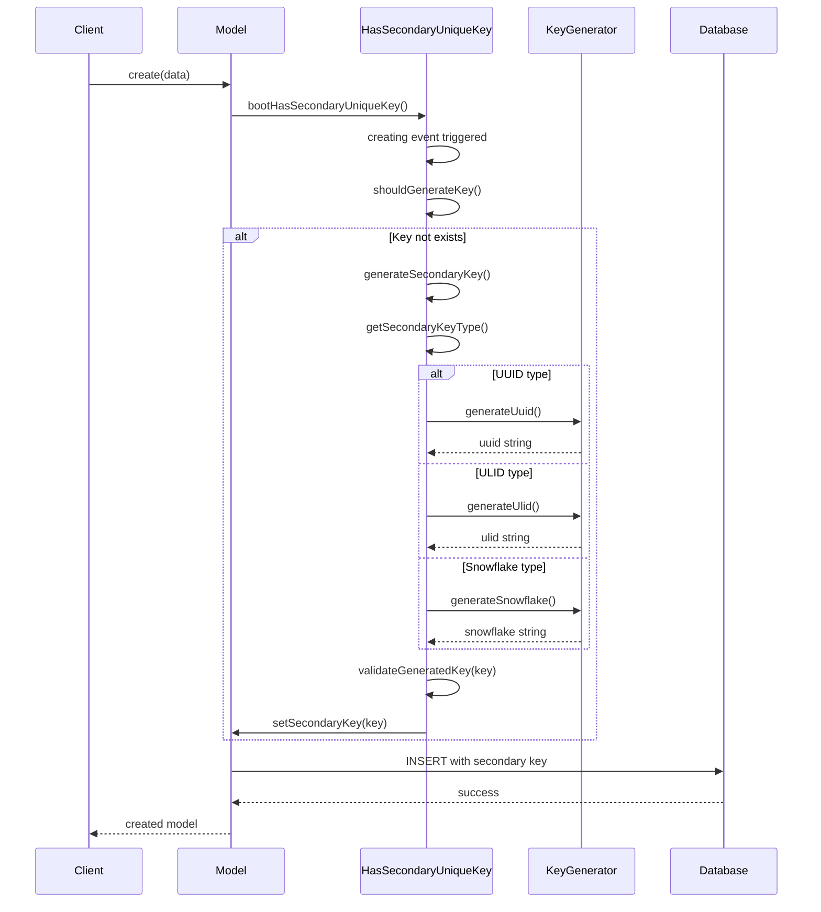

### 2. Secondary Key Lookup Flow

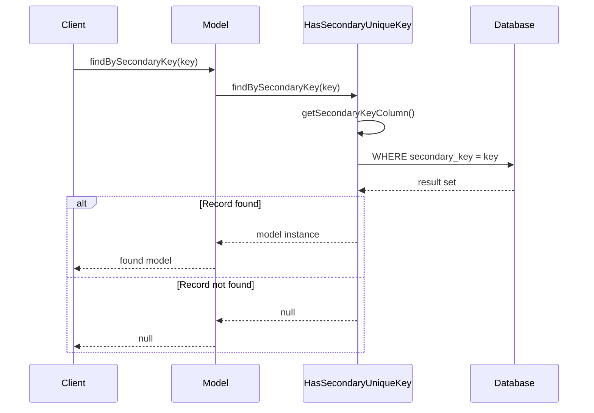

### 3. API Request with Secondary Key

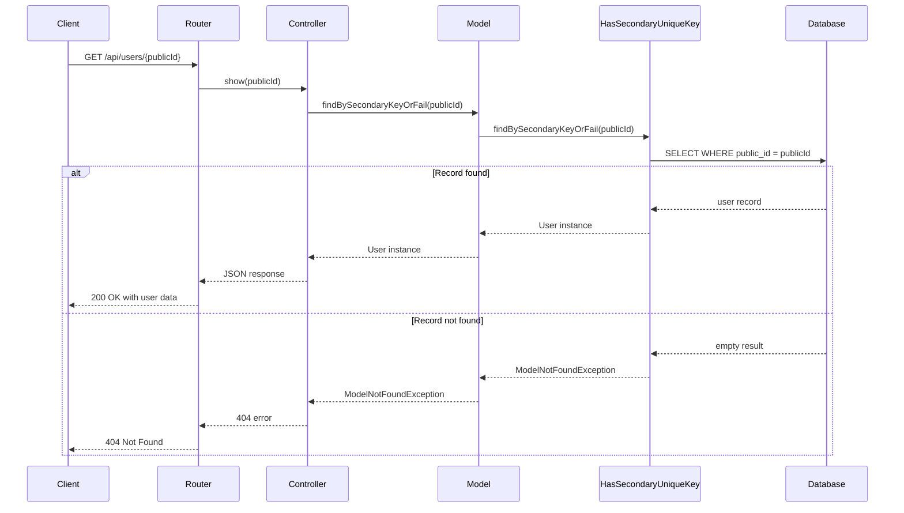

## Architectural Diagrams

### 1. System Architecture with Secondary Keys

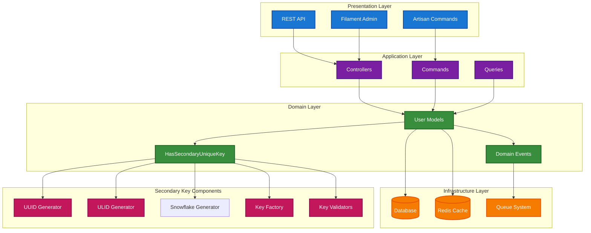

### 2. Key Generation Strategy Pattern

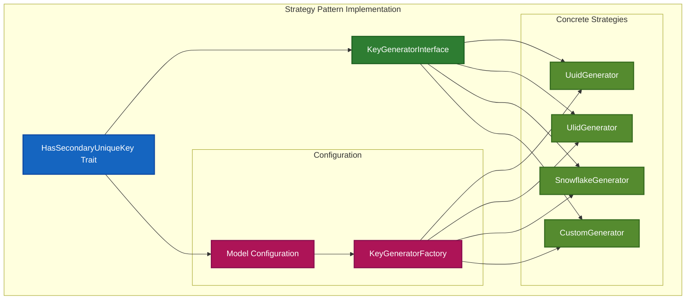

### 3. Database Index Performance Comparison

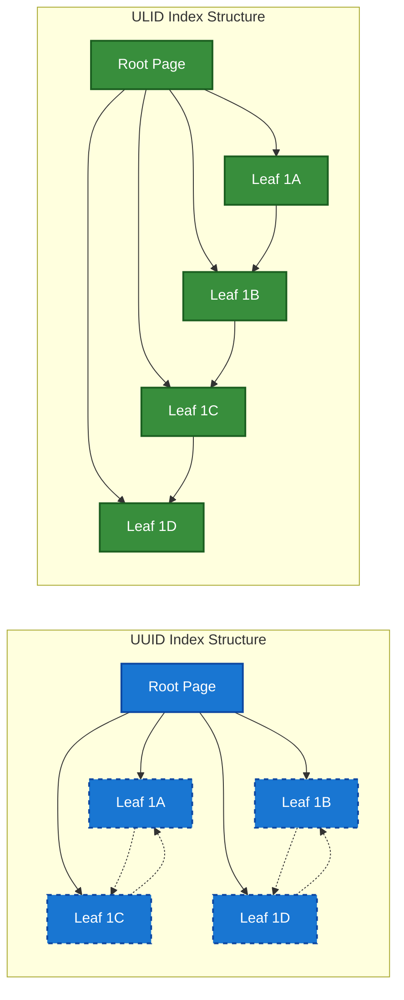

## Integration Patterns

### 1. Trait Integration with Existing Models

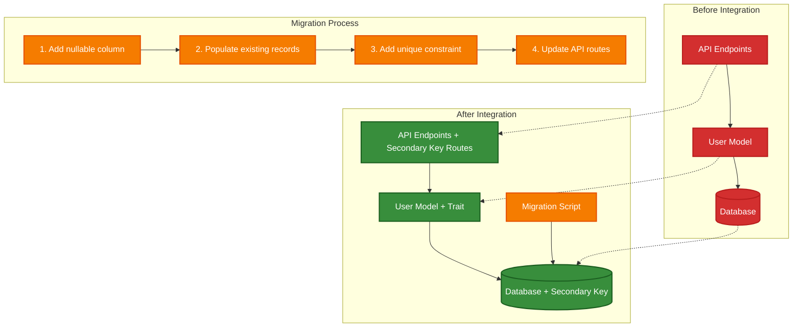

### 2. Multi-Model Secondary Key Usage

```mermaid
graph TB
    subgraph "User Management"
        User[User Models]
        UserUuid[UUID for security]
        UserActivity[User Activity]
        UserUlid[ULID for performance]
        SystemUser[System Users]
        SystemSnowflake[Snowflake for distributed]
    end

    subgraph "Team Management"
        Team[Team Models]
        TeamUlid[ULID for sorting]
        TeamActivity[Team Activity]
        TeamActivityUlid[ULID for chronology]
    end

    subgraph "Distributed Systems"
        ServiceRequest[Service Requests]
        ServiceSnowflake[Snowflake for tracing]
        TenantResource[Tenant Resources]
        TenantSnowflake[Snowflake for multi-tenant]
        MicroserviceLog[Microservice Logs]
        MicroSnowflake[Snowflake for coordination]
    end

    subgraph "Audit System"
        AuditLog[Audit Logs]
        AuditUlid[ULID for time ordering]
        SecurityEvent[Security Events]
        SecurityUuid[UUID for unpredictability]
    end

    subgraph "API Layer"
        PublicAPI[Public API]
        AdminAPI[Admin API]
        InternalAPI[Internal API]
        DistributedAPI[Distributed API]
    end

    User --> UserUuid
    UserActivity --> UserUlid
    SystemUser --> SystemSnowflake
    Team --> TeamUlid
    TeamActivity --> TeamActivityUlid
    ServiceRequest --> ServiceSnowflake
    TenantResource --> TenantSnowflake
    MicroserviceLog --> MicroSnowflake
    AuditLog --> AuditUlid
    SecurityEvent --> SecurityUuid

    PublicAPI --> UserUuid
    PublicAPI --> TeamUlid
    AdminAPI --> UserUuid
    AdminAPI --> AuditUlid
    InternalAPI --> UserUlid
    InternalAPI --> SecurityUuid
    DistributedAPI --> ServiceSnowflake
    DistributedAPI --> TenantSnowflake

    classDef uuid fill:#1976d2,stroke:#0d47a1,stroke-width:2px,color:#ffffff
    classDef ulid fill:#388e3c,stroke:#1b5e20,stroke-width:2px,color:#ffffff
    classDef snowflake fill:#c2185b,stroke:#880e4f,stroke-width:2px,color:#ffffff
    classDef api fill:#f57c00,stroke:#e65100,stroke-width:2px,color:#ffffff

    class UserUuid,SecurityUuid uuid
    class UserUlid,TeamUlid,TeamActivityUlid,AuditUlid ulid
    class SystemSnowflake,ServiceSnowflake,TenantSnowflake,MicroSnowflake snowflake
    class PublicAPI,AdminAPI,InternalAPI,DistributedAPI api
```

## Performance Flow Diagrams

### 1. Insert Performance Comparison

### 2. Query Performance Patterns

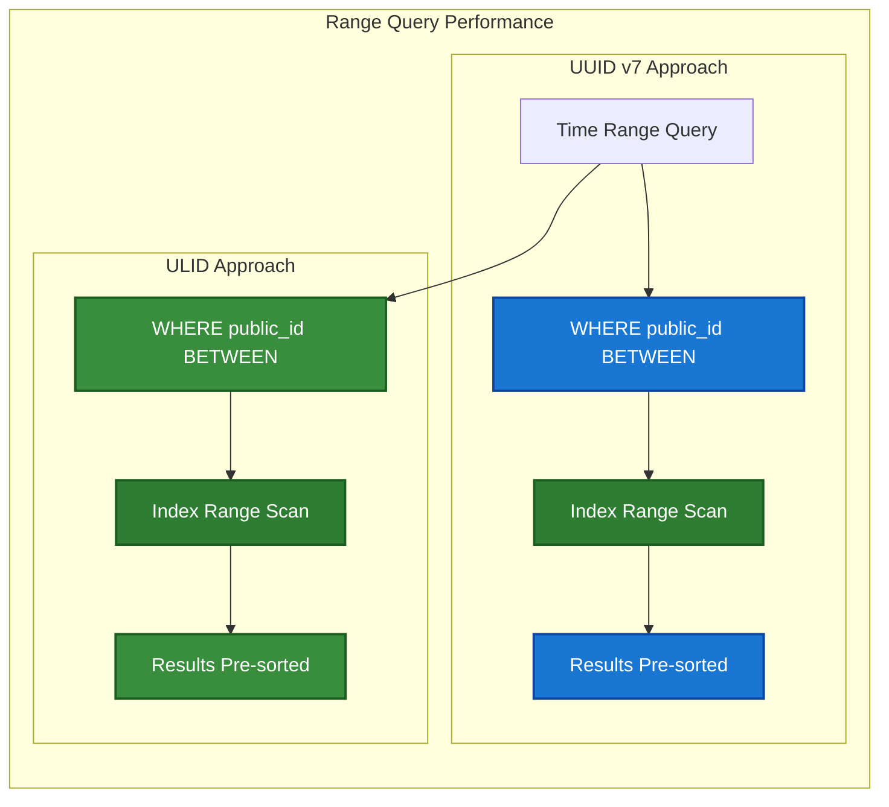

## Configuration and Deployment Diagrams

### 1. Environment-Specific Configuration

```mermaid
graph TB
    subgraph "Development Environment"
        DevConfig[Dev Config]
        DevUuid[Default: UUID]
        DevPerf[Performance: Low Priority]
    end

    subgraph "Staging Environment"
        StageConfig[Staging Config]
        StageHybrid[Hybrid: UUID + ULID]
        StageTest[Testing: Both Types]
    end

    subgraph "Production Environment"
        ProdConfig[Production Config]
        ProdOptimized[Optimized: Context-Specific]
        ProdMonitoring[Performance Monitoring]
    end

    subgraph "Configuration Sources"
        EnvFile[.env File]
        ConfigFile[config/secondary_keys.php]
        ModelConfig[Model-Specific Config]
    end

    DevConfig --> EnvFile
    StageConfig --> ConfigFile
    ProdConfig --> ModelConfig

    DevConfig --> DevUuid
    StageConfig --> StageHybrid
    ProdConfig --> ProdOptimized

    classDef dev fill:#1976d2,stroke:#0d47a1,stroke-width:2px,color:#ffffff
    classDef stage fill:#f57c00,stroke:#e65100,stroke-width:2px,color:#ffffff
    classDef prod fill:#388e3c,stroke:#1b5e20,stroke-width:2px,color:#ffffff
    classDef config fill:#7b1fa2,stroke:#4a148c,stroke-width:2px,color:#ffffff

    class DevConfig,DevUuid,DevPerf dev
    class StageConfig,StageHybrid,StageTest stage
    class ProdConfig,ProdOptimized,ProdMonitoring prod
    class EnvFile,ConfigFile,ModelConfig config
```

## Conclusion

These diagrams provide comprehensive visual documentation of the `HasSecondaryUniqueKey` trait implementation, covering:

1. **Class Structure**: How the trait integrates with the STI architecture
2. **Sequence Flows**: Step-by-step operations for key generation and retrieval
3. **Architecture**: Overall system integration and component relationships
4. **Performance**: Visual comparison of UUID vs ULID performance characteristics
5. **Integration**: Migration patterns and multi-model usage scenarios

The diagrams serve as both documentation and design validation tools, helping developers understand the trait's implementation and make informed decisions about its usage in different scenarios.

## References

- [Mermaid Diagram Syntax](https://mermaid-js.github.io/mermaid/)
- [UML Class Diagram Notation](https://www.uml-diagrams.org/class-diagrams-overview.html)
- [Database Index Visualization](https://use-the-index-luke.com/sql/anatomy)
- [Laravel Model Events Documentation](https://laravel.com/docs/eloquent#events)
