# 1. Architectural Diagrams for UMS-STI

## 1.1. Executive Summary

This document provides comprehensive architectural diagrams for the User Management System with Single Table Inheritance (UMS-STI) using Mermaid syntax. These diagrams illustrate the system's overall architecture, component relationships, data flow, and integration patterns to support understanding and implementation of the event-sourced, CQRS-based system.

## 1.2. Learning Objectives

After reviewing this document, readers will understand:

- **1.2.1.** System architecture overview and component relationships
- **1.2.2.** Event-sourcing and CQRS architectural patterns
- **1.2.3.** Data flow between system components
- **1.2.4.** Integration patterns with external systems
- **1.2.5.** Deployment architecture and infrastructure components

## 1.3. Prerequisite Knowledge

Before reviewing these diagrams, ensure familiarity with:

- **1.3.1.** Event-sourcing and CQRS concepts
- **1.3.2.** Laravel framework architecture
- **1.3.3.** Single Table Inheritance patterns
- **1.3.4.** Filament admin panel architecture
- **1.3.5.** SQLite database design

## 1.4. System Architecture Overview

### 1.4.1. High-Level System Architecture

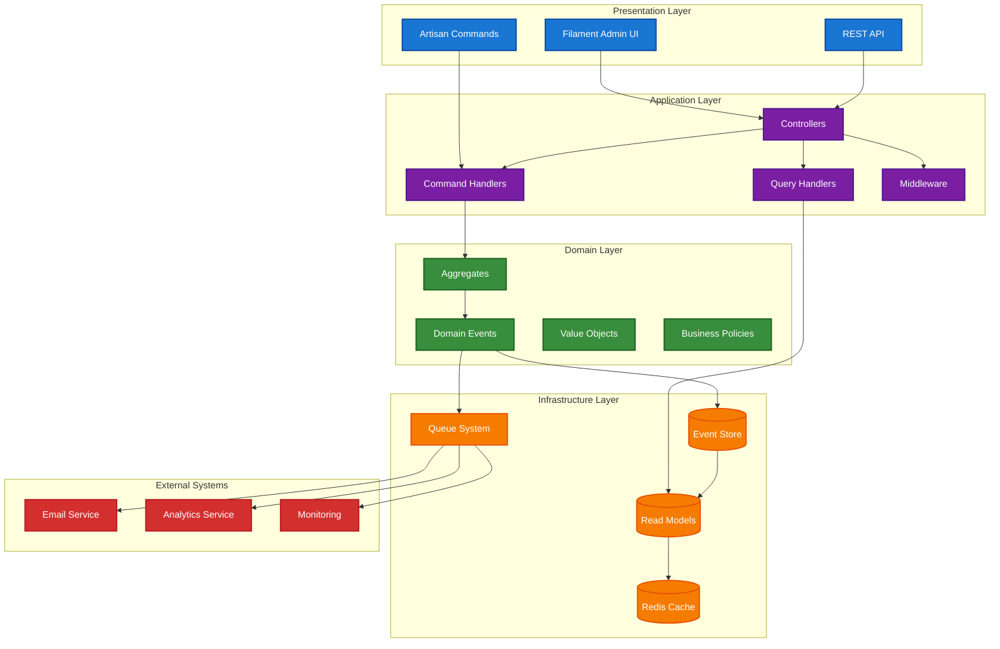

### 1.4.2. Event-Sourcing Architecture

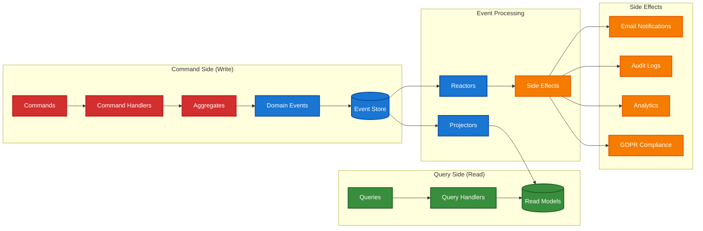

### 1.4.3. CQRS Data Flow

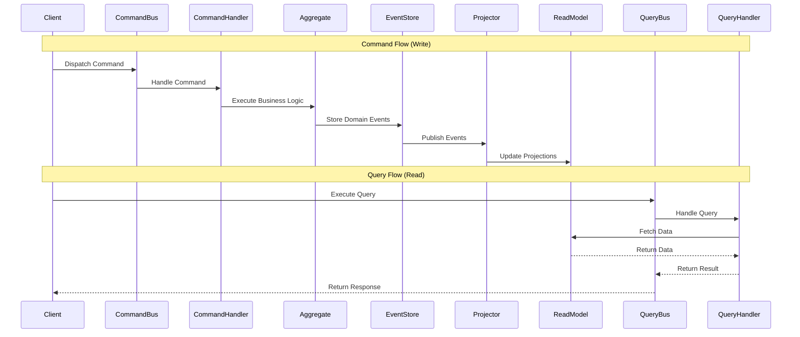

## 1.5. Component Architecture

### 1.5.1. User Management Components

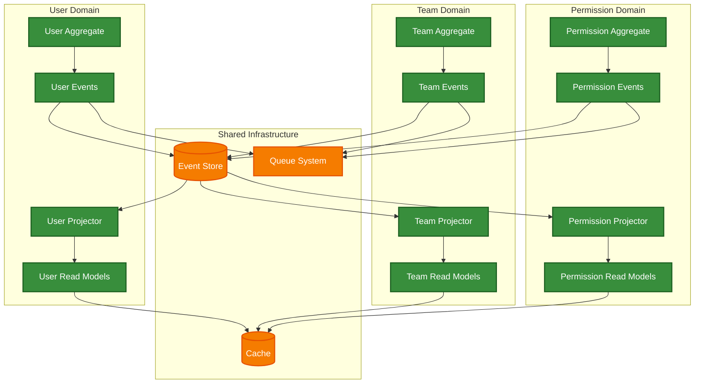

### 1.5.2. Filament Integration Architecture

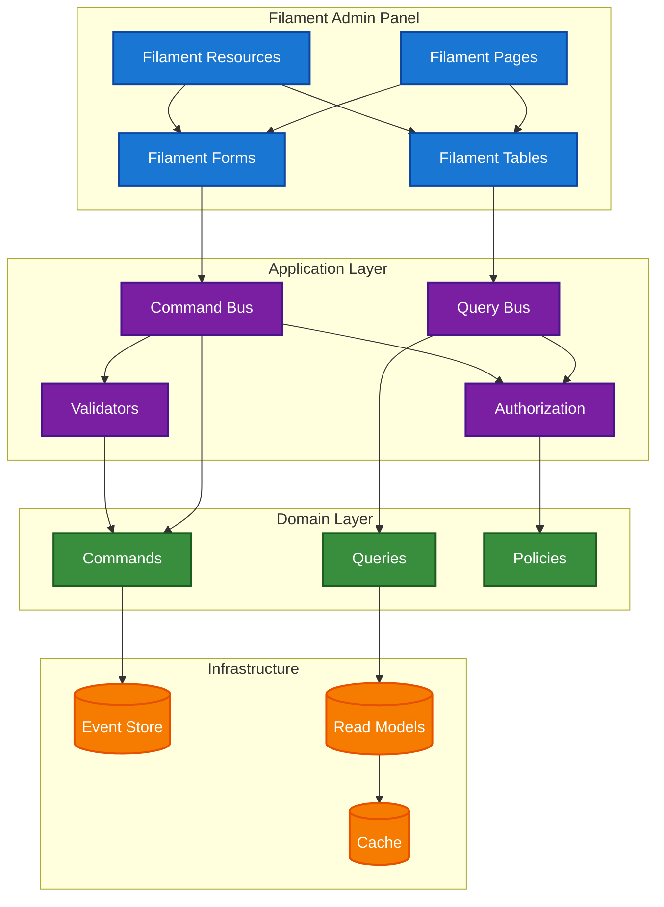

## 1.6. Data Architecture

### 1.6.1. Event Store and Read Model Architecture

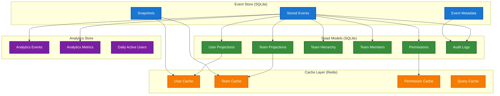

### 1.6.2. Single Table Inheritance Structure

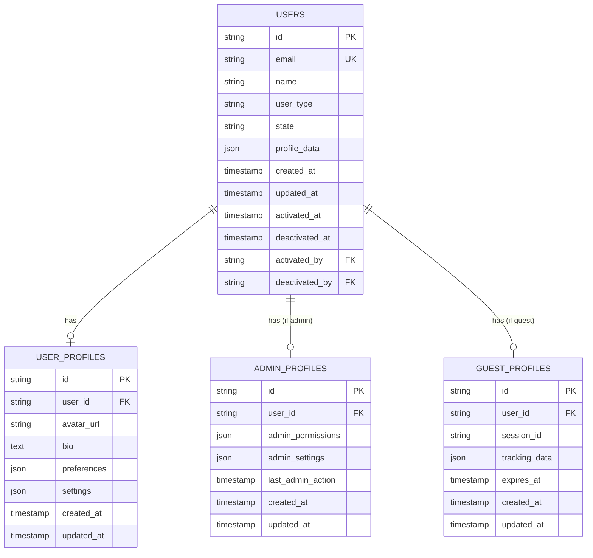

## 1.7. Integration Architecture

### 1.7.1. External System Integration

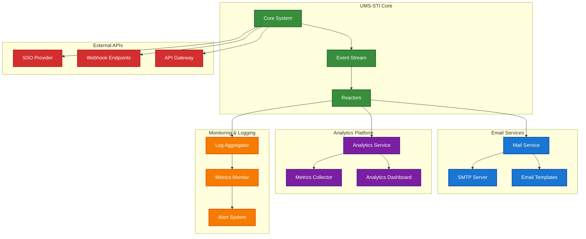

### 1.7.2. Queue and Job Processing Architecture

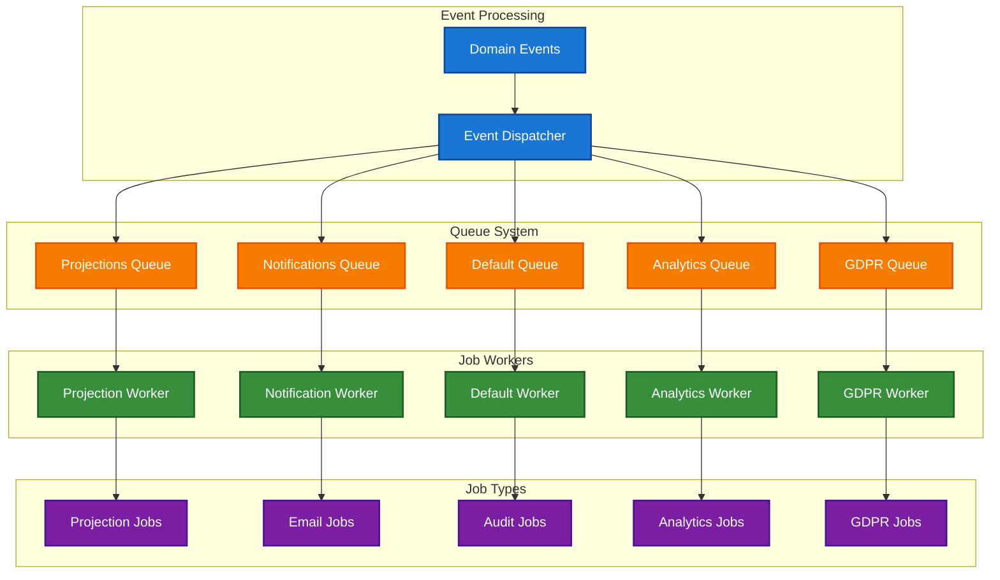

## 1.8. Deployment Architecture

### 1.8.1. Production Deployment Architecture

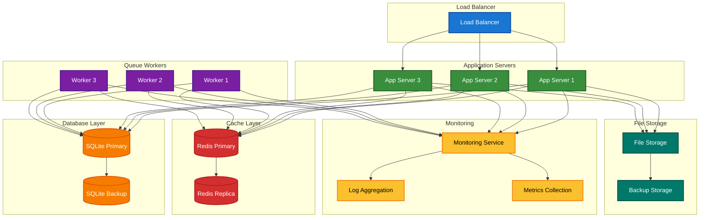

### 1.8.2. Development Environment Architecture

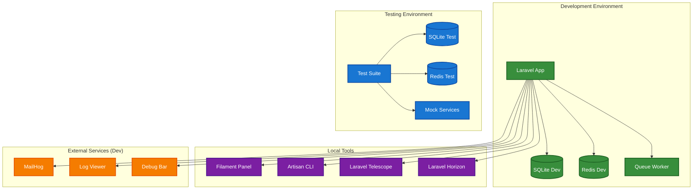

## 1.9. Security Architecture

### 1.9.1. Authentication and Authorization Flow

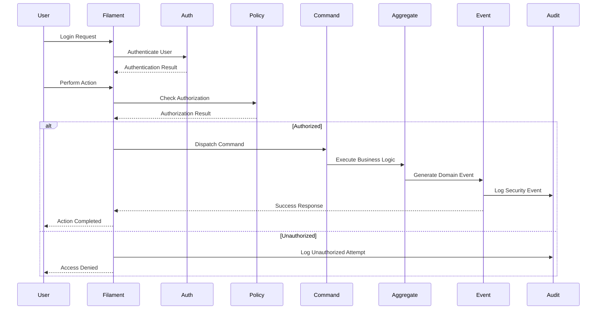

### 1.9.2. Data Protection Architecture

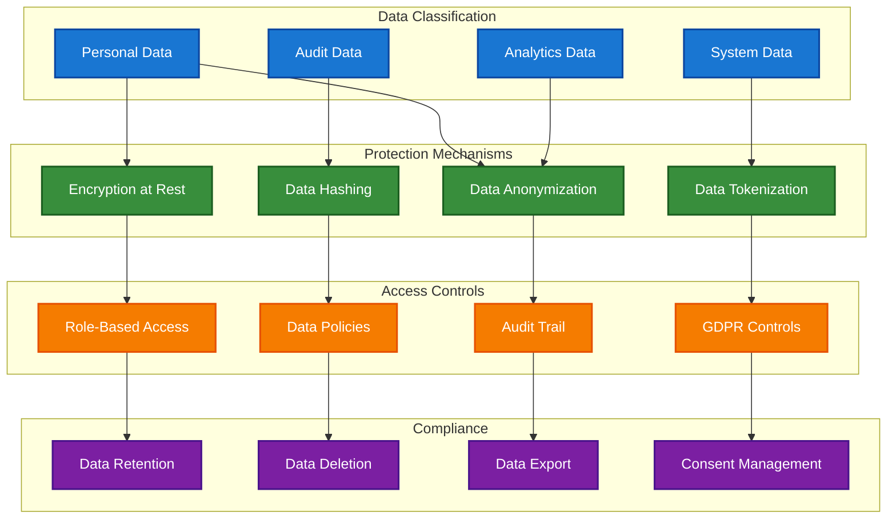

## 1.10. Performance Architecture

### 1.10.1. Caching Strategy

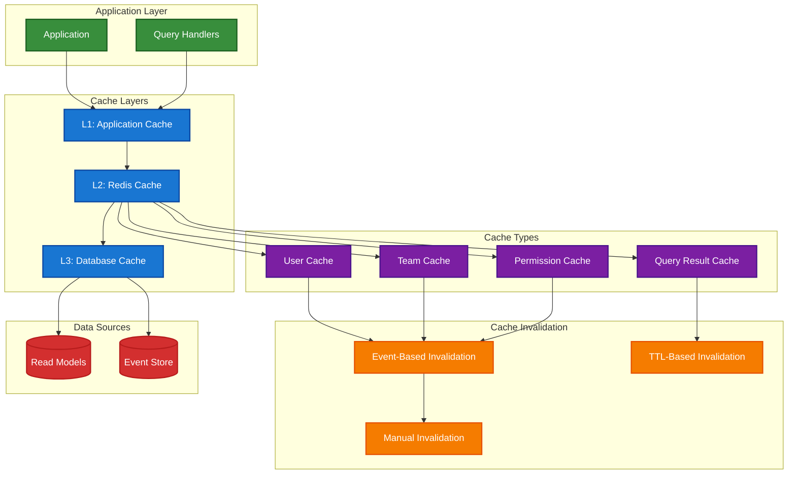

## 1.11. Cross-References

### 1.11.1. Related Diagrams

- **ERD Diagrams**: See [020-erd-diagrams.md](020-erd-diagrams.md) for detailed entity relationships
- **Business Process Flows**: See [030-business-process-flows.md](030-business-process-flows.md) for workflow diagrams
- **Swim Lanes**: See [040-swim-lanes.md](040-swim-lanes.md) for responsibility mapping
- **Domain Models**: See [050-domain-models.md](050-domain-models.md) for domain-specific diagrams
- **FSM Diagrams**: See [060-fsm-diagrams.md](060-fsm-diagrams.md) for state machine diagrams

### 1.11.2. Related Documentation

- **Event-Sourcing Architecture**: See [../070-event-sourcing-cqrs/010-event-sourcing-architecture.md](../070-event-sourcing-cqrs/010-event-sourcing-architecture.md)
- **CQRS Implementation**: See [../070-event-sourcing-cqrs/020-cqrs-implementation.md](../070-event-sourcing-cqrs/020-cqrs-implementation.md)
- **Database Foundation**: See [../020-database-foundation/010-database-design.md](../020-database-foundation/010-database-design.md)
- **User Models**: See [../030-user-models/010-sti-architecture-explained.md](../030-user-models/010-sti-architecture-explained.md)
- **Team Hierarchy**: See [../040-team-hierarchy/010-closure-table-theory.md](../040-team-hierarchy/010-closure-table-theory.md)

## 1.12. References and Further Reading

### 1.12.1. Architecture Patterns

- [Clean Architecture - Robert C. Martin](https://blog.cleancoder.com/uncle-bob/2012/08/13/the-clean-architecture.html)
- [Hexagonal Architecture - Alistair Cockburn](https://alistair.cockburn.us/hexagonal-architecture/)
- [Event-Driven Architecture Patterns](https://microservices.io/patterns/data/event-driven-architecture.html)

### 1.12.2. Event-Sourcing and CQRS

- [Event Sourcing Pattern - Martin Fowler](https://martinfowler.com/eaaDev/EventSourcing.html)
- [CQRS Pattern - Martin Fowler](https://martinfowler.com/bliki/CQRS.html)
- [Event Sourcing and CQRS - Greg Young](https://cqrs.files.wordpress.com/2010/11/cqrs_documents.pdf)

### 1.12.3. Laravel Architecture

- [Laravel Architecture Concepts](https://laravel.com/docs/architecture-concepts)
- [Laravel Service Container](https://laravel.com/docs/container)
- [Laravel Event System](https://laravel.com/docs/events)
